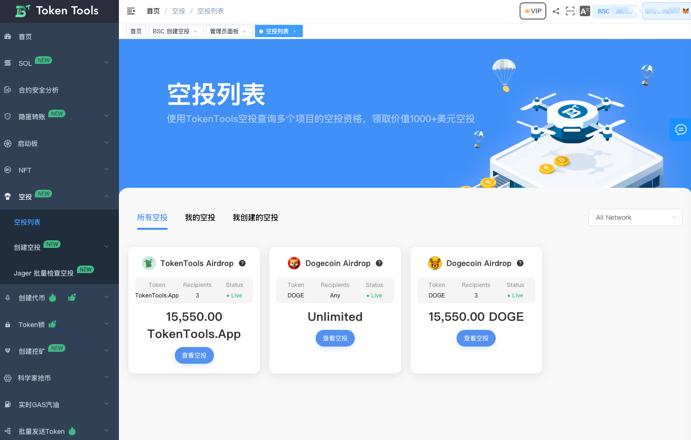
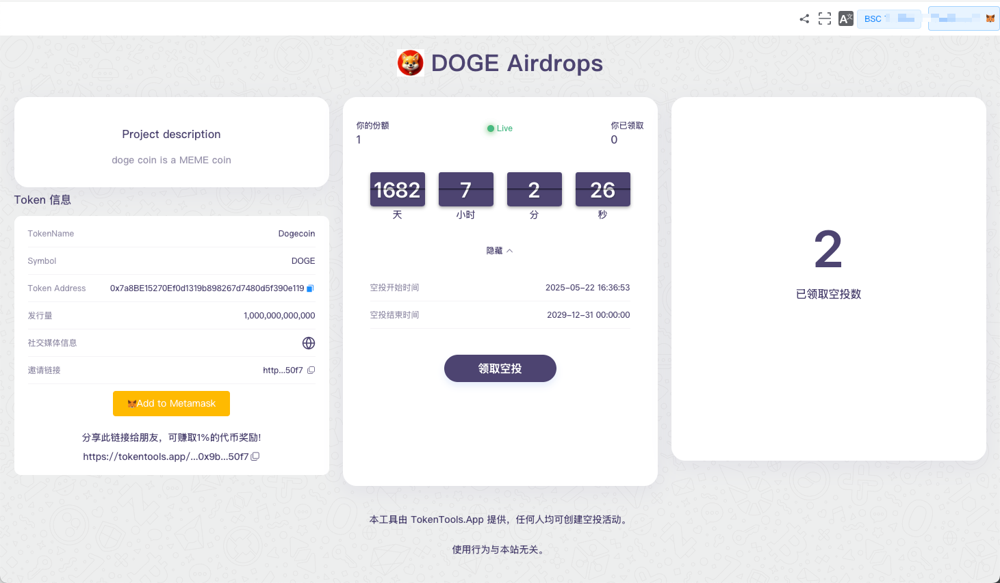
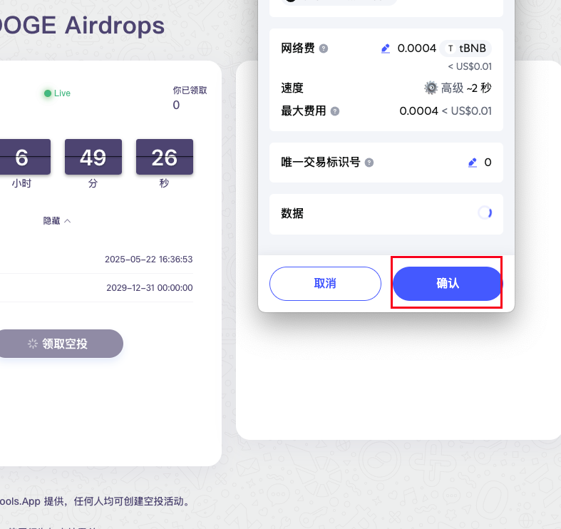
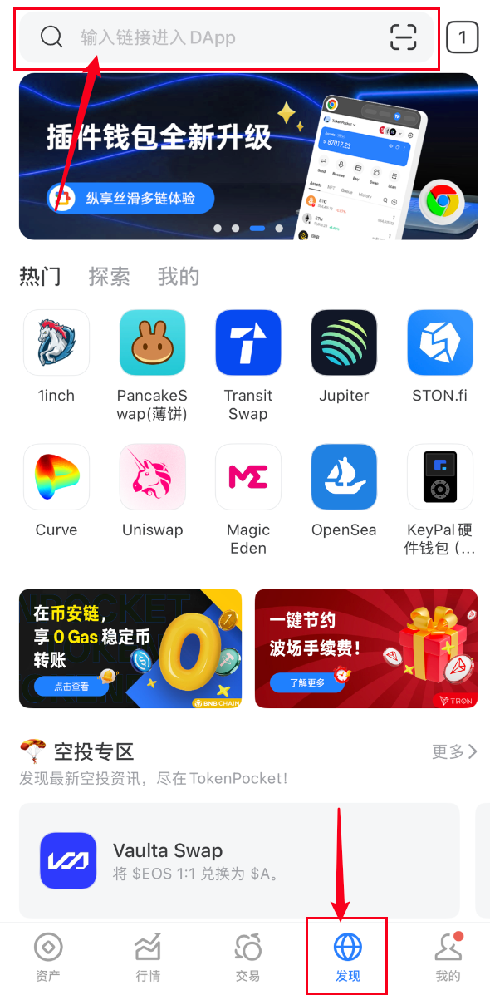
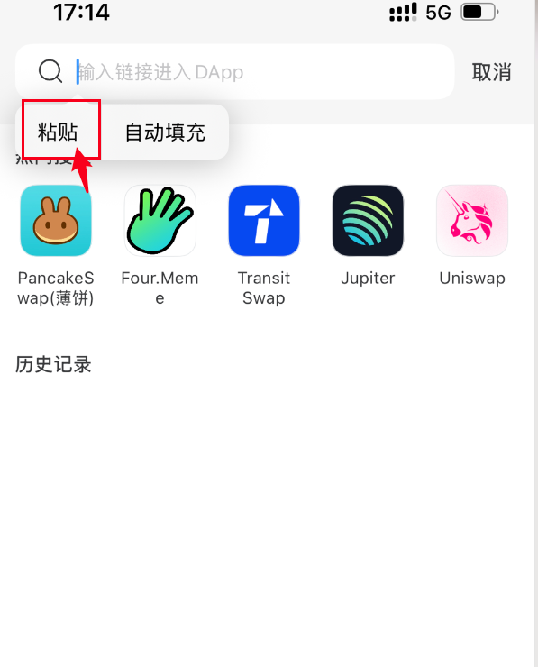
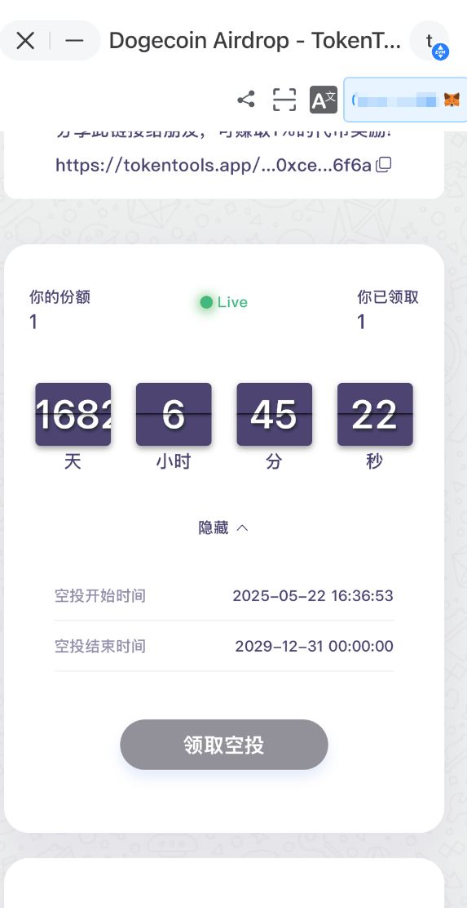

# 领取空投教程

### 一、选择要领取的空投

打开官网空投列表地址：[https://tokentools.app/airdrop/list](https://tokentools.app/airdrop/list)

在列表中选择感兴趣的空投项目，点击“查看空投”进入详情页面。

链接钱包后，点击"领取空投"按钮。

在钱包中确认操作，成功后即完成空投领取。

---

### 常见问题

**TP 钱包 APP 如何操作领取？**

- 复制空投详情页的链接，在 TP 钱包 APP 中打开“发现”页，粘贴链接访问即可领取。其他钱包 APP 操作方式类似。

  

**为什么“领取空投”按钮无法点击**

- 可能原因如下：
  - 已成功领取过该空投；
  - 空投活动尚未开始或已结束；
  - 当前地址不符合领取资格（如非白名单用户）。

如有疑问或不清楚的地方，欢迎加入官方 Telegram 群获取帮助：[https://t.me/TokenTool_App](https://t.me/TokenTool_App)