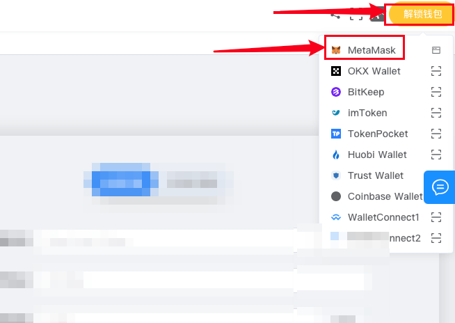
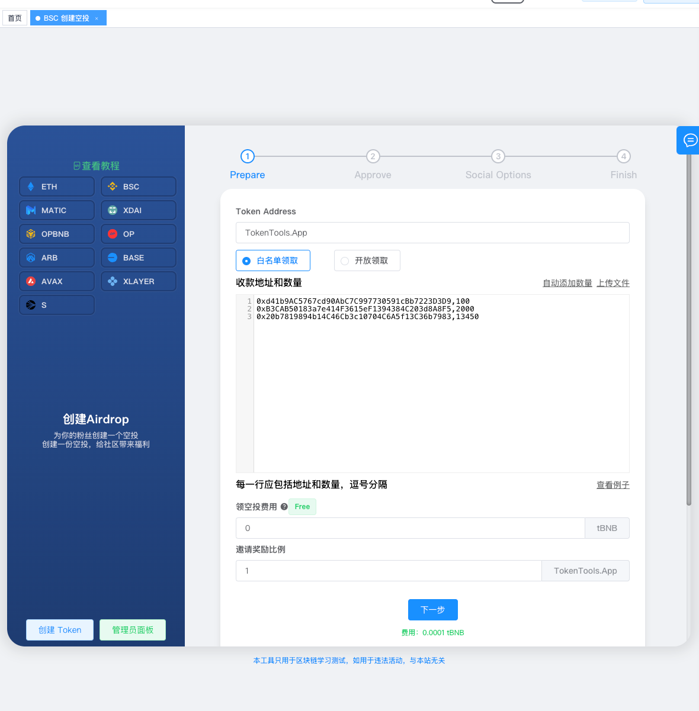
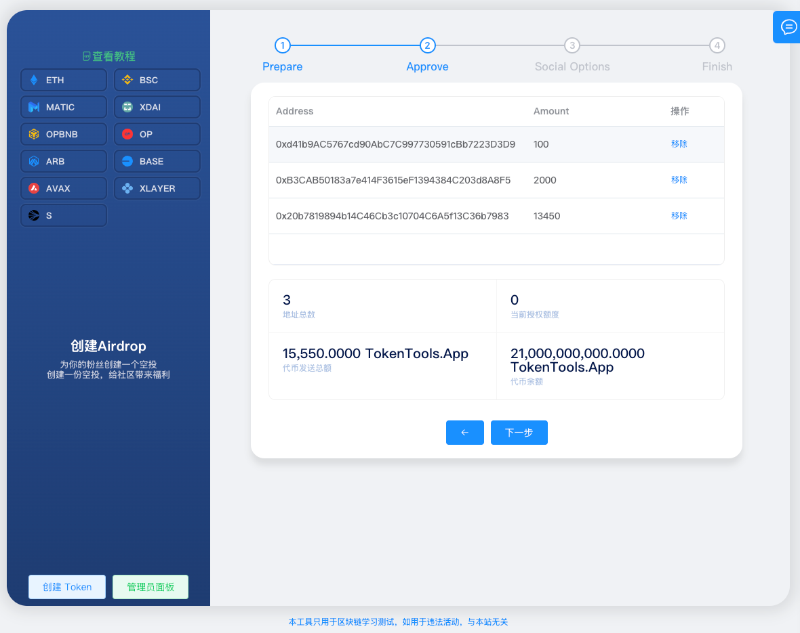
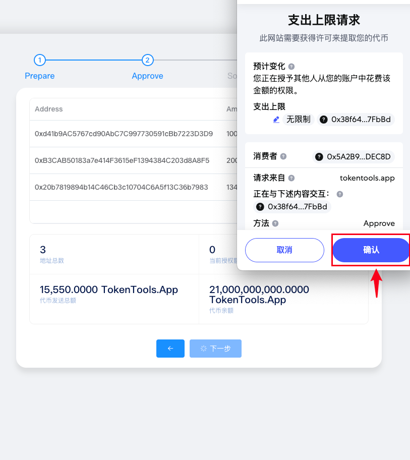
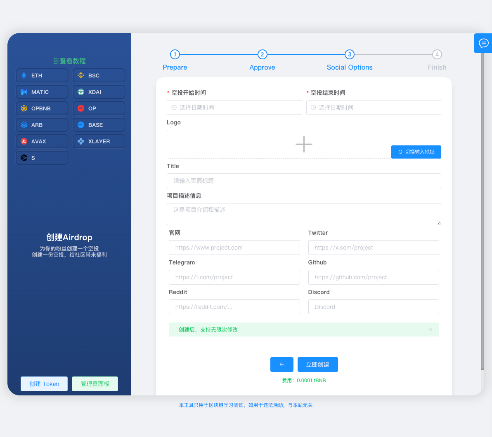
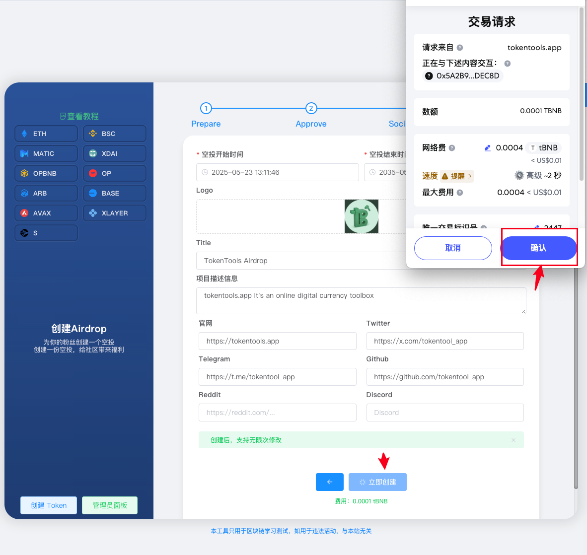
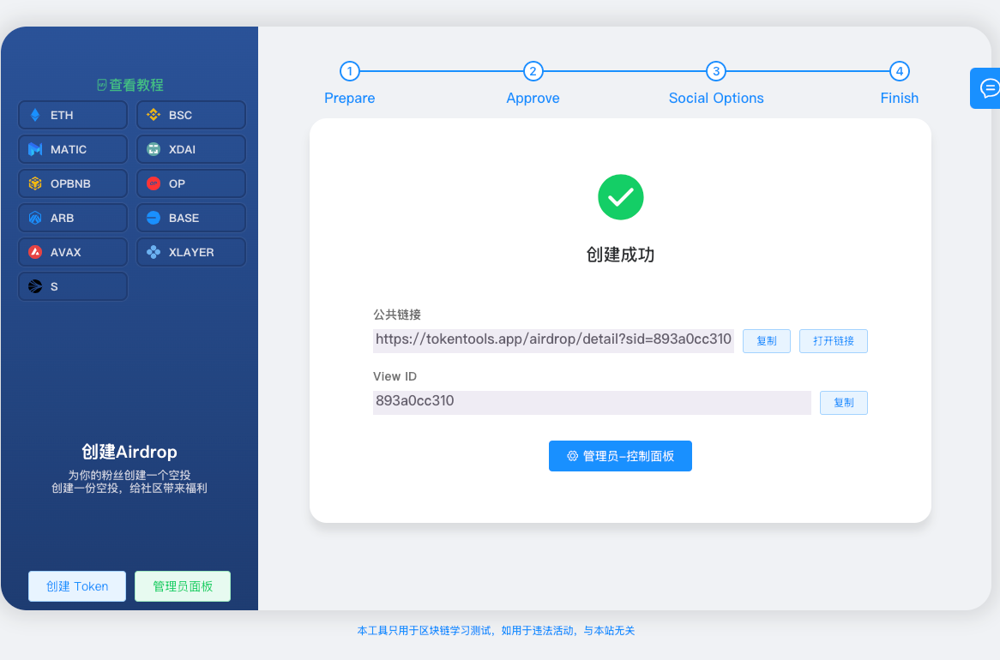
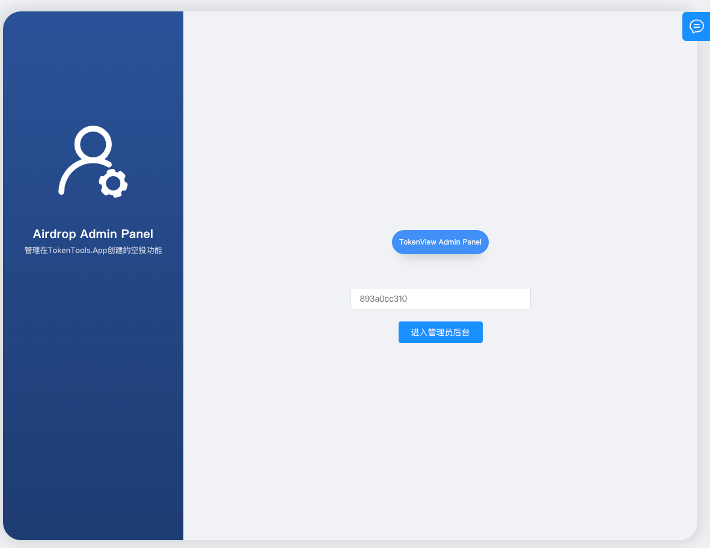
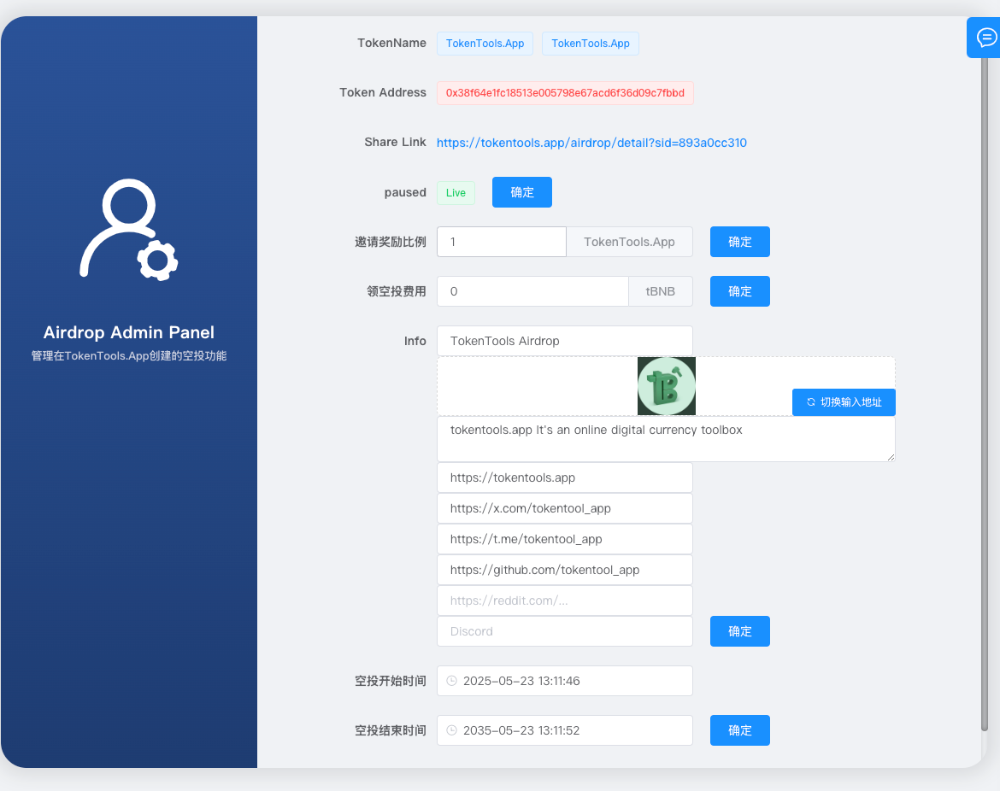

# 创建空投教程

### 什么是空投？

空投是一种快速推广代币的方式。你可以为你的代币创建一个空投活动，支持以下模式：

- 公开领取：任何人均可参与领取；
- 指定地址：仅允许白名单地址领取；
- 邀请奖励：用户邀请他人参与，可获得奖励；
- 领取收费：设置领取代币需支付一定费用。

用户只需通过你生成的空投链接，即可参与并领取代币。


⚠️ 在创建空投前，请确保你已经成功创建了代币。  没有代币，无法创建空投活动。


## 一、空投功能说明

- **兼容任意 ERC20 代币：** 所有 ERC20 的代币均可创建空投  
- **自动生成领取链接：** 系统自动生成专属 DApp 页面，用户可通过钱包一键领取  
- **支持白名单与公开领取：** 可设置不通的领取模式，满足不同分发需求  
- **支持个性化发放额度：** 可为不同地址设置不同领取数量，实现定制化分发  
- **支持收费领取：** 可设置用户需支付链原生币（如 ETH、BNB）才能领取  
- **内置邀请奖励机制：** 系统支持邀请返佣，用户邀请他人领取可获得奖励  

## 二、 空投活动创建教程

### 1. 连接钱包

访问 TokenTools 空投创建页面：[https://tokentools.app/airdrop/create/bsc](https://tokentools.app/airdrop/create/bsc)，点击右上角「解锁钱包」

系统将弹出钱包连接界面，选择一个地址并连接。  
如需在币安智能链（BSC）上创建空投，请将钱包切换至 BSC 网络。连接成功后，页面右上角将显示钱包地址与当前网络信息。

### 2. 填写空投参数

依次填写以下内容：

- **Token Address：** 输入你已部署的代币合约地址
- **领取模式选择：**  
  - **白名单模式：** 上传包含地址和对应领取数量的列表（格式：`地址,数量`）  
  - **公开模式：** 所有人均可领取，仅需填写每个地址的领取数量  
- **领取费用：** 设置为免费或收费（收费仅支持链原生币，如 ETH、BNB）  
- **邀请奖励比例：** 设定邀请奖励百分比，最小支持 `0.01`，例如填入 `1` 表示 1%

完成后点击【下一步】

### 3. 授权空投合约

在页面中显示信息：

- **白名单地址列表（如有）**
- **授权空投额度：** 授权平台合约可代你转账的代币总量
- **地址总数（白名单模式）**
- **钱包代币余额**

**⚠️首次使用平台进行空投需授权合约。用户领取时，代币将由创建者钱包转出，因此必须进行授权操作。**

确认信息无误后，点击【下一步】，在钱包中完成授权操作。

### 4. 填写项目信息

填写以下展示信息，用于 DApp 页面展示：

- **空投开始时间：** 设定何时开始领取  
- **空投结束时间：** 设定何时停止领取  
- **Logo 图片：** 上传用于展示的代币 logo  
- **标题（Title）：** 页面展示标题  
- **项目描述信息：** 简要介绍你的项目  
- **官网链接**、**Twitter**、**Telegram**、**GitHub**、**Reddit**、**Discord**

> **⚠️ 以上信息支持后台无限次修改。**

填写完毕后，点击【立即创建】，钱包将弹出确认窗口，请完成签名确认。

创建成功后，将显示空投活动编号（SID）：如 `893a0cc310`

### 5. 管理后台配置

打开 TokenTools 管理后台地址：[https://tokentools.app/airdrop/admin](https://tokentools.app/airdrop/admin)

输入空投 SID 编号，点击【管理员后台按钮】进入管理页面。

支持以下管理项：

- **paused：** 暂停空投，提前终止活动  
- **修改时间：** 更改空投的开始与结束时间  
- **编辑社交资料信息**
- **重新设置领取费用**
- **修改邀请奖励比例**

### 常见问题解答

**收费领取的费用到哪个钱包？**

- 如果设置了领空投费用，用户需要支付链原生币（如BNB/ETH）进行领取空投，费用自动转到创建空投的管理员地址。

**领空投的代币从哪里转出的？**

- 所有空投代币均由管理员钱包转出，平台合约仅执行转账操作，所以第二步骤需要授权操作。

**为什么用户领取失败**

- 管理员钱包余额不足，导致转账失败。
- 白名单模式下，用户地址未被列入白名单，无资格领取。
- 时间已经结束，无法领取。

**白名单地址最多支持多少个？**

- 最多支持 10 万个地址，地址数量不会显著影响 gas 成本。

**白名单地址支持修改吗**

- 后续无法在管理员后台进行修改，所以在空投之前需要确定好哪些地址能获得空投资格。

如有疑问或不清楚的地方，欢迎加入官方 Telegram 群获取帮助：[https://t.me/TokenTool_App](https://t.me/TokenTool_App)
