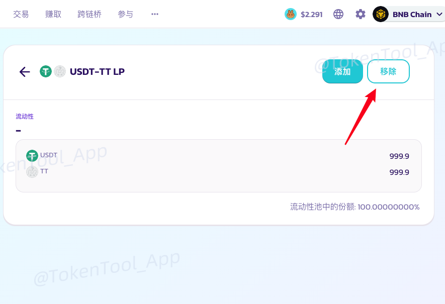
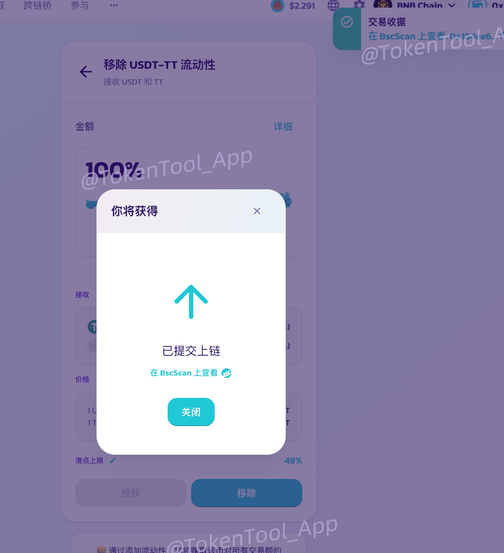

# 🥞 PancakeSwap 创建流动性资金池（V2 加池教程）

[PancakeSwap](https://pancakeswap.finance/?chain=bsc) 是运行在 BNB 智能链（BSC）上的头部 DEX（去中心化交易所），拥有领先的交易量与流动性。

本教程将手把手教你如何在 PancakeSwap 添加流动性（即“加池”）：

- **底池代币：** 通常选择 BNB 或 USDT，取决于合约部署时设定
- **V2还是V3：** 本教程为 V2 操作教程，TokenTools平台的合约大多也只支持V2

### 1、打开 PancakeSwap 并连接钱包

> 若使用手机 TP 钱包 / 欧易钱包，可跳过本步骤，默认已连接钱包。

1. 打开Pancake官网：[https://pancakeswap.finance/?chain=bsc](https://pancakeswap.finance/?chain=bsc)  
2. 点击右上角 `连接钱包` 按钮  
3. 选择钱包类型（推荐：MetaMask）

此时会跳出提示，让你选择钱包类似，电脑默认都是选择Metamask，之后小狐狸会提示让你确认

连接成功后，右上角显示你的钱包地址：

### 2、添加流动性（加池子）

1. 在上方导航栏点击 `赚取` → `农场/流动性`  
   或直接访问：[https://pancakeswap.finance/liquidity/positions](https://pancakeswap.finance/liquidity/positions)

2. 点击页面右侧的 **“添加流动性”** 按钮

3. 选择版本：**V2**

4. 选择两个代币：
   - 左边选择常见底池币（如 USDT 或 BNB）
   - 右边输入你的代币合约地址进行搜索
   - 点击“下一回合”按钮。

5. 输入你要注入的两种代币的数量。**代币比例 = 初始价格**

> 例如：注入 1000 USDT + 1000 TT，则 TT 初始价格为 1 U  
> 若注入 1000 USDT + 10,000 TT，则初始价格为 0.1 U

7. 分别点击 “授权 USDT” 和 “授权你的代币” → 钱包确认授权

8. 授权完成后，点击 `添加`，钱包确认交易即可 ✅

成功后，在 `我的持仓` 页面可查看流动性池详情：

### 3、撤出流动性（撤池子）

1. 打开 `流动性 → 我的持仓` 页面，点击你的 LP 项目

2. 点击右侧按钮 **“移除”**

3. 设置你要移除的比例（如 50%、100%）
	- 选择50%就是撤出一半的流动性。选择最大，就是撤出你自己的100%全部流动性（注意：是你自己的流动性）

4. 授权钱包并确认，即可撤出你自己的流动性

至此，关于加池和撤池的教程基本就结束了

### 常见问题答疑

**1）第一次加池需要多少币？**

- 答：**建议金额：** 不少于 300 U 或 1 个 BNB。  实际可根据你的经济模型与初始定价需求灵活设置。

**2）初始上线价格怎么算？**

- **答：** 代币初始价格由第一次加池的比例决定。如果你加100U和100个币，那么代币的上线价格就是1U。如果你加100U和10000个币，代币的上线价格就是0.01U。计算方式：100 U / 10000 TT  = 0.01 U 

**3）交易时提示流动性不足，是什么意思？**

- **答：** 说明池子里的流动性不够。薄饼有规定，单次交易的数量/金额，一般不能超过池子里的25%。假设你池子里有100U和100个币，如果你买币，不能买超过25个。如果你卖币，也不能卖超过25U。以此类推，池子越大，交易越顺畅

**4）撤池子能把别人加的池子撤走吗？**

- **答：** 不能。撤池子，只能撤出自己的流动性比例。假设自始至终只有你一个人加池子，那你撤出100%，就可以把池子全撤走。你只能撤出自己加进池子的那部分。其他用户的流动性与你无关。

**5）代币价格与什么有关系？如何操盘？**

- **答：** 买入代币，价格上涨。卖出代币，价格下跌

**6）能不能直接往池子里转币？**

- **答：坚决不能。** 如果你想让池子变大，只能在薄饼以加流动性的方式增大池子，千万不能直接往池子地址里转币，不然会被套利机器人把池子掏走

**7）V2和V3有什么区别？**

- **答：** 带功能/机制的币，只能加V2。目前V3的池子只支持标准币，大家不要加错了

到问题？欢迎加入 Telegram 中文社群提问：

👉 [https://t.me/tokentool_app](https://t.me/tokentool_app)