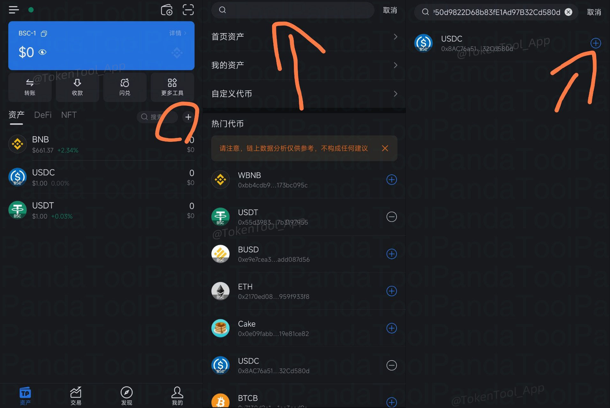
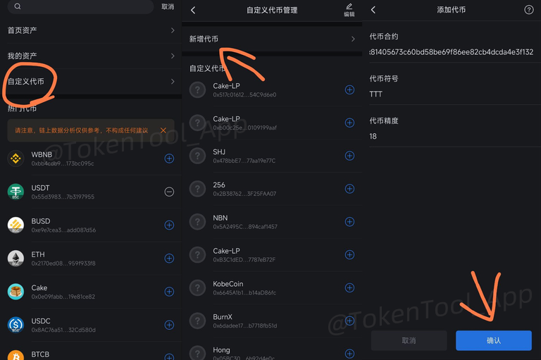
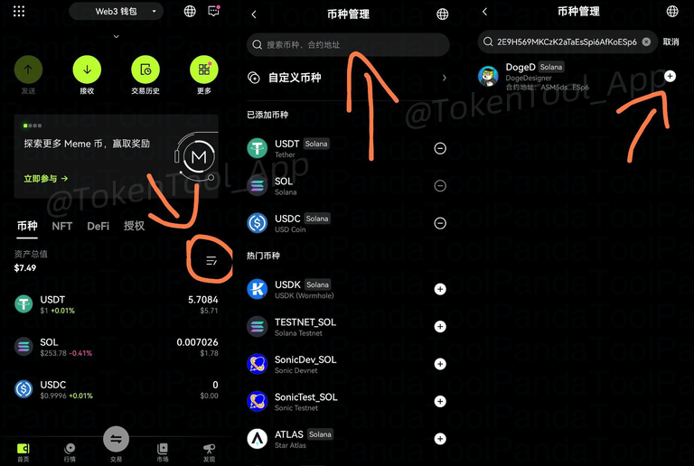
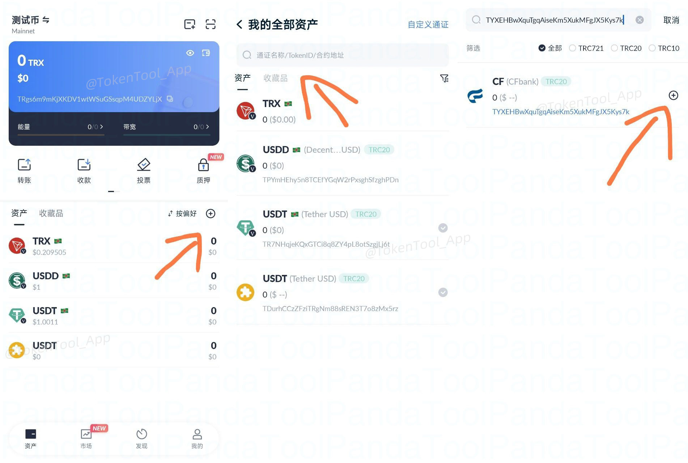
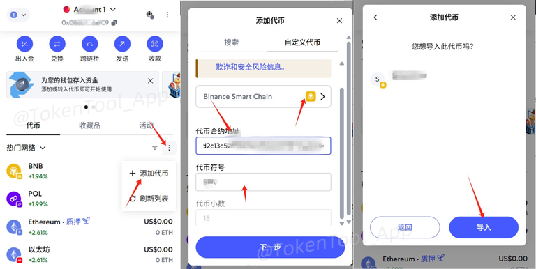
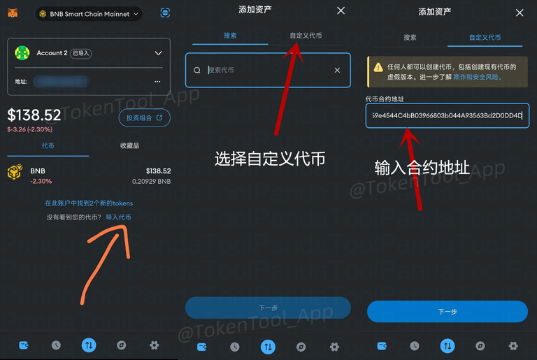
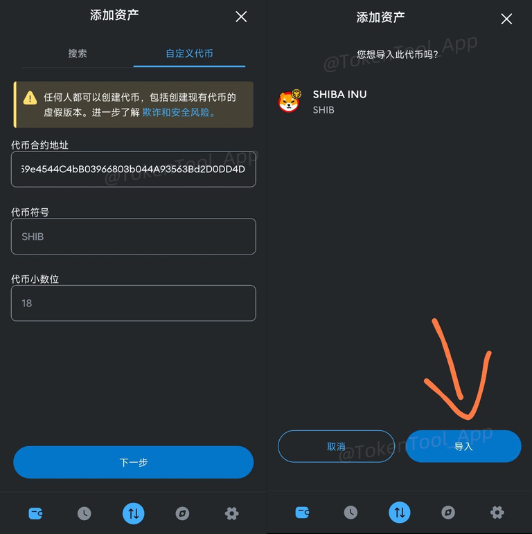
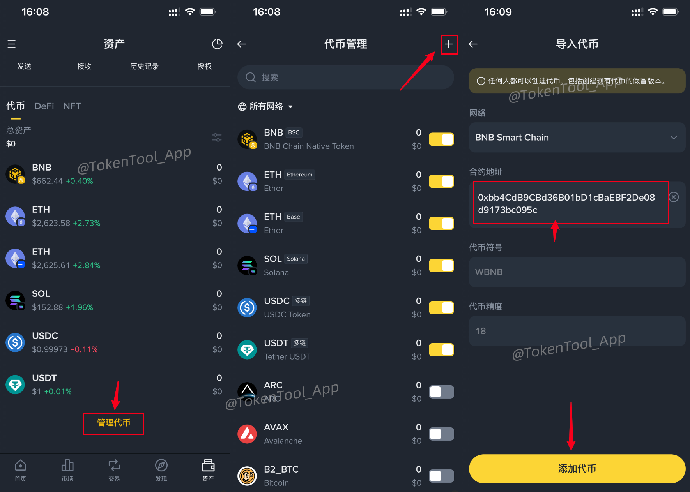

很多朋友在发币之后，发现自己的代币在钱包中无法直接看到。其实非常简单，只需要手动添加合约地址即可。

本篇文章将教大家，如何在钱包里搜索并添加代币

### 1、TokenPocket钱包（TP钱包）

1. 打开 TP 钱包 App，切换到目标链及钱包地址  
2. 点击右上角 **「+」** 按钮  
3. 粘贴你的代币 **合约地址**，搜索添加

若搜索失败，可点击 **「自定义代币」**，手动输入以下字段：

### 2、OKX Web3 钱包（欧易钱包）

操作方式基本与 TP 钱包一致：

1. 打开 App 钱包页面  
2. 点击右上角 **「添加代币」**  
3. 输入 **合约地址** 即可搜索  
4. 找不到？点击「自定义添加」

### 3、TronLink 钱包（波宝钱包）

适用于 **波场链（TRON）** 的钱包，操作方式如下：

1. 切换至 TRON 主网  
2. 点击 **添加资产** 右上角 **「+」** 按钮 图标  
3. 输入合约地址或代币名称进行搜索

### 4、MetaMask 钱包（小狐狸钱包）

MetaMask 添加代币方式分为插件和移动端：

1. 打开 MetaMask 插件 → 资产页  
2. 点击底部 **「导入代币」**  
3. 输入代币合约地址，点击「添加自定义代币」

1. 打开 MetaMask App  
2. 点击资产页底部「导入代币」  
3. 切换到「自定义代币」，填写合约信息

### 5、币安Web3钱包

1. 打开 Binance Web3 钱包 App  
2. 点击资产页的 **管理代币** 按钮  
3. 点击右上角 **「+」** 按钮  
4. 输入合约地址搜索 ，顶尖级添加代币

如在添加代币过程中遇到任何问题，欢迎加入我们的官方 Telegram 社群交流：

👉 [https://t.me/tokentool_app](https://t.me/tokentool_app)