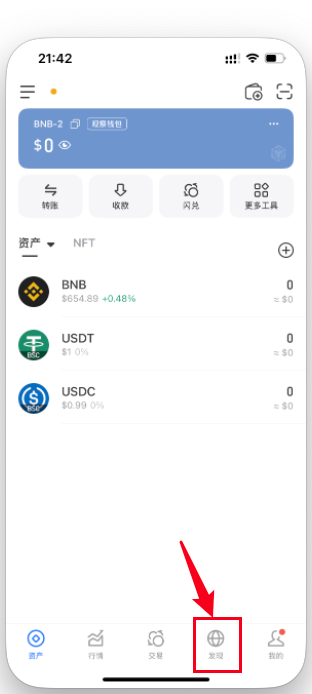

# 如何通过 TP 钱包一键发币

考虑到部分用户没有电脑，或不熟悉电脑发币操作，本教程将手把手教你如何**使用手机上的 TP 钱包 App**，实现一键发币。

## 操作步骤详解（以币安链为例）

第一步：在手机上打开`TP钱包`，点击左上角`切换网络`

第二步：选择你要创建合约的链以及钱包地址，这里以`币安链`为例

第三步：点击下方第三个按钮`发现`，进入TP钱包内置浏览器

1. 点击**【发现】**菜单页
2. 点击搜索栏，输入发币链接地址 输入`TokenTools`网址：tokentools.app

第六步：选择你要发行的代币类型，这里以`标准代币`为例

以上就是使用手机TP钱包发币的全部流程了，使用IMToken钱包、BK钱包也是同样的流程，区别不大。

如有其他疑问，欢迎加入官方 Telegram 社群获取帮助：  
📢 [https://t.me/tokentool_app](https://t.me/tokentool_app)
