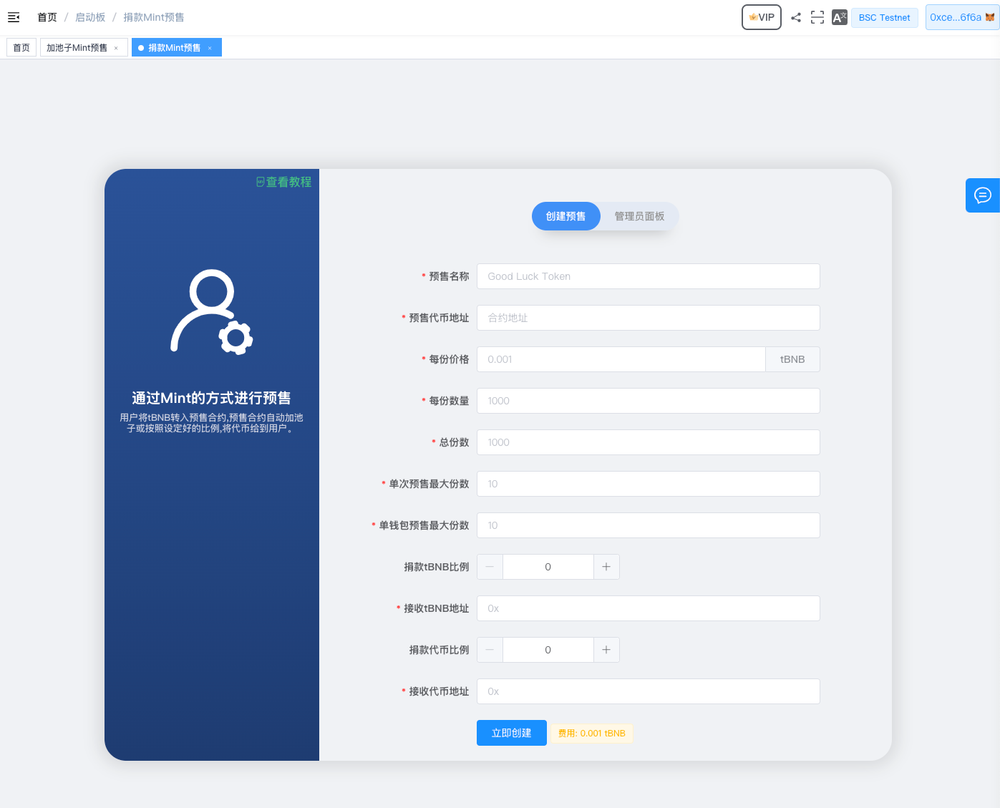

# 创建捐款 Mint 预售教程

### 什么是捐款 Mint 预售？

捐款 Mint 预售是在标准预售的基础上加入捐赠机制：在用户进行 Mint 操作时，合约会按照设置的比例将部分资金转账至指定的捐款地址。

简单来说，项目方将一定数量的代币打入预售合约。预售开启后，用户将链上原生币（如 BNB、ETH）转入预售合约地址。合约会：

- 按设定比例分发代币给用户；
- 并按照捐赠比例转账至第三方钱包（如 V 神等名人地址）。

与标准预售和加池预售不同，捐赠预售更适合打造**名人效应叙事**，助力项目宣传和传播。


注意：创建预售的前提是必须先创建代币。没有代币，无法创建 Mint 预售。


## 一、Mint 捐赠预售功能说明

- **捐赠机制：** 预售时会自动将一部分 BNB/ETH 或代币转入**名人钱包**
- **无前端支持：** 无需网页界面，纯合约交互，100% **去中心化**
- **转账即参与：** 用户向预售合约转账，即可**自动获得代币**
- **可自定义配置：** 项目方可通过控制台修改**预售价格**与**每份数量**
- **无软顶 / 硬顶限制：** 仅设置“预售总数量” = 份数 × 每份数量

## 二、注意事项

- 注意名人地址（如 V 神）可能在未来**抛售代币**，存在一定风险
- **不推荐使用标准代币合约**，可能会在预售期间被他人加池
- 若使用其他合约模板，**请勿在预售期间开启交易**（如有手动开盘功能）

## 三、 Mint 预售创建教程

### 1. 连接钱包

打开 TokenTools 官网：[https://tokentools.app/launchpad/donateMint](https://tokentools.app/launchpad/donateMint)，点击右上角的“解锁钱包”。

系统会弹出钱包连接界面，选择一个地址连接即可。如果您希望在币安智能链上创建预售，请将钱包切换至 BSC 网络。连接成功后，页面右上角会显示钱包地址和网络信息。

### 2. 填写预售参数

钱包连接成功后，我们通过TokenTools可视化页面创建预售，还是那个页面[https://tokentools.app/launchpad/donateMint](https://tokentools.app/launchpad/donateMint) 打开，填写相应的预售参数：

在页面中填写以下信息：

- **预售名称：** 请自定义一个英文名称，例如 `TT-Presale`
- **预售代币地址：** 要进行预售的代币合约地址（需提前创建好）
- **每份价格：** 例如每份价格为 `0.001 BNB/ETH`
- **每份数量：** 每份所包含的代币数量（例如一份 1000 枚代币）
- **总份数：** 可预售的总份数（须满足 每份数量 × 总份数 ≤ 代币总量）
- **单次最大购买份数：** 单次最多可购买多少份
- **单钱包最大购买份数：** 每个钱包地址最多可购买多少份（必须小于或等于单次最大份数）
- **捐赠BNB/ETH比例：** 将预售的BNB/ETH按照多大的比例（0~100）捐赠给某个地址
- **接收BNB/ETH的地址：** 将BNB/ETH捐赠给哪个地址（一般是名人钱包）
- **捐赠代币的比例：** 将预售的代币按照多大的比例（0~100）捐赠给某个地址
- **接收BNB/ETH的地址：** 将代币捐赠给哪个地址（一般是名人钱包）


V神钱包地址：0xd8da6bf26964af9d7eed9e03e53415d37aa96045


填写完毕后，点击【立即创建】，钱包会弹出确认交易的提示，点击确认后等待几秒，即可完成合约部署。

点击确认后等待几秒，就会提示你预售创建完成。如果钱包内BNB/ETH余额不够，可能会导致失败。

创建预售合约成功。

### 3. 管理员后台操作

预售合约部署成功后，打开管理员后台：[https://tokentools.app/launchpad/mintAddSale](https://tokentools.app/launchpad/mintAddSale)，进入“管理员面板”，填写刚才生成的 **预售地址**（注意：不是代币合约地址）。


根据上面填写的参数，以0.001BNB的价格可以Mint一份，一份的数量是1000个代币，其中捐赠比例都是5%。

什么意思呢，就是说：用户每Mint一次，将会有0.0002的BNB和200个代币给到V神钱包。用户自己只能获得800个代币，项目方只能获得0.0008BNB的预售费用。



后台可进行如下操作：

- **拥有权转移** : 将合约权限转让给其他人（转移权限之前，记得复制`控制台链接`。新的权限地址必须通过控制台链接，才能进入控制台操作）
- **开启预售：** 点击后钱包确认，即可开启预售（**注意此操作需要钱包确认2次**）
- **提取合约内余额：** 可以将预售合约里面的价值币和代币提取走

- **修改每份价格 :** 重新修改预售价格
- **修改每份数量：** 重新修改每份数量
- **修改总份数：** 根据实际情况重新修改总的预售份数
- **修改单次预售最大份数：** 根据需求修改单次预售上限
- **修改单钱包最大份数：** 根据需求修改单个钱包预售上限
- **修改接收BNB/ETH的钱包：**重新设置接受捐赠的钱包地址
- **修改捐赠BNB/ETH的比例：**重新设置捐赠的比例
- **修改接受代币的钱包：**重新设置接受捐赠的钱包地址
- **修改捐赠代币的比例：**重新设置捐赠的比例

### 4. 预售开始与结束？

**1）开启预售：**在`管理员后台`点击**开启预售**，会进行两次确认。第一次是授权确认，第二次会让你**转入**足够的代币进入预售合约里。

首先，点击开启预售按钮后，钱包会弹出让你进行授权。

第一次授权成功后，紧接着会弹出钱包进行第二次确认，并将预售的代币转入预售合约地址。

第二次确认成功后，会提示你预售开启成功，同时预售开关变成打开状态，同时也能看到代币已经转入到合约里面。

**2）结束预售：**如果你想提前结束预售，只需要通过“提取合约内余额”的功能，将合约里面的代币全部提出来，就无法预售了，如下图所示

### 常见问题解答

**加池比例怎么理解？**

- 假设你选择100%，那就意味着用户每次预售的BNB会全部加入到池子里作为流动性；假如你选择50%，那么用户预售的BNB，一半会给到营销钱包，一半会加入到池子里

**营销钱包有什么用？**

- 营销钱包默认就是发币钱包，主要是在你选择加池模式的时候，用来接受用户多余的BNB的。如果你没有选择加池模式，那这个钱包没有任何用处

**为什么开启预售失败？**

- **钱包里没有足够的代币：** 假设你设置的预售【每份数量x总份数=10000枚代币】，但是你的钱包里只有9000枚代币，那么就会提示预售失败
- **预售合约没有加白名单：** 如果没有把预售合约地址加入到代币白名单里面，就有可能出现预售开启失败的情况
- **代币合约有持币限制：** 假如之前的代币合约有最大持仓限制，而你预售的数量超过这个限制，导致代币无法转入到预售地址里，就会造成预售开启失败的情况

**预售开启成功后，为什么用户转账预售失败？**

- **价格问题：** 用户转账的BNB数量低于每份价格，就会失败，BNB原路返还
- **Gas问题：** 如果gas费设置的太低，就有可能会导致预售失败
- **合约总量问题：** 如果合约地址内已经没有足够的代币用于预售，那用户自然无法参与
- **份数填写错误：** 单钱包最大份数必须大于或等于单次预售最大份数
- **达到了预售限制：** 如果达到了单次预售限制或者单钱包预售限制，则无法再购买
- **预售已完成：** 假设你设置的预售总份数是10份，如果已经达到10份，那就代表着预售已经完成，此时将无法继续预售。如果权限还在，可以通过修改预售份数的方式继续预售。如果权限不在了，那就没办法了

**为什么标准代币不适合做预售？**

- 因为选择标准代币，用户预售的同时自动加池子就开始交易了，会导致后续预售无法正常进行。所以要使用有交易开关机制的代币，如果代币有白名单机制，需要把预售地址加入白名单。

**可以用wBNB或者USDT预售吗**？

- 不支持，目前只支持使用原生代币预售。如BSC链用BNB，Base链用ETH

**批量预售与实际发放份数问题**

- **整倍数预售：** 假设1份100个币，每份价格0.03BNB。用户转账0.06BNB，发放200个；用户转账0.09BNB，发放300个币，以此类推
- **非整倍数预售：** 同样是1份100个币，价格0.03BNB。假设用户转账0.04个BNB，则会发放100个币，并退回多余的0.01BNB。如果用户转账0.05BNB，则会发放100个币+退回0.02BNB。假设用户转账0.07BNB，则会发放200个币+退回0.01BNB。合约会自动按照最大倍数发放，多余退还

**预售有没有最大/最小限制？**

- **最小限制：** 单个地址单次预售，这个最小限制就是你设定的最小价格，低于这个价格无法预售。
- **最大限制：** 单次和单个钱包都分别有最大限制

如有不明白或者不清楚的地方，请加入官方电报群：[https://t.me/TokenTool_App](https://t.me/TokenTool_App)
