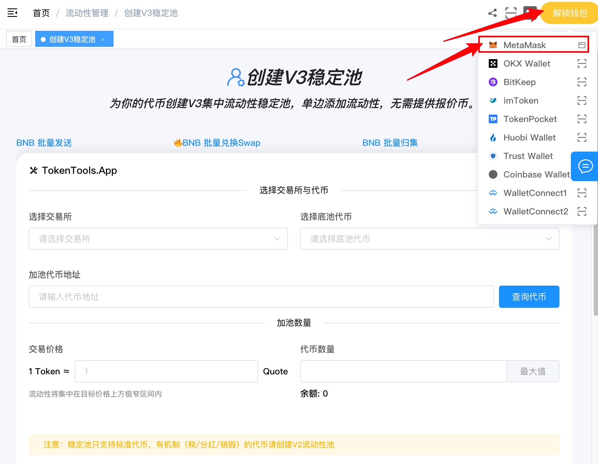
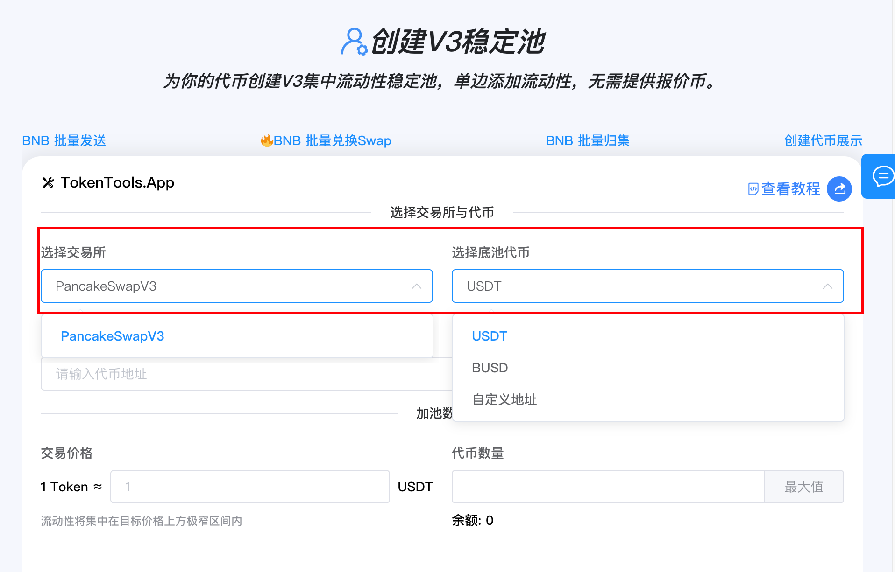
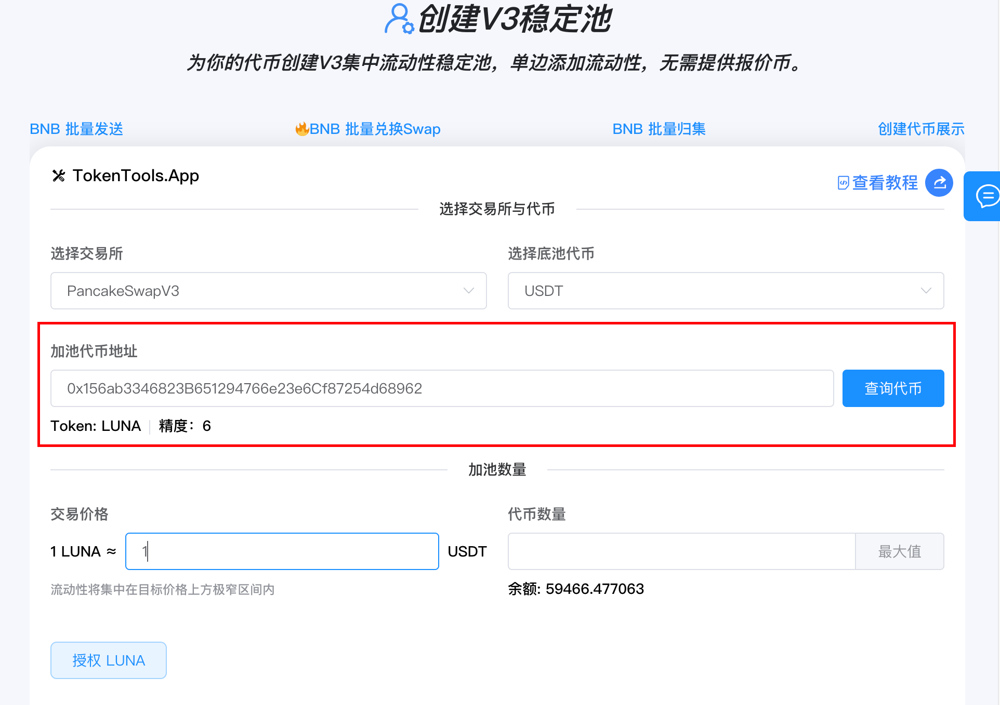
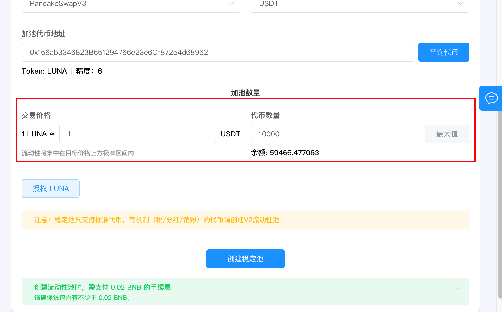
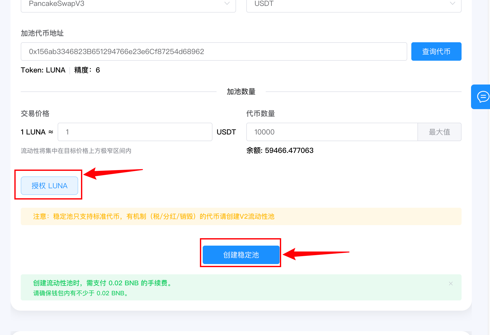

# 创建V3稳定池教程

> 为你的代币创建 V3 集中流动性稳定池，单边添加流动性，无需提供稳定币。适配 PancakeSwap V3、UniSwap V3 等主流 V3 DEX。

> **点击加入 [TokenTools官方交流群](https://t.me/tokentool_app) 交流反馈**
>
> **推荐使用电脑版谷歌浏览器 + `Metamask` 插件钱包进行操作**
>
> **手机用户也可以在 `MetaMask钱包`-发现-输入官网链接 进行操作**


## 简介

TokenTools 的 **创建 V3 稳定池**工具专为稳定币、同质化代币打造，适配 PancakeSwap-V3、Uniswap-V3 等 V3 系列 DEX。

底池固定选用 USDT 等稳定币，池子手续费锁定 0.01%，专为稳定币、同质化代币创建**窄区间集中流动性**；可自定义初始开盘价，资金集中锚定平价位置，资金利用率远高于 V2 池子，降低交易滑点、积攒交易手续费收益。

### 📌 核心特性

- **单边添加流动性**：只需提供您的代币，无需同时提供 USDT，一键完成建池

- **窄区间集中流动性**：流动性集中在目标价格上方的极窄区间内，资金利用率远超 V2 池子

- **自定义初始开盘价**：自由设定 1 代币 = 多少 USDT 的开盘价，灵活掌控发行节奏

- **手续费锁定 0.01%**：自动使用交易所支持的最低手续费等级，降低交易成本

- **多 DEX 支持**：适配 PancakeSwap V3、UniSwap V3 等多条链的 V3 交易所



**创建V3稳定池 | 单边建池 | 资金利用率远超V2 | 全网最低费用**

为你的代币创建 V3 集中流动性稳定池，资金集中锚定平价位置，降低交易滑点、积攒交易手续费收益。

[立即体验>>>](https://tokentools.app/liquidity/createV3Stable)




## 什么是 V3 稳定池？

### V3 集中流动性

与传统 V2 流动性（全价格范围均匀分布）不同，V3 允许流动性提供者将资金**集中在特定的价格区间**内：

```
V2: 资金分布在 0 到 ∞ 的整个价格范围（大部分资金闲置）
V3: 资金集中在 [目标价, 目标价+极小] 的窄区间（资金全部被利用）
```

### 稳定池的优势

对于稳定币和同质化代币（价格基本锚定 1:1 的代币）：

- **资金利用率高**：集中在一个极窄的价格区间，同样的资金提供更深的流动性
- **交易滑点低**：深度更好的池子，大额交易对价格的影响更小
- **手续费收益高**：更集中的流动性 → 更高的手续费分成比例
- **单边建池**：创建时只需提供您的代币，无需准备大量 USDT


## 准备事项

1. 一台电脑或一部手机，支持桌面端和移动端访问
2. MetaMask（小狐狸）钱包，[安装教程](https://metamask.io/download/)
3. 钱包最少准备 **0.001 BNB** 作为 Gas 汽油矿工费用 + **服务费**
4. 您的代币余额，确保钱包中有足够的代币用于添加流动性
5. 确认您的代币是**标准代币**（没有税、分红、销毁等特殊机制）


**重要**：V3 稳定池只支持**标准代币**（无买卖税、无分红、无销毁机制）。如果您的代币有特殊机制，请使用 [创建 V2 流动性池](https://tokentools.app/liquidity/createV2) 功能。



## 操作步骤

### 第 1 步：连接钱包

1. 打开页面：[https://tokentools.app/liquidity/createV3Stable](https://tokentools.app/liquidity/createV3Stable)
2. 点击右上角，连接 **MetaMask（小狐狸）钱包**
3. 选择你要操作的目标链（BSC / Ethereum 等）



连接成功后，页面会显示当前链名称和您的钱包地址。

### 第 2 步：选择交易所和底池币

**选择交易所**：从下拉列表中选择 V3 DEX：Ethereum(UniSwapV3)、BSC（PancakeSwapV3） 等V3系列Dex
**选择底池币**：选择您的代币将与哪种稳定币组成交易对：USDT（最常用）、USDC、其他预设稳定币
**自定义地址**：输入任意 ERC20 稳定币合约地址（如 DAI）




**提示**：底池币建议选择流动性好、用户基础大的稳定币（如 USDT、USDC、BUSD），有利于后续交易活跃度。



### 第 3 步：输入代币地址并查询

1. 在"加池代币地址"输入框中粘贴您的代币合约地址
2. 系统会**自动识别**并查询代币信息（也可点击"查询代币"按钮手动查询）
3. 查询成功后显示：**代币名称、精度、钱包余额**




### 第 4 步：设置交易价格和数量

1. 在"交易价格"输入框中设置您的代币的**初始开盘价**：

```
1 {您的代币} ≈ [  X  ] {USDT}
例如：输入`1`, 1 个您的代币 = 1 USDT（平价锚定） 
```

2. 设置添加数量 在"代币数量"输入框中输入您要添加的代币数量。




**什么是窄区间？** 系统会自动将流动性集中在目标价格**上方极窄的一个格子**内。例如设置价格为 1，流动性就集中在 [1, 1.0001] 这个区间，资金全部锚定在平价位置。
**单边添加的优势**：您只需要提供您的代币，**不需要提供 USDT**！系统会自动在目标价格上方建立窄区间流动性仓位，您的代币 100% 进入池子。



### 第 5 步：授权操作，并确认操作

点击 **「授权 {您的代币}」** 按钮，授权您的代币给加池合约。
一切准备就绪后，点击 **「创建稳定池」** 按钮。



等待片刻后，交易完成。您的 V3 流动性仓位已创建成功，可以在 [流动性管理页面](https://tokentools.app/liquidity/manage) 查看和管理您的 V3 仓位。


## 常见问题 FAQ

**Q：V3 稳定池和 V2 流动性池有什么区别？**

A：

| | V2 流动性池 | V3 稳定池 |
|------|------|------|
| 价格范围 | 全范围（0 到 ∞） | 窄区间（目标价上方一个格子） |
| 资金利用率 | 低（大部分资金闲置） | 高（资金全部被利用） |
| 添加方式 | 双边（两种代币都要） | **单边（只需您的代币）** |
| 仓位凭证 | LP 代币 | LP NFT |
| 适合代币 | 标准/税机制代币 | 稳定币、标准代币 |

**Q：为什么 V3 稳定池只需要单边添加？**

A：系统会在目标价格**上方**建立极窄区间仓位。在这个区间内，仓位 100% 由您的代币构成，因此只需要提供您的代币，不需要提供 USDT。

**Q：什么代币适合创建 V3 稳定池？**

A：适合价格锚定在 1:1 附近的代币，包括：

- 稳定币（如 USSD、DAI 等新稳定币）
- 同质化代币（与 USDT 等稳定币保持 1:1 兑换关系的代币）

**Q：代币价格可以随意设置吗？**

A：可以。您可以在第 4 步自由设置初始开盘价（1 代币 = 多少 USDT）。但建议根据代币的实际定位合理设置：

- 稳定币、同质化代币：设置 `1`
- 其他代币：根据发行计划设置

**Q：为什么锁定 0.01% 手续费？**

A：0.01% 是 V3 交易所支持的最低手续费等级。更低的手续费意味着：

- 交易者的交易成本更低
- 更适合稳定币等低波动代币的频繁交易
- 吸引更多交易量 → 流动性提供者赚取更多手续费

**Q：创建失败怎么办？**

A：请检查以下几点：

- 钱包余额是否足够（服务费 + Gas 费）
- 授权是否完成
- 代币是否是标准代币（有特殊机制请使用 V2 功能）
- 价格和数量是否已填写

**Q：我的仓位在哪里查看？**

A：V3 仓位以 **NFT** 形式发放到您的钱包。可以在 [流动性管理页面](https://tokentools.app/liquidity/manage) 的 V3 标签页查看仓位详情、添加更多流动性或移除流动性。

**Q：支持哪些链和交易所？**

A：目前支持 Ethereum、BSC、Base、X Layer、Robinhood 等链的 V3 交易所（UniSwap V3、PancakeSwap V3 等）。不同链可选的交易所不同。

**Q：如何设置自定义底池币？**

A：底池币下拉列表中选择"自定义地址"，输入任意 ERC20 稳定币合约地址（如 DAI）即可。系统会自动查询该代币的信息。


## 联系与支持

如果在使用过程中遇到任何问题，欢迎通过以下方式联系我们：

- 📧 Email：tokentool.app@gmail.com
- 📱 Telegram：[https://t.me/tokentool_app](https://t.me/tokentool_app)
- 🐦 Twitter / X：[https://x.com/tokentool_app](https://x.com/tokentool_app)

