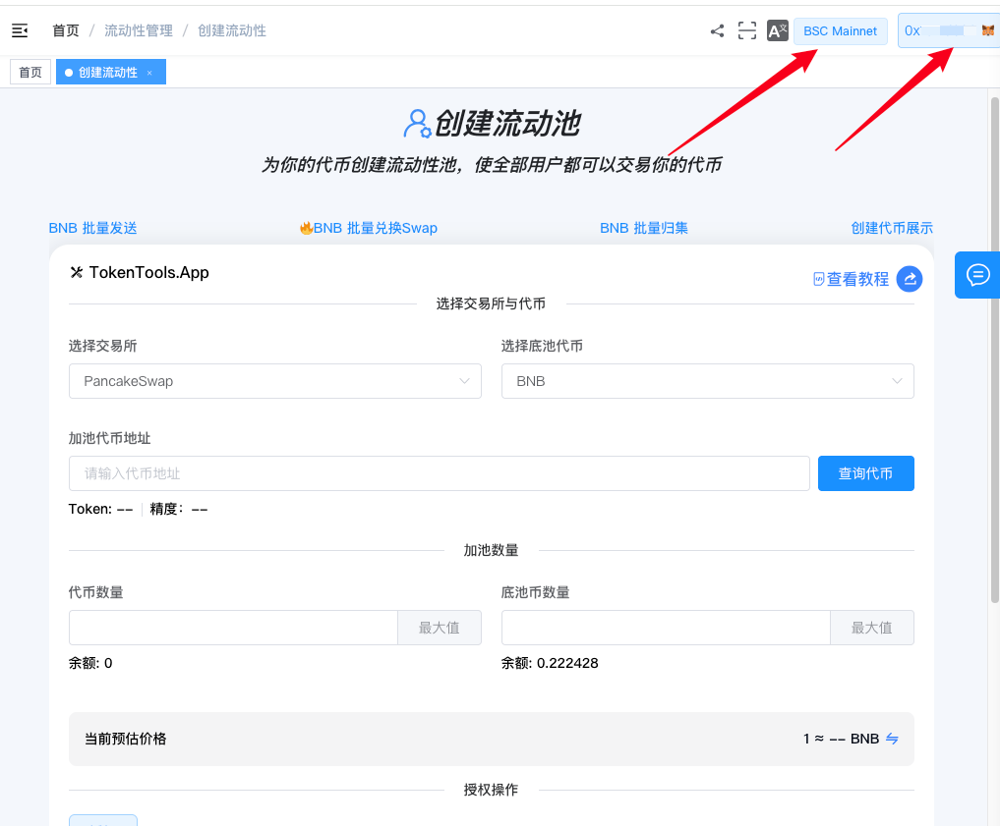
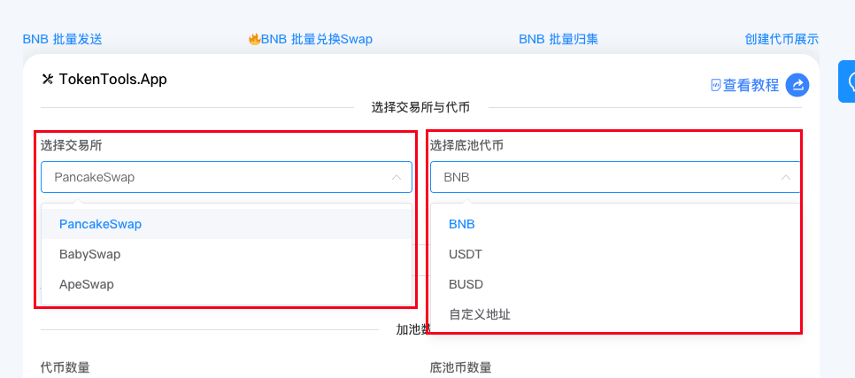
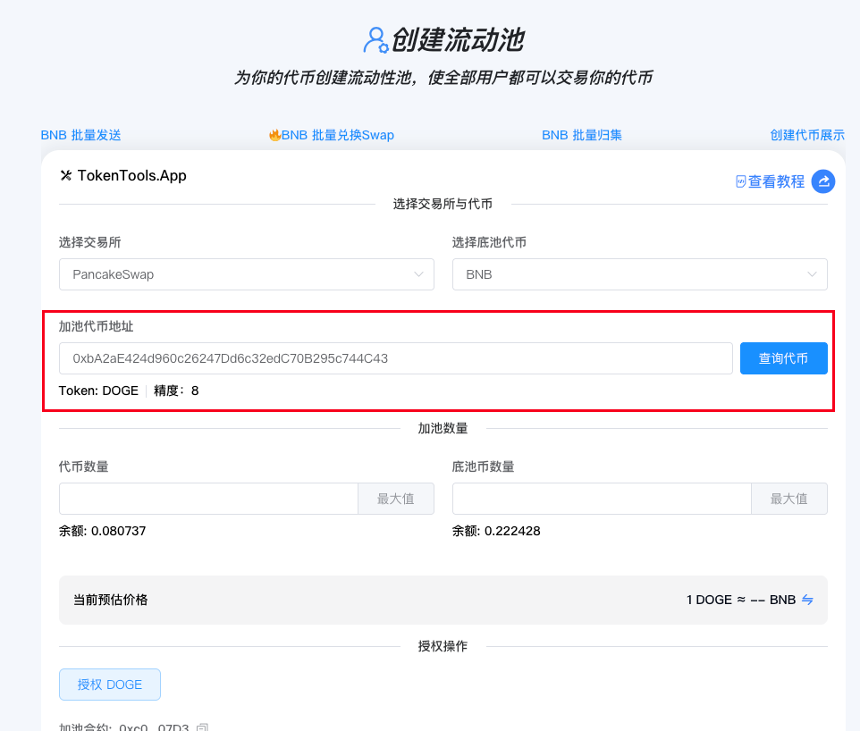
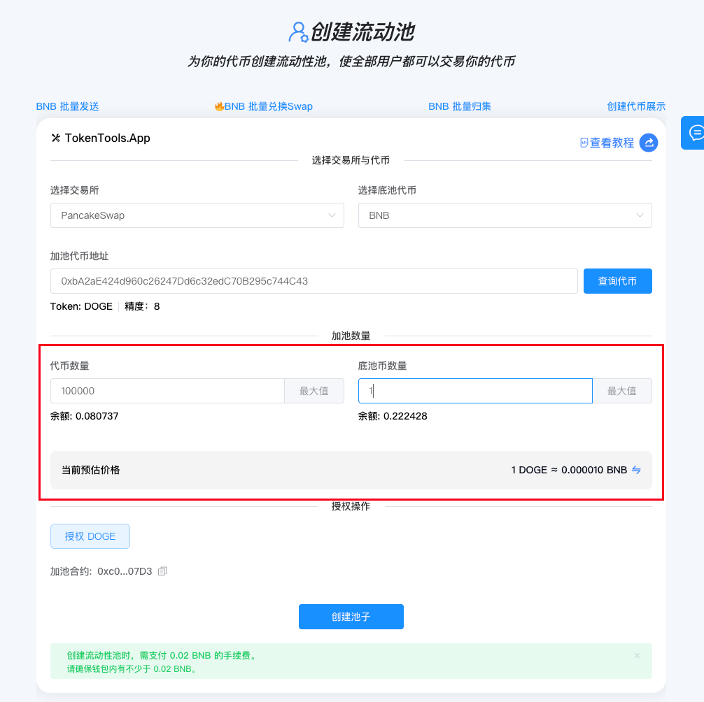
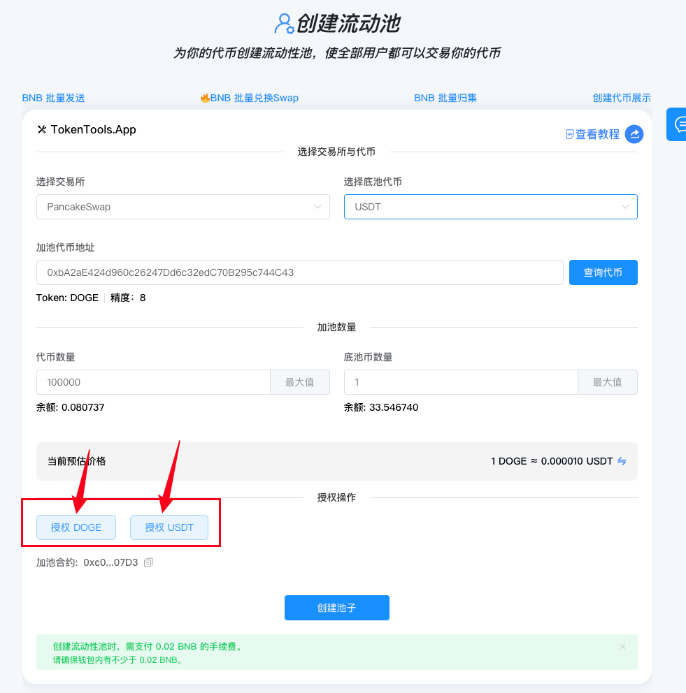
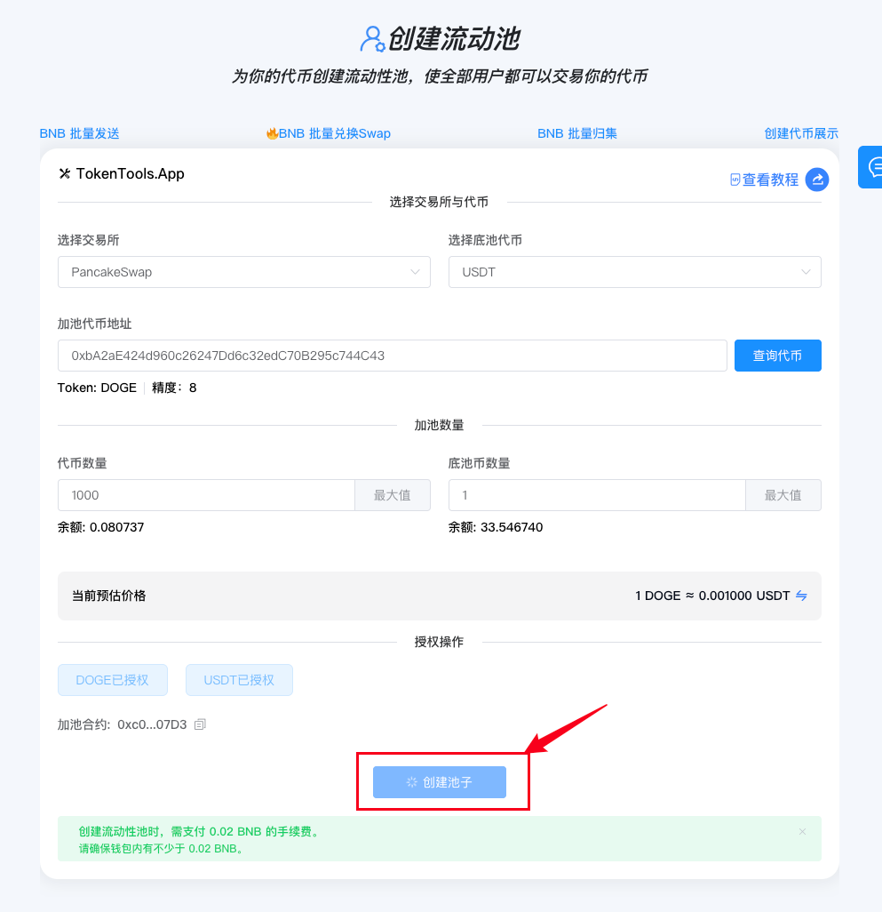

# 创建V2流动性池教程

> 为你的代币创建 V2 流动性池，让所有用户都可以交易你的代币。支持 Uniswap V2 / PancakeSwap / SushiSwap 等主流 DEX。

> **点击加入 [TokenTool官方交流群](https://t.me/tokentool_app) 交流反馈**
> **推荐使用电脑版谷歌浏览器 + `Metamask` 插件钱包进行操作**
> **手机用户也可以在 `TP钱包`-发现-输入官网链接 进行操作**

---

## 简介

TokenTools 的 **创建 V2 流动性池**工具支持在主流 V2 去中心化交易所（DEX）上为你的代币创建流动性池，让用户可以自由买卖你的代币。

### 📌 核心特性

- **多链多交易所支持**：支持 Ethereum、BSC、Polygon、Arbitrum、Optimism、Base 等多条链的 V2 DEX（UniSwap V2、PancakeSwap、SushiSwap、QuickSwap 等）

- **底池币灵活选择**：支持 BNB/ETH 等原生代币和 USDT/USDC 等 ERC20 稳定币作为底池币，也可以自定义输入任意代币合约地址

- **价格自动预估**：输入数量后实时计算交易价格，支持价格方向反转显示



**创建V2流动性池 | 让代币拥有流动性 | 全网最低费用**
为你的代币创建流动性池，使全部用户都可以交易你的代币。
[立即体验>>>](https://tokentools.app/liquidity/createV2)



---

## 什么是 V2 流动性池？

V2 流动性池是去中心化交易所（DEX）的核心机制：

- **恒定乘积公式**：`token0 数量 × token1 数量 = 恒定值`
- **无需订单簿**：买卖双方直接与流动性池交易
- **流动性提供者（LP）**：为池子提供两种代币，获得交易手续费分成
- **价格由池子自动决定**：买入代币越多，价格越高


**提示**：创建流动性池时，代币的价格由你添加的两种代币的比例决定。例如添加 10000 个代币 + 1 个 BNB，初始价格就是 1 代币 = 0.0001 BNB。


## 准备事项

1. 一台电脑或一部手机，支持桌面端和移动端访问
2. MetaMask（小狐狸）钱包，[安装教程](https://metamask.io/download/)
3. 钱包最少准备 **0.002 BNB** 作为 Gas 汽油矿工费用
5. 底池币余额，如果是 USDT/USDC 等 ERC20 代币，确保钱包中有足够的底池币


**安全提醒**：创建流动性池前请确认你的代币合约没有特殊机制（如合约限制转账、黑名单、买卖税等），部分特殊代币可能导致加池失败或无法撤池。建议先在小额测试后再大规模添加流动性。


## 操作步骤

### 第 1 步：连接钱包

1. 打开页面：[https://tokentools.app/liquidity/createV2](https://tokentools.app/liquidity/createV2)
2. 点击右上角，连接 **MetaMask（小狐狸）钱包**
3. 选择你要操作的目标链（Ethereum / BSC / Polygon 等）


连接成功后，页面会显示当前链名称和您的钱包地址。


### 第 2 步：选择交易所和底池币

**选择交易所**：从下拉列表中选择你要创建流动性池的 DEX：

**选择底池币**：选择你的代币将与哪种币组成交易对：

- **BNB / ETH**（原生代币）：最常用的底池币
- **USDT / USDC**（稳定币）：适合稳定价格锚定
- **其他代币**：自定义输入任意 ERC20 代币合约地址

### 第 3 步：输入代币地址并查询

1. 在"加池代币地址"输入框中粘贴你的代币合约地址
2. 系统会**自动识别**并查询代币信息（也可点击"查询代币"按钮手动查询）
3. 查询成功后显示：**代币名称、精度**

---

### 第 4 步：设置加池数量

在"加池数量"区域输入两种代币的数量：

**代币数量**：你要添加到池子中的你的代币数量

**底池币数量**：你要添加到池子中的底池币（BNB/USDT等）数量

- **手动输入**：直接输入数量
- **一键 MAX**：点击 `MAX` 按钮自动填入钱包全部可用余额
- **余额显示**：输入框下方实时显示钱包当前余额


**重要**：
- 代币价格 = 底池币数量 ÷ 代币数量
- 例如：添加 100000 个代币 + 1 BNB，初始价格 = 1 代币 = 0.00001 BNB
- 系统会自动校验输入数量是否超过钱包余额


### 第 5 步：授权操作

点击授权按钮，分别授权两种代币：

- **授权 {你的代币}**：授权你的代币给加池合约
- **授权 {底池币}**：授权底池币给加池合约（BNB/ETH 无需授权）


**提示**：
- 授权是**一次性操作**，授权完成后按钮会变为"已授权"状态
- 如果选择 BNB/ETH 作为底池币，无需授权，系统会自动跳过


### 第 6 步：一键创建流动性池

一切准备就绪后，点击 **「立即加池」** 按钮。

钱包完成确认交互，等待片刻后，交易完成。你可以在 [流动性管理页面](https://tokentools.app/liquidity/manage) 查看你的 LP 持仓，也可以直接到对应 DEX 上查看交易对。


🎉 如果代币有特殊的功能，如果手动开盘、持仓限制、转账限制、转账税等，请先将【加池合约】地址加到白名单中。


## 常见问题 FAQ

**Q：支持哪些链？**
A：目前支持 Ethereum、BSC、Polygon、Arbitrum、Optimism、Base、X Layer、Robinhood 等多条链的 V2 DEX。不同链可选的交易所不同。

**Q：创建流动性池失败怎么办？**
A：请检查以下几点：

- 钱包余额是否足够（代币 + 底池币 + Gas 费 + 服务费）
- 授权是否完成
- 代币是否有特殊机制（合约限制转账、黑名单、买卖税等，请先将【加池合约】地址加到白名单中。）

**Q：代币价格是怎么确定的？**
A：初始价格由你添加的两种代币数量比例决定：**价格 = 底池币数量 ÷ 代币数量**。创建后价格会随交易动态变化。

**Q：是否需要同时提供两种代币？**
A：是的。V2 流动性池需要同时提供两种代币（你的代币 + 底池币），比例由你决定，这决定了初始价格。

**Q：LP 凭证在哪里查看？**
A：加池成功后，LP 凭证（流动性代币）自动发放到你的钱包。可以在 [流动性管理页面](https://tokentools.app/liquidity/manage) 查看 LP 持仓、添加更多流动性或移除流动性。

**Q：可以选择自定义底池币吗？**
A：可以。底池币下拉列表中选择"自定义地址"，输入任意 ERC20 代币合约地址即可。系统会自动查询该代币的信息和余额。

## 联系与支持

如果在使用过程中遇到任何问题，欢迎通过以下方式联系我们：

- 📧 Email：tokentool.app@gmail.com
- 📱 Telegram：[https://t.me/tokentool_app](https://t.me/tokentool_app)
- 🐦 Twitter / X：[https://x.com/tokentool_app](https://x.com/tokentool_app)

