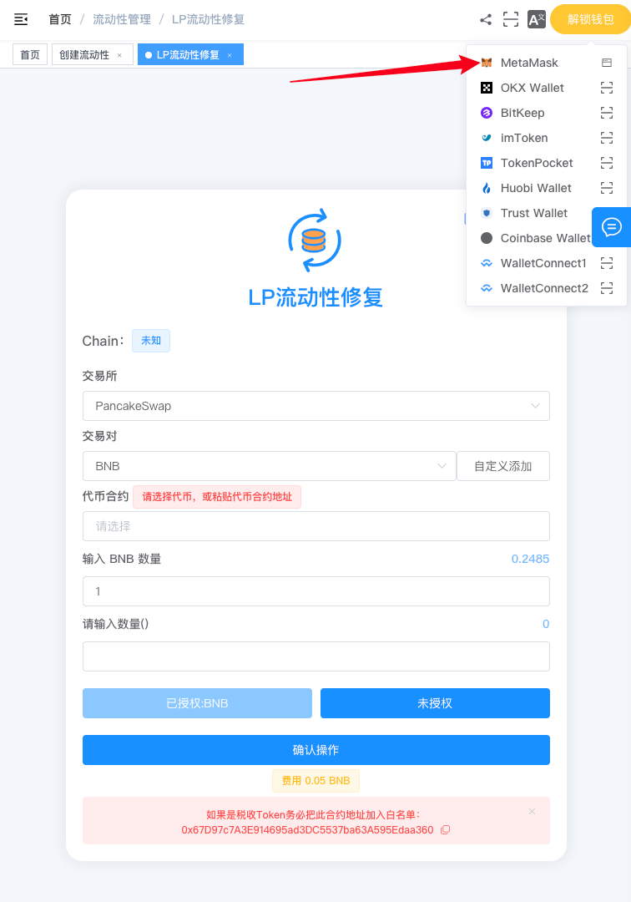
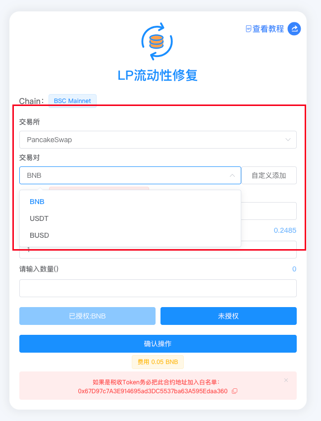
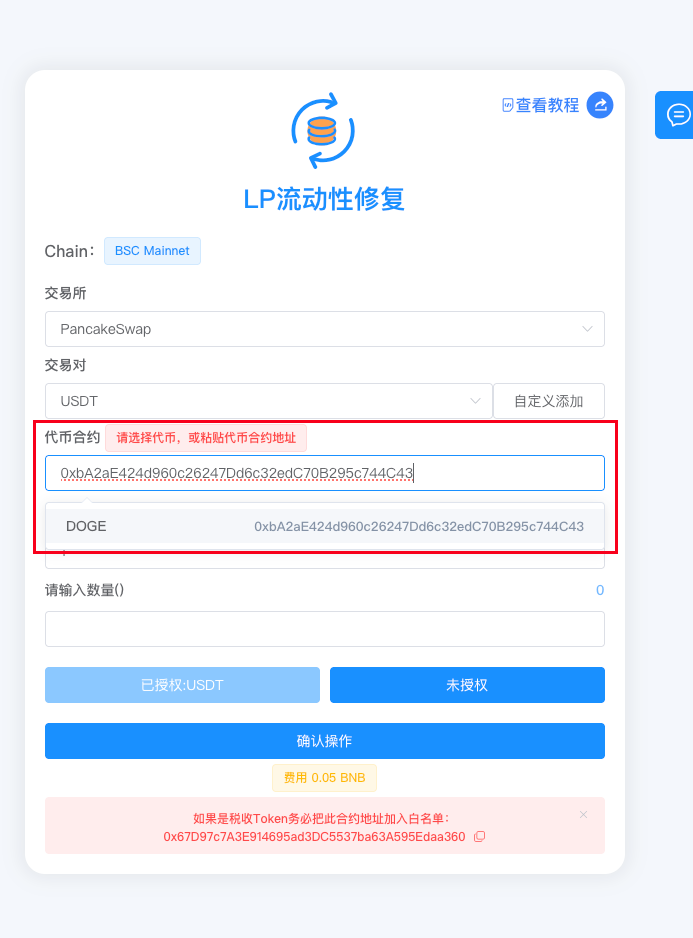
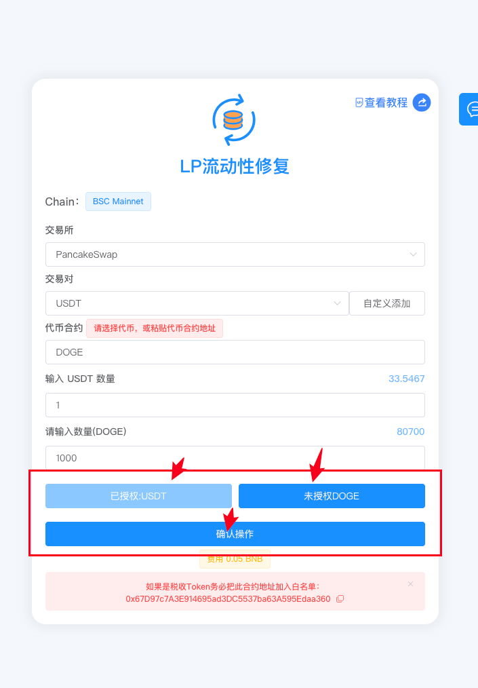

# 流动性修复教程

> 修复 V2 流动性池异常状态，解决因他人误转账导致的加池失败问题，让您的流动性恢复正常。

> **点击加入 [TokenTools官方交流群](https://t.me/tokentool_app) 交流反馈**
>
> **推荐使用电脑版谷歌浏览器 + `Metamask` 插件钱包进行操作**
>
> **手机用户也可以在 `TP钱包`-发现-输入官网链接 进行操作**


## 简介

TokenTools 的 **流动性修复**工具用于修复 V2 流动性池的异常状态，解决因他人向池子地址误转代币导致的加池失败问题。



**流动性修复 | 解决加池失败 | 一键修复池子**

修复 V2 流动性池异常状态，恢复正常添加流动性。

[立即体验>>>](https://tokentools.app/liquidity/fixLp)




## 为什么需要修复流动性？

### 问题场景

在去中心化交易所（DEX）中，流动性池是通过**恒定乘积公式**运行的：

```
代币数量 × 底池币数量 = 恒定值
```

正常情况下，添加流动性必须**严格按照池子当前的比例**同时添加两种代币。系统会根据池子的储备量自动计算需要添加的数量。

**但是**，如果有人**直接向池子合约地址转账**（而不是通过"添加流动性"功能），比如：

> 某用户直接向 USDT-代币 交易对的池子地址转了 0.000000000000000001 USDT

这会导致池子中 USDT 的**实际余额**和系统记录的**储备量（Reserves）不一致**。之后再添加流动性时，合约计算的比例就会出错，导致**加池交易一直失败**。

### 修复原理

流动性修复功能通过特殊的方式重新平衡池子，让储备量与实际余额一致，恢复正常的加池功能。


**通俗理解**：就像别人往你的水桶里滴了一滴墨，导致水桶"不纯净"了。修复功能就是把水桶重新校准，让它恢复正常使用。



## 准备事项

1. 一台电脑或一部手机，支持桌面端和移动端访问
2. MetaMask（小狐狸）钱包，[安装教程](https://metamask.io/download/)
3. 钱包最少准备 **0.001 BNB** 作为 Gas 汽油矿工费用
4. 钱包中持有需要修复的流动性池对应的**底池币**和**代币**


**注意**：修复操作需要您同时提供两种代币（底池币 + 您的代币），用于重新校准池子比例。请确保钱包中有足够的余额。



## 操作步骤

### 第 1 步：连接钱包

1. 打开页面：[https://tokentools.app/other/fixLp](https://tokentools.app/other/fixLp)
2. 点击右上角，连接 **MetaMask（小狐狸）钱包**
3. 选择你要操作的目标链（BSC / Ethereum 等）



连接成功后，页面顶部会显示当前的链名称。


### 第 2 步：选择交易所

从"交易所"下拉列表中选择您的流动性池所在的 DEX：

- PancakeSwap（BSC 链）
- UniSwap（Ethereum 链）
- 其他支持 V2 的 DEX

选择您的交易对中的底池币（如 USDT、BNB 、BUSD等）：

- 从下拉列表选择常见的底池币
- 如果列表中没有，点击 **「自定义添加」** 按钮，输入代币合约地址添加





**重要**：底池币必须与您需要修复的交易对中的底池币**完全一致**。



### 第 4 步：选择您的代币

选择需要修复的交易对中的另一个代币（您自己的代币）：

- 粘贴合约地址后进行选择




### 第 5 步：输入修复数量

选择代币后，系统会自动查询并显示您的钱包余额：

**底池币数量**：输入您要添加到池子中的底池币数量（如 USDT）

**代币数量**：输入您要添加到池子中的代币数量

点击授权按钮，分别授权两种代币：

- **授权底池币**：授权 USDT/BNB 等底池币给修复合约
- **授权代币**：授权您的代币给修复合约






**提示**：

- 授权是**一次性操作**，完成后按钮会显示"已授权"
- 如果底池币是 BNB/ETH（原生代币），无需授权，系统会自动跳过
- **注意**：页面底部红色提示框中的**白名单地址**（修复合约地址）。如果您的代币有特殊机制（转账限制、买卖税等），请先将该地址加入代币合约的白名单中



一切准备就绪后，点击 **「确认操作」** 按钮。



交易完成后，弹出交易详情对话框，您可以点击查看交易哈希。

🎉 恭喜！流动性修复完成，您现在可以正常添加流动性了！


## 常见问题 FAQ

**Q：什么情况下需要修复流动性？**

A：当出现以下情况时，可能需要修复：

- 有人直接向池子合约地址转账了代币（不是通过"添加流动性"操作）
- 添加流动性交易一直失败
- 池子的实际余额和储备量不一致

**Q：修复流动性会不会影响池子中的现有资产？**

A：不会。修复操作只会**重新校准**池子的储备量记录，您和其他流动性提供者的资产都是安全的。修复过程本身添加的少量代币会成为新的流动性。

**Q：为什么别人的误转账会导致加池失败？**

A：V2 流动性池按照恒定乘积公式运行。如果池子合约地址直接收到了一笔转账（没有经过"添加流动性"流程），池子的实际余额和内部记录的储备量就会不一致。后续添加流动性时，合约按照储备量计算比例，但实际转账时发现余额对不上，交易就会失败。

**Q：修复失败怎么办？**

A：请检查以下几点：

- 交易所和底池币是否选择正确
- 代币是否选择正确
- 授权是否完成
- 代币是否有特殊机制（转账限制、买卖税等），如有请先将修复合约地址加入白名单

**Q：修复一次需要多少费用？**

A：修复费用以页面显示为准，全网最低费用。如果使用 BNB/ETH 作为底池币，费用合并到修复交易中一起支付。

**Q：修复后还需要做什么？**

A：修复完成后，池子恢复正常。您可以直接使用 [流动性管理](https://tokentools.app/liquidity/manage) 功能正常添加流动性/移除流动性操作。

**Q：代币有特殊机制（转账限制、买卖税等）怎么处理？**

A：如果您的代币有特殊机制，请先将页面显示的**修复合约地址**加入代币合约的白名单（免除转账限制/税费），否则修复交易可能失败。


## 联系与支持

如果在使用过程中遇到任何问题，欢迎通过以下方式联系我们：

- 📧 Email：tokentool.app@gmail.com
- 📱 Telegram：[https://t.me/tokentool_app](https://t.me/tokentool_app)
- 🐦 Twitter / X：[https://x.com/tokentool_app](https://x.com/tokentool_app)
