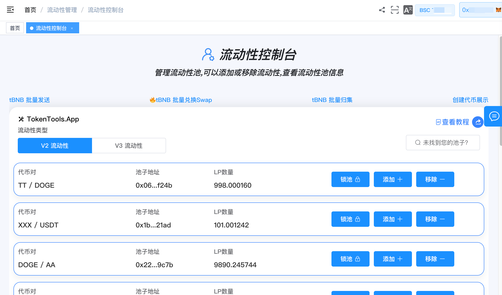
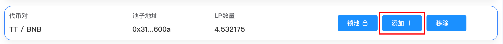
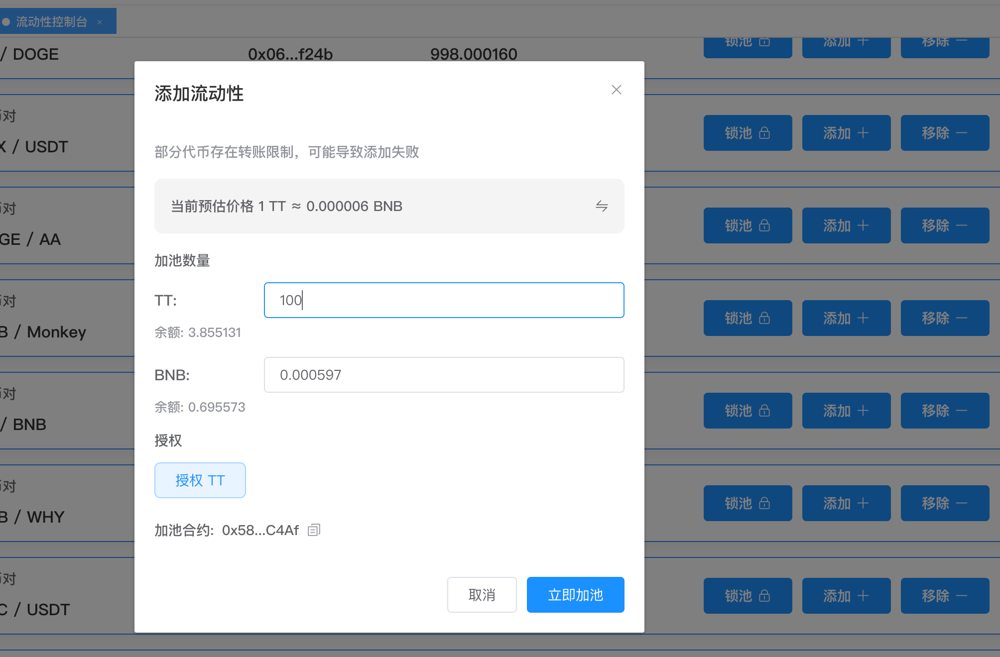
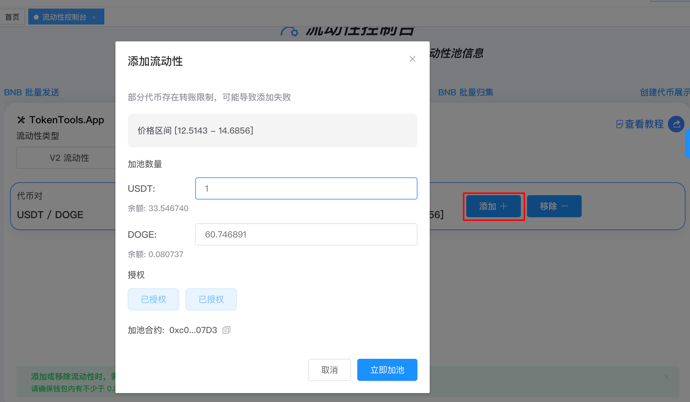
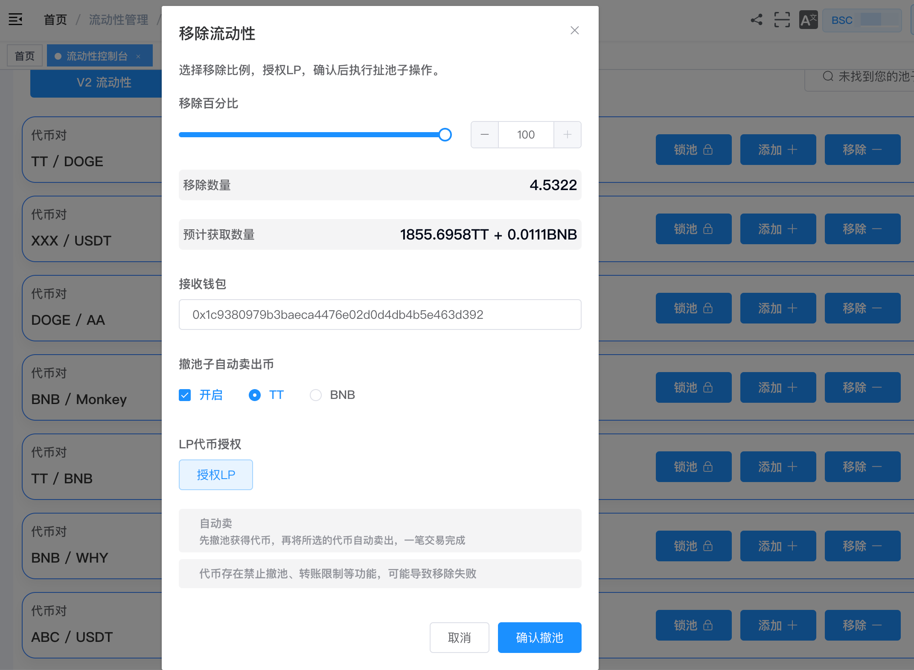

# 增加/移除流动性资金池教程

> 管理您的 V2 / V3 流动性仓位，支持添加流动性、移除流动性、查找池子，以及跳转锁池功能。

> **点击加入 [TokenTools官方交流群](https://t.me/tokentool_app) 交流反馈**
>
> **推荐使用电脑版谷歌浏览器 + `Metamask` 插件钱包进行操作**
>
> **手机用户也可以在 `Metamask钱包`-发现-输入官网链接 进行操作**

## 简介

如果您已经在 PancakeSwap、Uniswap 等去中心化交易所创建了流动性资金池，可以通过 TokenTools 的**流动性控制台**统一查看和管理您名下的所有流动性仓位。



**流动性控制台 | V2/V3 仓位统一管理 | 全网最低费用**

管理流动性池，可以添加或移除流动性，查看流动性池信息。

[立即体验>>>](https://tokentools.app/liquidity/manage)



流动性控制台支持以下操作：

- **锁池**：将 V2 流动性代币（LP）锁定在合约中，锁定期间无法取出，从而无法撤出流动性（详细操作请参考 [锁池子教程](https://docs.tokentools.app/lock/lock-create-liquidity)）
- **添加流动性**：继续向池子内注入代币，扩大资金池深度
- **移除流动性**：将池子中的资金按比例取出
- **查找流动性**：通过代币地址 + 底池代币，查找未自动识别的流动性池

## 准备事项

1. 一台电脑或一部手机，支持桌面端和移动端访问
2. MetaMask（小狐狸）钱包，[安装教程](https://metamask.io/download/)
3. 钱包最少准备 **0.001 BNB** 作为 Gas 汽油矿工费用
4. 确认您的钱包中已持有流动性仓位（LP 代币或 V3 NFT）

## 操作步骤

### 第 1 步：连接钱包并查看仓位

1. 打开页面：[https://tokentools.app/liquidity/manage](https://tokentools.app/liquidity/manage)
2. 点击右上角，连接 **MetaMask（小狐狸）钱包**
3. 选择您流动性所在的链（BSC / Ethereum 等）

连接成功后，系统会自动查询当前钱包名下的流动性仓位，以列表形式展示.


**未找到您的池子？** 如果系统没有自动识别出您的流动性仓位，请点击页面右上角的 **「未找到您的池子？」** 按钮，通过代币地址和底池代币手动查找。


### 第 2 步：添加流动性

添加流动性（也称"增加流动性"）是指当您的池子深度不足、可供交易的金额较小时，向池子中注入更多代币，扩大资金池。

在仓位列表中点击 **「添加」** 按钮，进入添加流动性对话框：

**V2 流动性添加：**

- **当前价格**：显示当前池子的交易价格，支持点击 ⇅ 图标反转显示
- **加池数量**：分别输入两种代币的添加数量（基础代币 + 报价代币），系统会根据池子比例自动换算另一种代币的数量
- **余额显示**：实时显示钱包中两种代币的可用余额
- **授权**：分别授权基础代币和报价代币（BNB/ETH 无需授权）
- **立即加池**：确认数量与授权后，点击提交，钱包确认后完成

**V3 流动性添加：**

- **价格区间**：显示当前仓位的价格区间（只读）
- **加池数量**：按仓位当前持仓比例添加，系统自动计算两种代币数量
- **授权**：分别授权两种代币
- **立即加池**：确认后提交，钱包确认后完成


**加池成功提示**：添加完成后，页面会提示"添加流动性成功"，仓位列表中的数据会自动刷新。


### 第 3 步：移除流动性

移除流动性（也称"撤池子"）是指将流动性资金池内的代币按比例撤出。撤出的代币归操作钱包所有。

在仓位列表中点击 **「移除」** 按钮，进入移除流动性对话框：

**移除参数设置：**

- **移除百分比**：选择撤出比例，范围 1% - 100%（100% 即全部撤出）
- **移除数量**：由百分比自动计算出的 LP / 流动性数量
- **预计获取数量**：预计可获得的两种代币数量
- **接收钱包**：接收撤出代币的钱包地址，默认为当前操作钱包
- **自动卖出**（仅 V2）：撤池后自动将获得的代币卖出

**授权操作：** LP 代币授权

确定好移除比例和接收钱包后，点击 **「确认撤池」** 按钮，钱包确认后等待几秒即可完成。

### 第 4 步：锁住流动性（锁池）

锁池是将流动性代币锁定在合约中，锁定期间无法取出，从而杜绝项目方"撤池跑路"的风险，是建立投资者信任的重要手段。


**注意**：锁池功能仅支持 **V2 流动性**（LP 代币为 ERC20 形式，可锁定）。V3 仓位为 NFT 形式，暂不支持锁池——切换到 V3 标签页时不会显示"锁池"按钮。


在 V2 仓位列表中点击 **「锁池」** 按钮，系统将**自动跳转至 TokenTools 锁池功能页面**，并在锁池页面中完成操作.
详细的锁池操作步骤请参考 [锁池子教程](https://docs.tokentools.app/lock/lock-create-liquidity)。

## 常见问题 FAQ

**Q：为什么加池/撤池会失败？**

A：请依次检查：
- 钱包是否有足够的原生代币（如 BSC 链至少 0.001 BNB 作为 Gas 费 + 服务费）
- 代币是否存在特殊机制（池子限制、持仓限制、买卖税等），如有需要将【加池合约】提示的地址加入白名单操作
- 是否完成授权操作

**Q：锁池后代币还能交易吗？**

A：可以。锁池只是限制流动性提供者撤出流动性，不会影响代币的正常交易。

**Q：锁池可以提前取出 LP 吗？**

A：不可以。必须严格遵循锁定时间，到期之前任何人无法取回 LP。

**Q：移除/添加/锁池会收取费用吗？**

A：添加流动性、移除流动性按次收费，费用以页面提示为准。锁池功能请参考锁池页面的费用说明。

**Q：为什么我的池子没有显示在列表中？**

A：请检查：

- 钱包是否正确连接，网络是否切换到池子所在链
- V2 池子请确认在"V2 流动性"标签页查看，V3 仓位请在"V3 流动性"标签页查看
- 切换标签页后系统会自动重新查询
- 如果仍然找不到，请使用 **「未找到您的池子？」** 功能，输入代币地址手动查找

**Q：移除流动性时可以选择"自动卖出"吗？**

A：V2 流动性支持"撤池子自动卖出币"功能：先撤池获得代币，再将所选代币自动卖出，一笔交易完成。V3 流动性暂不支持自动卖出。

**Q：如何查找未自动识别的流动性池？**

A：点击页面右上角的 **「未找到您的池子？」** 按钮，在弹窗中：

- 选择交易所（DEX）
- 输入您的代币地址
- 选择或输入底池代币（如 USDT、BNB）
- 点击查询，系统将通过链上合约自动 查询对应交易对

**Q：添加流动性时数量会自动换算吗？**

A：会。V2 流动性添加时，系统会根据池子当前的储备比例自动换算另一种代币的数量；V3 流动性添加时，系统按仓位当前持仓比例自动计算。您只需输入一种代币的数量即可。

## 联系与支持

如果在使用过程中遇到任何问题，欢迎通过以下方式联系我们：

- 📧 Email：tokentool.app@gmail.com
- 📱 Telegram：[https://t.me/tokentool_app](https://t.me/tokentool_app)
- 🐦 Twitter / X：[https://x.com/tokentool_app](https://x.com/tokentool_app)

