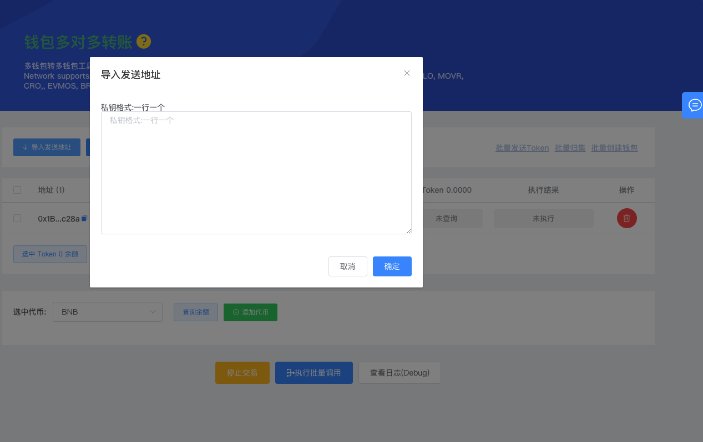
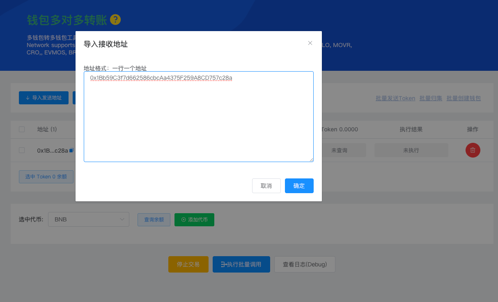
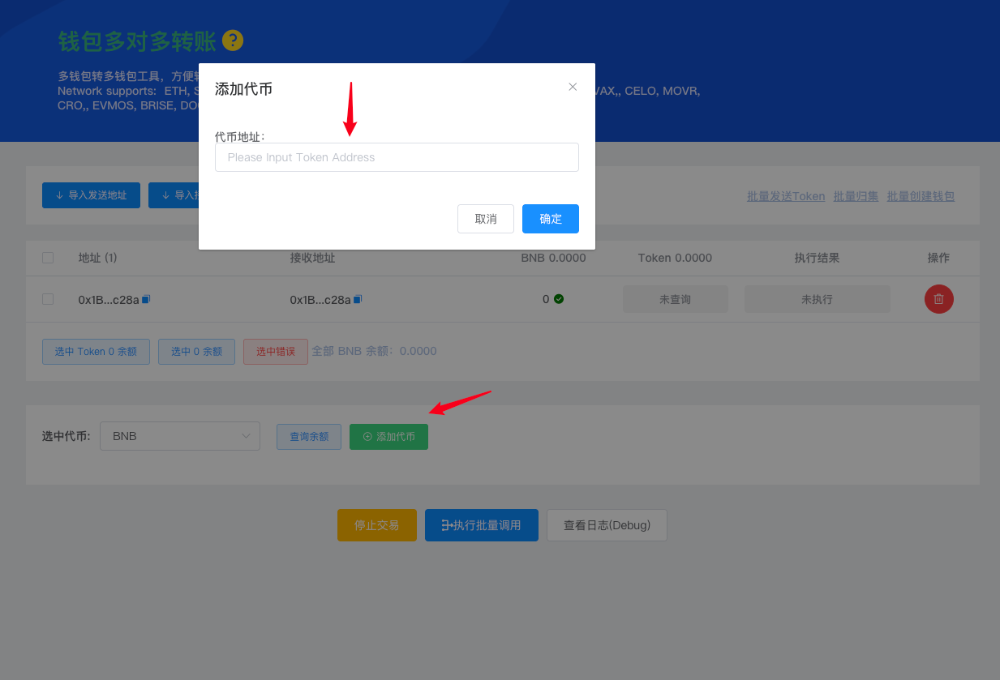
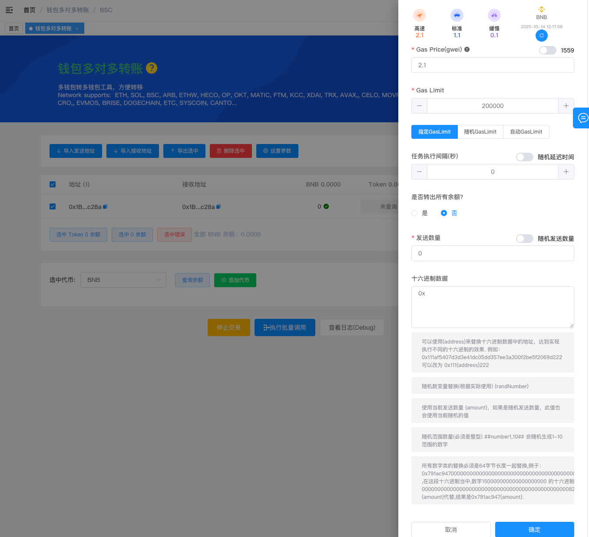

# 钱包多对多转账

使用 TokenTools.App 的【钱包多对多转账】功能，可以快速实现多个钱包之间批量转账，支持主流 EVM 网络，包括 ETH、BSC、ARB、HECO、OP、MATIC、FTM、AVAX 等。

###  功能简介

钱包多对多转账工具，支持：
- 从多个钱包地址向多个接收地址批量发送代币；
- 支持主币和任意 ERC20 代币；
- 可自定义 Gas、延迟时间、发送数量、十六进制附加数据；
- 适合批量分发、空投、归集、测试等多场景使用。


### 第 1 步：导入钱包地址

点击 **「导入发送地址」** 按钮，打开导入窗口。



### 导入格式
在输入框中，每一行输入一个私钥地址：
```
私钥1
私钥2
```


导入完成后，系统会自动识别钱包地址，并显示在列表中。


### 第 2 步：导入接收地址

点击 **「导入接收地址」**，同样可以粘贴或上传文件。  
发送地址与接收地址会一一对应进行转账操作。



> 例如：第1个钱包发送到第1个接收地址，第2个钱包发送到第2个接收地址，以此类推。


## 第 3 步：选择转账代币





在页面下方选择要转账的代币类型：

- 可选择主币（如 BNB、ETH）；
- 或点击 **「添加代币」**，输入代币合约地址添加 ERC20 代币；
- 点击 **「查询余额」** 可查看导入钱包的当前余额。


### 第 4 步：参数设置

右侧栏中可自定义链上交易参数：




**Gas Price (gwei)** ：设置交易的 Gas 价格，可选择高、标准、低三档，或手动输入。

**Gas Limit**：限制交易的最大 Gas 消耗。可选择：指定 / 随机 / 自动三种模式。

**任务执行间隔（秒）**：执行一次转账任务后的延迟时间，可设置为固定值或随机范围。  

> 例如：设置为 5，则每个钱包之间的执行间隔为 5 秒。

**是否转出所有余额**

- **是**：发送该钱包内全部余额；
- **否**：按照发送数量规则发送指定金额。

**发送数量**：可选择固定数量或开启“随机发送数量”功能。  例如：设置 0.1 ~ 1，则系统会随机选择区间内的金额发送。

**十六进制附加数据（Data）**：如果需要在交易中携带额外参数（例如特定合约调用），可在此处填写十六进制格式数据。  

> 示例：`0x` 或 `0x11ffddaa`


## 常见问题（FAQ）

**Q1：是否支持同一个发送地址向多个接收地址转账？** 
答：当前版本为“一对一”模式，即每个发送地址对应一个接收地址。

**Q2：执行过程中能否暂停？** 
答：可以，点击“停止交易”即可中止当前任务。

**Q3：Gas 设置错误怎么办？** 
答：建议选择“自动 GasLimit”模式，系统会根据链上状态自动调整。

**Q4：转账失败会重试吗？** 
答：不会自动重试，请检查错误日志后手动重新执行。

