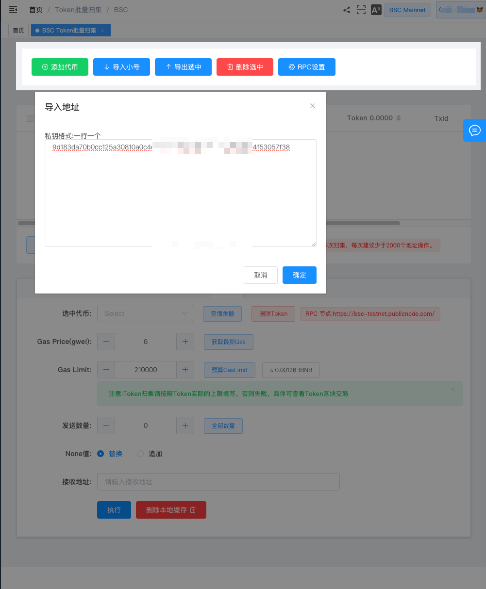
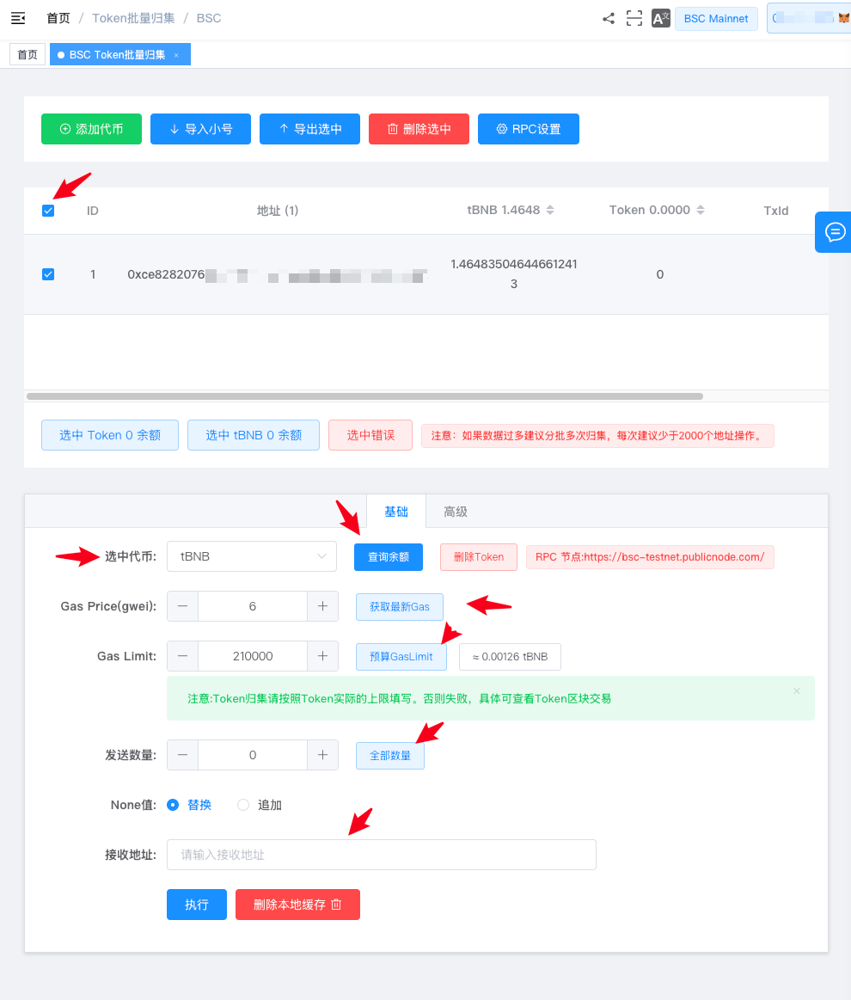
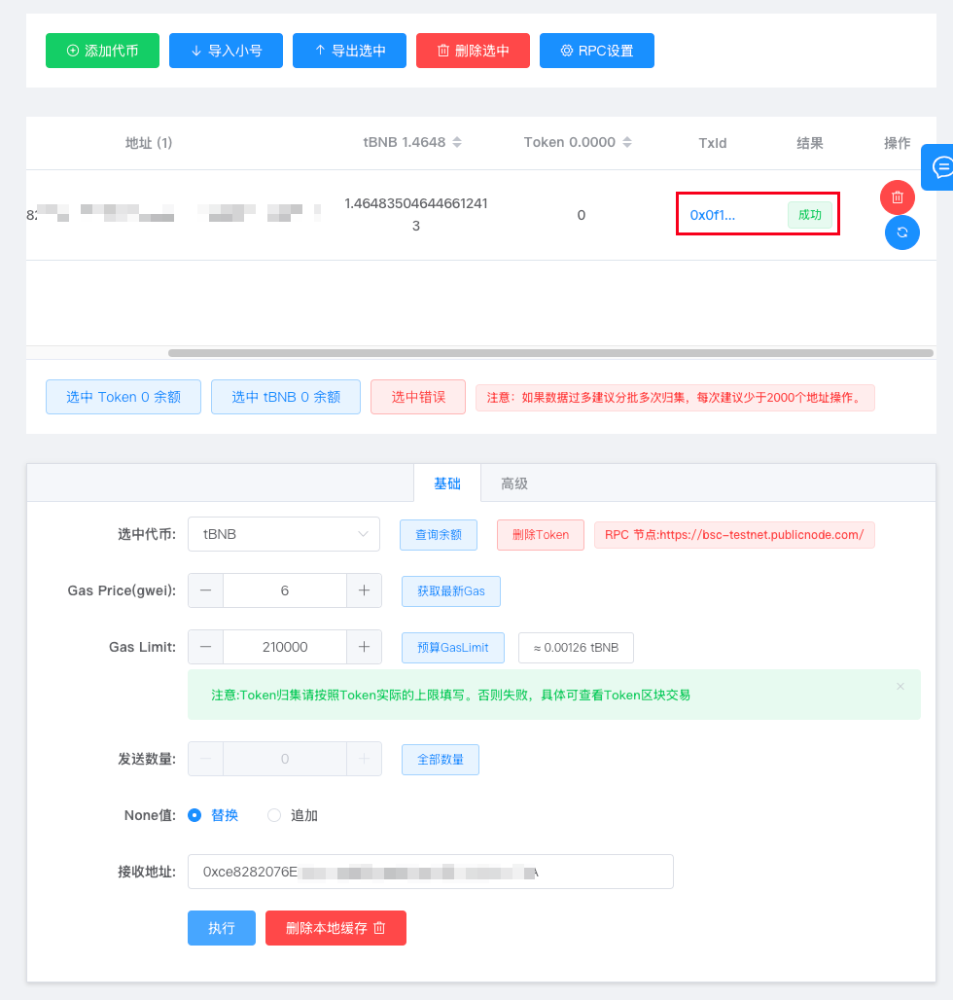
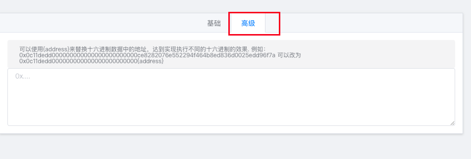

# Token批量归集

Token 批量归集功能是一个多功能工具，允许用户将多个钱包地址中的 ERC20 代币或链上原生币（如 BNB、ETH）统一归集到一个指定地址，实现高效便捷的多对一转账操作。





批量归集时，每个地址需预留足够的 Gas 费用。无需开通 VIP，功能永久免费。



### 1、导入地址

- **添加代币**：如需归集 ERC20 代币，需输入代币合约地址后进行添加，并在 “选中代币” 中选择目标代币。
- **导入小号**：在对话框中粘贴地址私钥，每行一个，进行批量导入。
- **导出选中**：可将已选择地址导出为 Excel 文件，便于管理和统计。
- **删除选中**：支持删除无效地址。
- **RPC 设置**：如默认 RPC 节点出现连接问题，可自定义其他 RPC 地址。更多 RPC 可通过工具中的 [快捷网络 ChainList](https://tokentools.app/other/chainList) 获取。

### 2、配置归集参数

1. 根据需要选择要归集的地址和币种，点击“查询余额”获取账户信息。
2. 获取当前最新的 Gas 价格信息。
3. 获取 GasLimit（Gas 上限）推荐值。
4. 输入要发送的数量，或选择 `全部数量`，表示发送地址内的全部可用余额。
5. **None 设置说明**：
   - **默认替换** ：如该地址存在未打包交易，会进行替换提交。
   - **追加模式** ：不替换未打包交易，适用于批量任务稳定性要求较高的情况。
6. 输入接收地址，确认归集参数无误后点击 `执行按钮` 开始归集。

### 3、执行归集

归集执行完成后，可在页面查看成功状态及生成的上链交易哈希（Tx Hash），点击即可跳转至区块浏览器查看详情。

### 4、高级功能：16 进制 Hex 调用

TokenTools 提供的 BNB 批量归集工具，不仅支持常规的“多地址归集到一个地址”操作，还内置了强大的 **高级功能模式**，适合更复杂的批量链上交互操作。

##### ✅ 支持批量参与预售 / Mint 操作

通过该功能，您可以实现：

- 多地址同时向某个合约地址转账 BNB（参与预售）
- 自动调用指定合约的某个方法（如 PinkSale、DXSale 的 Mint 或参与函数）
- 批量执行十六进制数据指令，实现自定义合约交互

例如，可用于：

- 批量 Mint NFT
- 批量参与预售（PinkSale、DxSale 等）
- 批量打入质押池
- 批量调用 `claim()`、`buy()` 等方法

##### ⚠️注意：该功能涉及智能合约交互，使用前需具备基本的链上交易分析能力。

##### 🎥 教程示例：小号批量Mint XEN，批量领取收益 教程


### 5、归集疑问解答
##### 1、为什么归集会失败？
- 地址内 Gas 余额不足，导致交易无法执行；
- 当前链路延迟或堵塞，影响部分交易提交；
- GasLimit 设置过小，建议点击 `预算 GasLimit` 按钮自动填充推荐值。
##### 2、为什么归集会失败？
- TokenTool 的批量归集功能无需开通 VIP，**永久免费**；
- 除链上 Gas 费用外，不会收取任何服务费用。
##### 16进制参数是什么？
- 除支持普通归集外，该功能允许你批量调用合约函数，如参与预售、Mint NFT 等；
- 可通过 `{address}` 替换方式实现参数自动注入，提高批处理灵活性；
- 使用前建议对目标合约逻辑有所了解，避免误操作。

