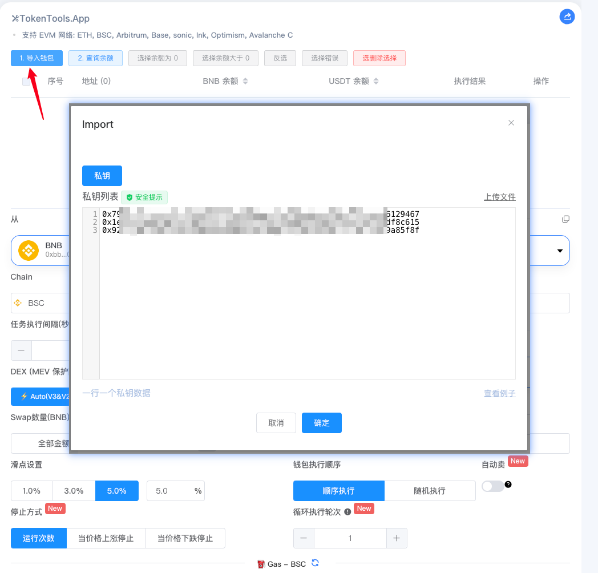
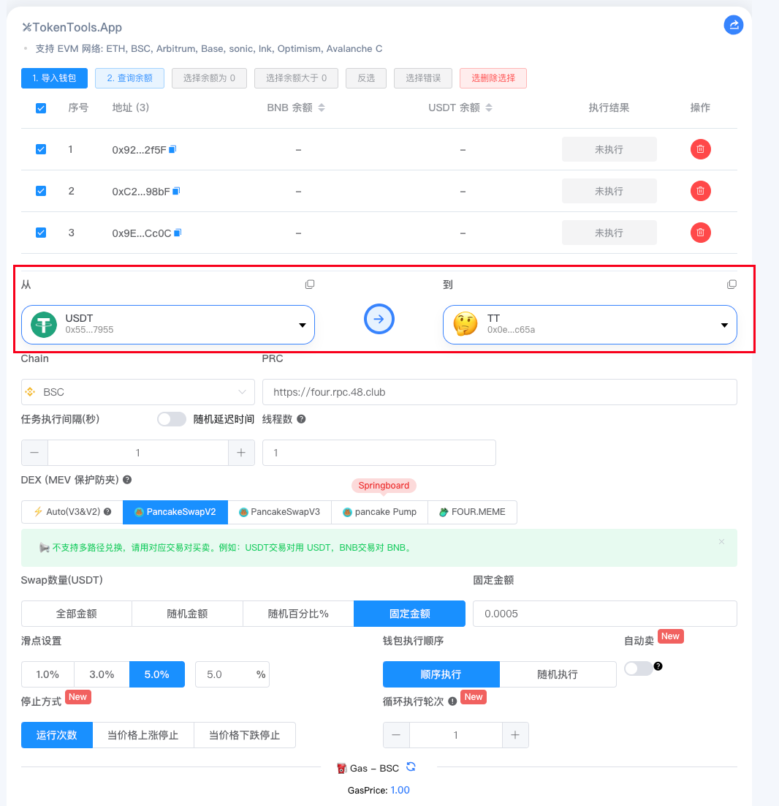
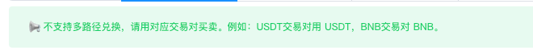
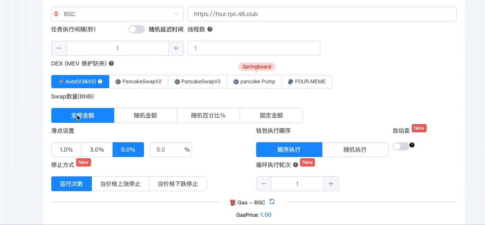
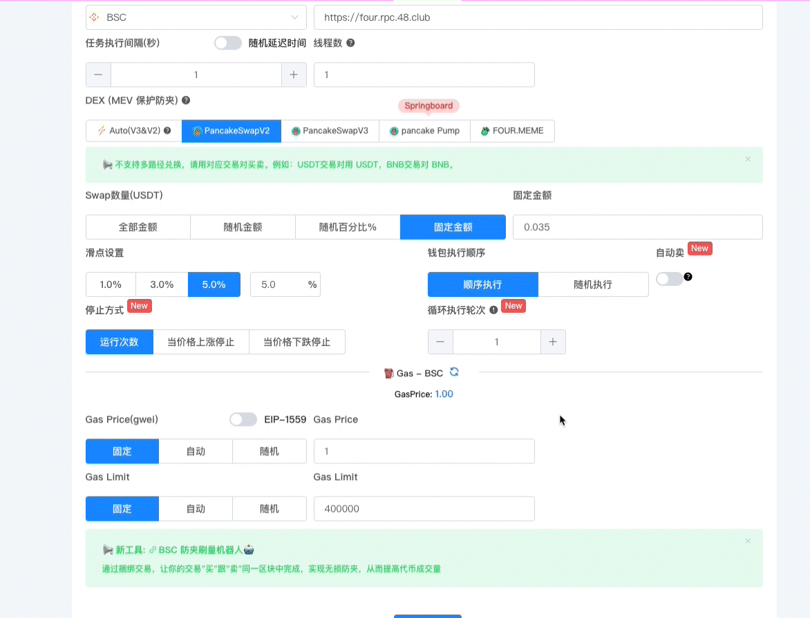

# 批量Swap兑换

与大多数交易所相比，在 TokenTool Swap 上进行交易更加便捷。您无需担心滑点的复杂设置，系统会为您自动计算并提供最优结果。

本教程将详细介绍如何使用 **TokenTools.App 批量 Swap 功能**，包括导入钱包、设置交易参数、执行规则等。

### 开始交易

在进行交易之前，您需要一个支持 Web3 的区块链钱包，例如 **MetaMask** 等插件钱包。本教程使用BSC网络作为教程的详细介绍。您还需要一些 BEP20 代币才能进行交易。

### 在TokenTool Swap批量兑换交易

1. 在这里进入兑换页面 ➡️ [https://tokentools.app/batchSwap/bsc](https://tokentools.app/batchSwap/bsc)

2. 在进行批量 Swap 操作前，需要先导入钱包地址。
    目前支持 **私钥导入**：

   - 点击 `导入钱包`
   - 在弹窗中输入私钥列表（每行一个私钥），或[下载模版](http://tokentools.app/xlsx/private_key_eth_example.xlsx)直接上传文件导入。
   - 导入后，这些钱包将用于批量执行交易。

   ⚠️ **注意事项：**

   - 私钥需妥善保管。导入钱包后，平台会根据您的设置进行批量操作，请确保这些钱包中有足够的代币和 Gas 费用。
   - 导入的钱包会以你设置的执行顺序（顺序执行 / 随机执行）进行交易。

### 设置兑换代币

- **从**：选择你要兑换的币 （例如 BNB、USDT、USDC、或其他交易对代币）。
- **到**：选择目标 Token币（例如 你自己发行的代币，或其他代币）。

➡️ 表示 **从 Token0** 兑换 **到 Token1**。例如：本教程中演示用 USDT 兑换 TT 币（买入操作），相反方向则为卖出操作。

⚠️ **注意事项：**

- 平台如果提示 **不支持多路径兑换**，请务必选择正确的交易对。
  - 例如：**USDT 交易对只能用 USDT 买卖，BNB 交易对只能用 BNB 买卖。**

### 参数设置说明

**RPC：** RPC节点地址，如有自己搭建节点可自由切换。

**任务执行间隔（秒）：** 每次执行交易后的等待时间，可以选择固定时间或随机时间。

**线程数：** 表示同时运行的钱包数量。（例如：导入 100 个钱包，线程数设置为 10，则会同时执行 10 个钱包，依次批量完成。）

**选择 DEX：** 在 **DEX** 区域选择要使用的去中心化交易所，例如BSC链所支持的：

- PancakeSwapV2、PancakeSwapV3
- pancake Pump 内盘、Four.MeMe 内盘

⚠️ 请确保选择的 DEX 与您要交易的 Token 池子一致，否则交易可能失败。

**设置 Swap 数量：** 你可以灵活设置每笔交易的数量，支持以下模式：

- **全部金额**：使用钱包中所有 Token0 余额兑换。

- **随机金额**：在你设置的随机范围内生成交易金额（支持小数位数设置）。

- **随机百分比**：按照钱包余额的百分比随机。（例如：钱包有 100 BNB，设置随机比例为 10% ~ 20%，则每次会随机选择 10~20 BNB 进行交易。）

- **固定金额**：输入固定的 Token0 数量进行交易。

**滑点设置：** 根据代币的税率填写合适的滑点，例如 1%、3%、5%、20% 等

**钱包执行顺序：** 

- **顺序执行：** 按导入的钱包顺序逐个执行。
- **随机执行：** 打乱钱包顺序，随机选择执行。

**自动卖出功能（可选）：**

- 开启后，会根据你设置的金额规则（全部、随机、百分比、固定）自动卖出 Token1。
- 卖出的规则与买入的金额规则完全一致。

**停止方式：**

提供多种停止策略：

1. **运行次数**
   - 设置钱包批量运行的轮次，例如运行 3 轮。
2. **价格上涨停止**
   - 输入一个价格，当市场价格上涨到该值时，自动停止批量操作。
   - 如果价格未达到设定值，程序会循环执行（相当于无限轮次），直到价格条件被触发为止。
3. **价格下跌停止**
   - 输入一个价格，当市场价格跌到该值时，自动停止操作。

**Gas 相关设置：**

- **Gas Price（油费）**
  - 固定：输入固定数值
  - 自动：系统自动获取网络推荐值
  - 随机：在你设置的范围内随机
- **Gas Limit（Gas 限额）**
  - 固定：输入固定值
  - 自动：系统自动计算
  - 随机：在范围内随机

⚠️ 建议新手用户使用 **自动模式**，以确保交易不会因 Gas 设置过低而失败。

###  使用建议与注意事项

1. **钱包安全第一**：请妥善保管私钥，避免泄露。
2. **测试小额交易**：建议先用小额测试，确认参数设置正确，再进行大额批量操作。
3. **合理滑点**：代币若有税或高波动，请适当提高滑点，避免交易失败。
4. **Gas 设置**：使用自动模式更安全，避免因 Gas 过低导致交易 Pending。
5. **线程数设置**：过大线程数可能导致节点压力或失败，建议根据钱包数量合理分配。
6. **价格停止策略**：适合在指定价格点止盈止损。

###  常见问题

**Q1：为什么要用私钥导入钱包？**
 A：因为批量操作需要直接控制钱包签名和交易，必须通过私钥导入。请确保私钥来源安全，避免泄露。

**Q2：导入的钱包有顺序吗？**
 A：有。默认是按照导入的顺序执行，但你也可以选择 **随机执行** 模式，打乱执行顺序。

**Q3：能不能用助记词导入？**
 A：目前仅支持私钥导入。如果需要助记词导入，建议先用工具转成私钥再导入。

**Q4：“从”和“到”是什么意思？**
 A：就是 Token0 兑换成 Token1。例如：从 BNB 到 USDT，表示用 BNB 兑换 USDT。

**Q5：支持多路径兑换吗？**
 A：根据选择DEX交易所，如果有提示不支持信息。必须选择单一交易对。比如 **USDT 交易对只能用 USDT 买卖，BNB 交易对只能用 BNB 买卖**。

**Q6：Swap 数量怎么选择？**
 A：有 4 种方式：

- 全部金额（用光钱包余额）
- 随机金额（按范围随机）
- 随机百分比（按钱包余额百分比随机）
- 固定金额（写死一个数）

**Q7：任务执行间隔有什么作用？**
 A：每次交易后会延迟一段时间再执行下一笔。支持固定间隔或随机间隔。

**Q8：线程数怎么理解？**
 A：线程数代表同时执行的钱包数量。

- 例如导入 100 个钱包，线程数 10，就会同时运行 10 个，完成后继续下一个 10。

**Q9：钱包执行顺序怎么选？**
 A：执行顺序分2种情况，默认是顺序执行

- 顺序执行：从第一个钱包依次到最后一个。
- 随机执行：随机挑选钱包执行，打乱顺序。

**Q10：自动卖出和买入的规则一样吗？**
 A：是的。自动卖出的金额规则（全部、随机、百分比、固定）与买入完全相同。

**Q11：必须开启自动卖出吗？**
 A：不是。自动卖出是可选功能，如果只想单向买入，可以不开启自动卖。

**Q12：运行次数是指什么？**
 A：是指导入的钱包循环执行多少轮。例如：运行次数设置为 2，则所有钱包执行两次交易。

**Q13：价格上涨停止和下跌停止怎么用？**
 A：

- 上涨停止：当价格涨到设置值，批量操作自动停止。
- 下跌停止：当价格跌到设置值，批量操作自动停止。
- 如果价格一直没有触发，程序会循环执行，直到达到条件。

**Q14：Gas Price 有哪些模式？**
 A：Gas Price是汽油参数，有3种模式

- 固定：输入一个固定值（风险：可能过低卡 Pending）。
- 自动：系统自动获取最优 Gas（推荐）。
- 随机：在一个范围内随机生成。

**Q15：Gas Limit 应该怎么设置？**
 A：同样有固定、自动、随机三种模式。大部分情况下，建议用自动。

**Q16：批量操作失败的原因有哪些？**
 A：常见原因包括：

- 钱包余额不足
- Gas 设置过低
- 滑点过小导致交易失败
- Token 合约有交易限制（例如黑名单、冷却时间）

> 引用地址：
>
> [https://tokentools.app/batchSwap/bsc](https://tokentools.app/batchSwap/bsc) 批量Swap兑换
> 
> [https://tokentools.app/oneToMore/bsc](https://tokentools.app/oneToMore/bsc) 批量发送代币
> 
> [https://tokentools.app/batchCollection/bsc](https://tokentools.app/batchCollection/bsc) 批量归集代币
> 
> [https://tokentools.app/createWallet/bsc](https://tokentools.app/createWallet/bsc) 批量创建钱包
> 
>  [https://youtu.be/A7wKrW3k24I](https://youtu.be/A7wKrW3k24I) 视频教程

如果您还有其他问题，可以加入TokenTool 电报群了解，

> **点击加入** [**TokenTool官方交流群**](https://t.me/tokentool_app) **交流反馈**
