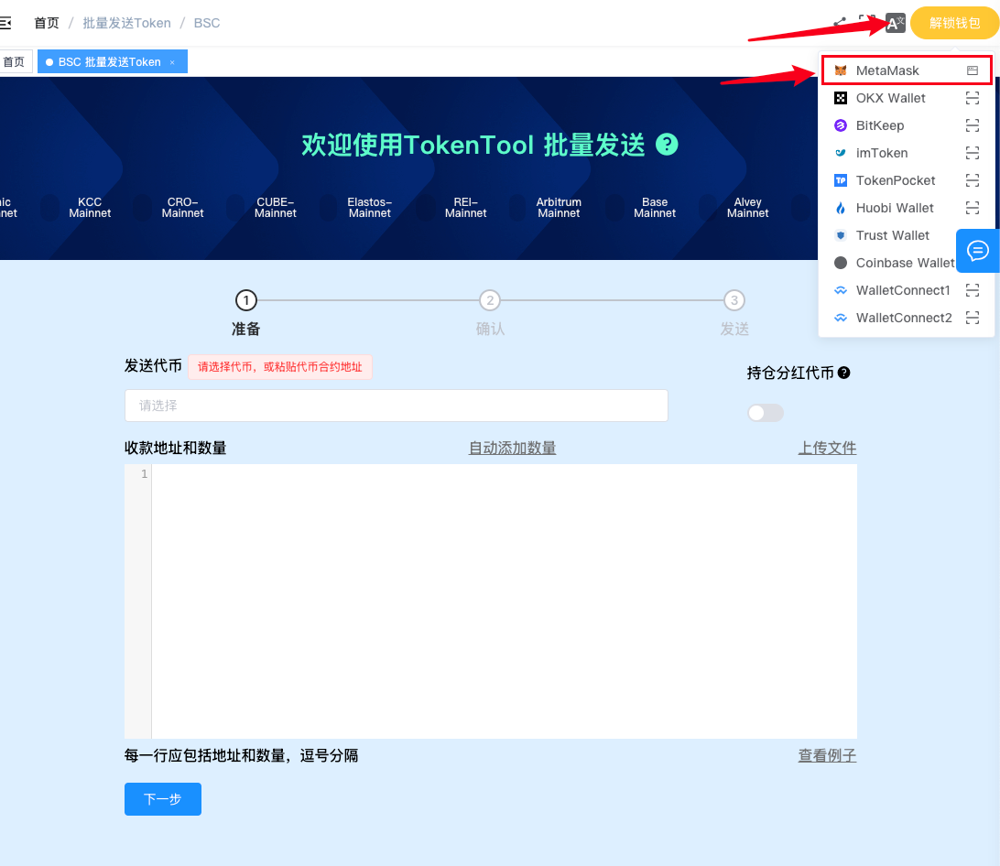
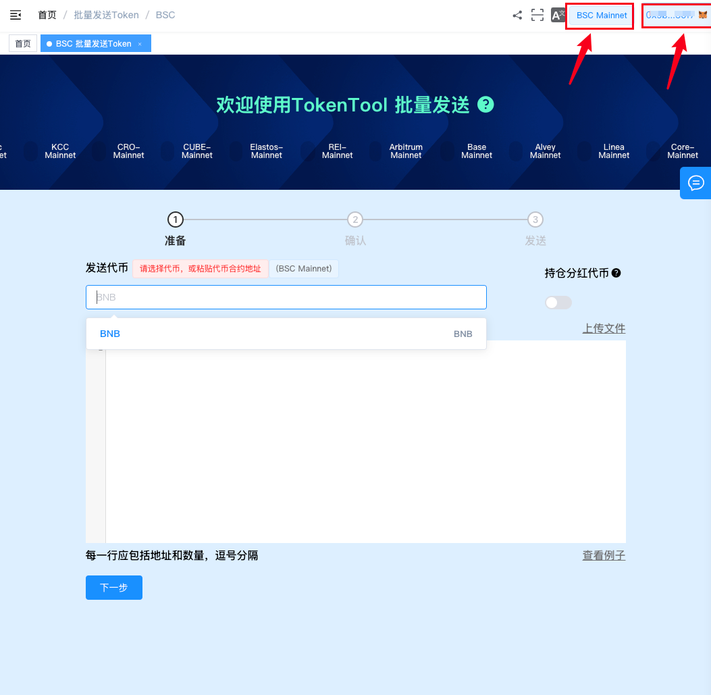
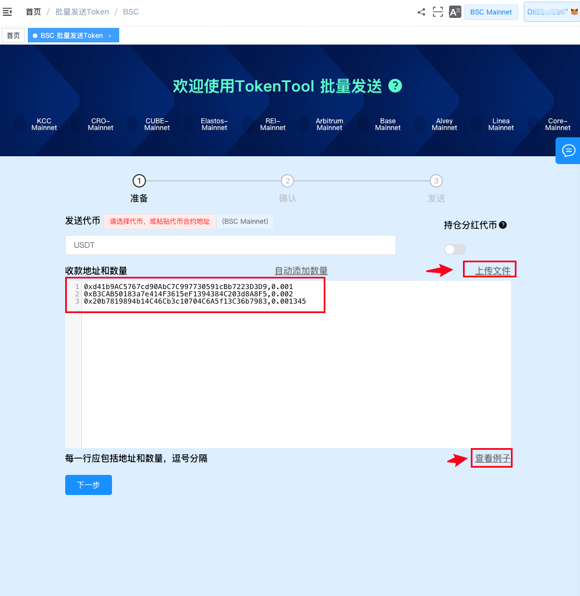
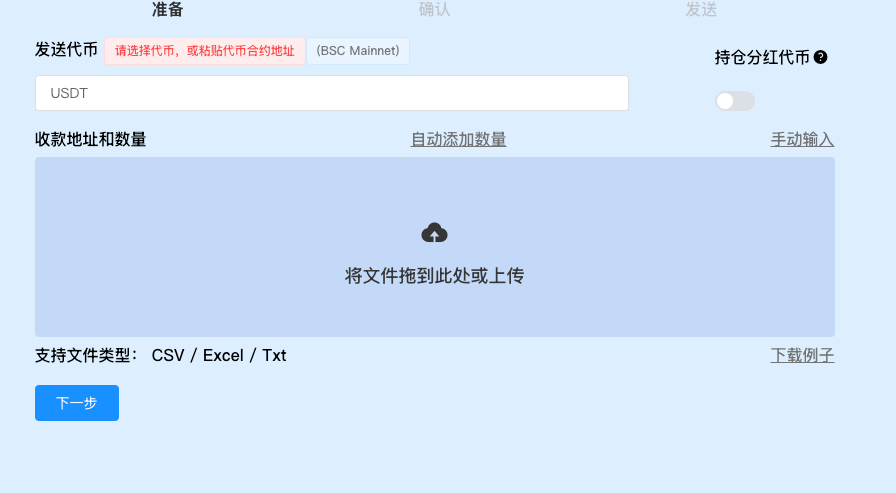
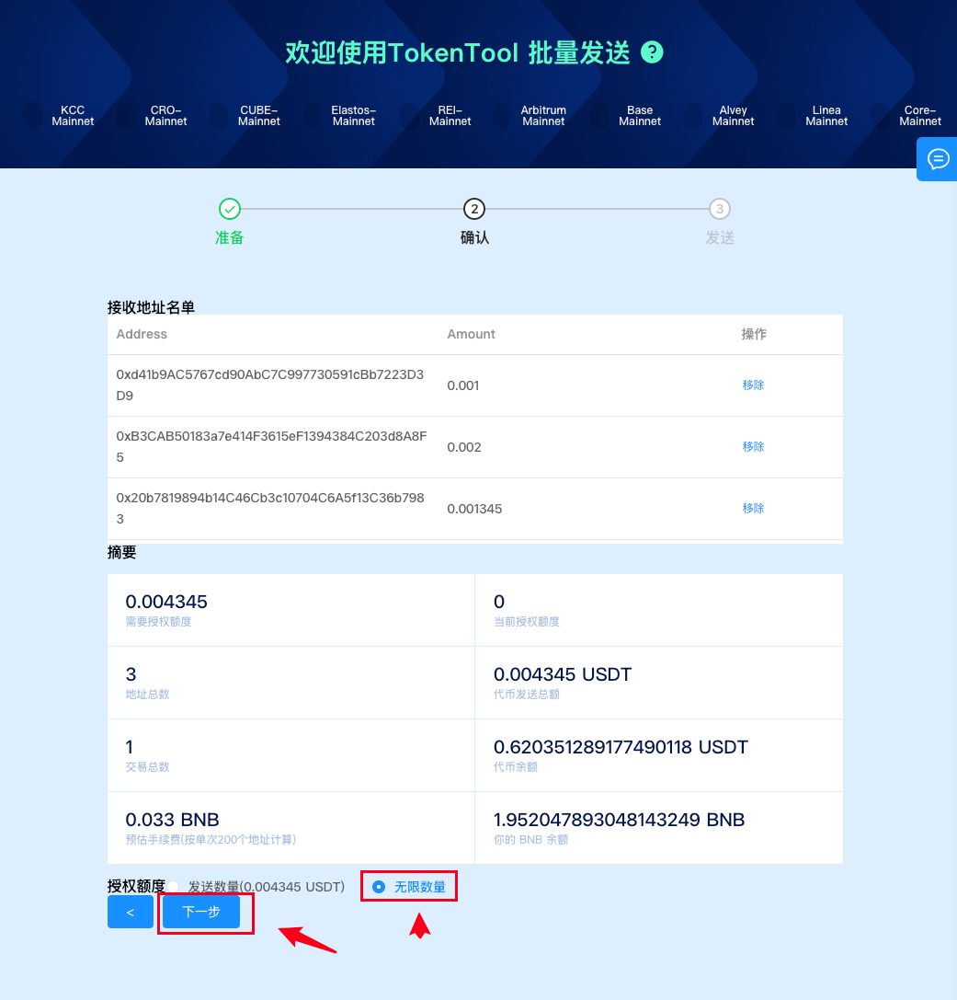
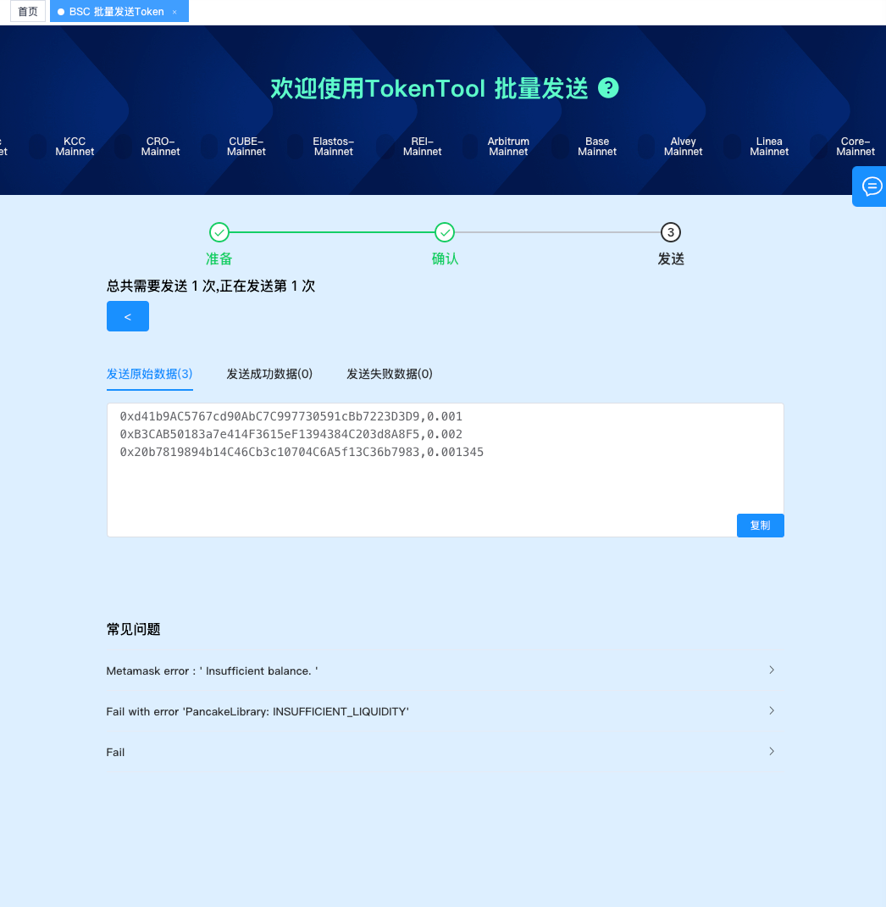
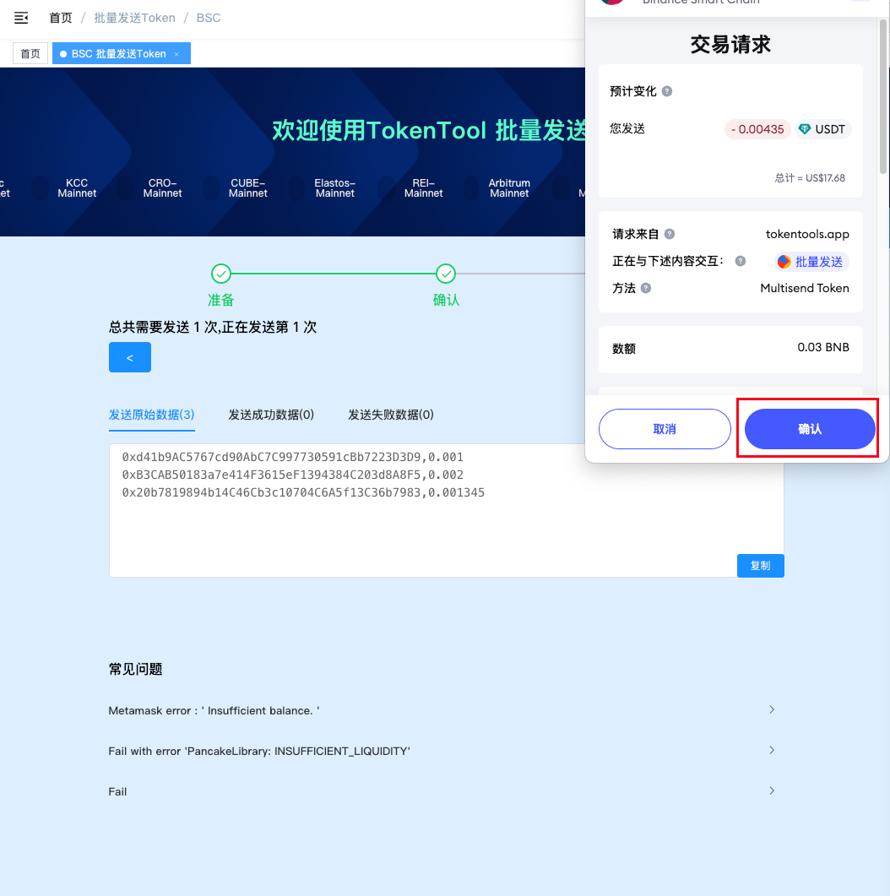

# EVM链批量转账工具教程

批量转账工具是什么？顾名思义，它可以在区块链上批量转账代币，如 BNB、USDT、ETH 等。使用批量转账工具，用户可以高效地将某一地址中的代币发送至多个不同地址。

相较于逐一转账，批量操作显著节省时间和精力。例如，一次性向 200 个地址转账，与手动执行 200 次操作相比，效率和操作体验大大提升。同时，批量转账在手续费消耗上也更具优势。

下面，TokenTools 将演示如何使用该工具完成批量转账操作。



### 一、连接钱包

打开 BSC 链的批量转账工具：[https://tokentools.app/oneToMore/bsc](https://tokentools.app/oneToMore/bsc)，点击右上角的“连接钱包”按钮。  
请确保你已在浏览器中安装 Web3 钱包（如 MetaMask、OKX 钱包、TokenPocket 等）。本教程以 MetaMask 插件钱包为例进行演示。

随后，MetaMask 钱包将弹出确认窗口，点击 **连接**。连接成功后，页面右上角将显示钱包地址及当前区块链网络。

### 二、填写转账信息

1. 选择你要转账的代币。若为非默认代币，请手动输入代币合约地址，例如：BSC 链的 USDT 合约地址为 `0x55d398326f99059fF775485246999027B3197955`。

2. 在输入框中填写收款地址和对应数量。可点击 `查看例子` 按钮了解格式要求：
	1. 格式要求：**地址,数量**（注意使用英文逗号 `,`）
	1. 示例：`0xd41b9AC5767cd90AbC7C997730591cBb7223D3D9,1` 表示向该地址转账 1 个 USDT

3. 若地址数量较多，建议通过 Excel 文件批量上传，文件格式请参考：[模板文件下载](https://tokentools.app/example.xlsx)

上传时请使用 `.xlsx` 格式，并严格按照模板格式填写。

确认内容无误后点击 **下一步**。系统会展示你填写的地址总数及转账金额，请再次核对后点击 **下一步 / 授权**。

若为首次使用合约代币（如 USDT），钱包会提示授权操作，请点击确认，MetaMask 将进行授权交互。

> 注意：BNB 等原生代币无需授权。

授权完成后，点击下一步，系统会显示预计需要的打包交易次数及成功/失败记录预览。

最后，在 MetaMask 钱包中确认交易，等待上链打包完成，即可完成批量转账流程。

如有其他疑问，欢迎加入官方 Telegram 社群获取帮助：  
📢 [https://t.me/tokentool_app](https://t.me/tokentool_app)
