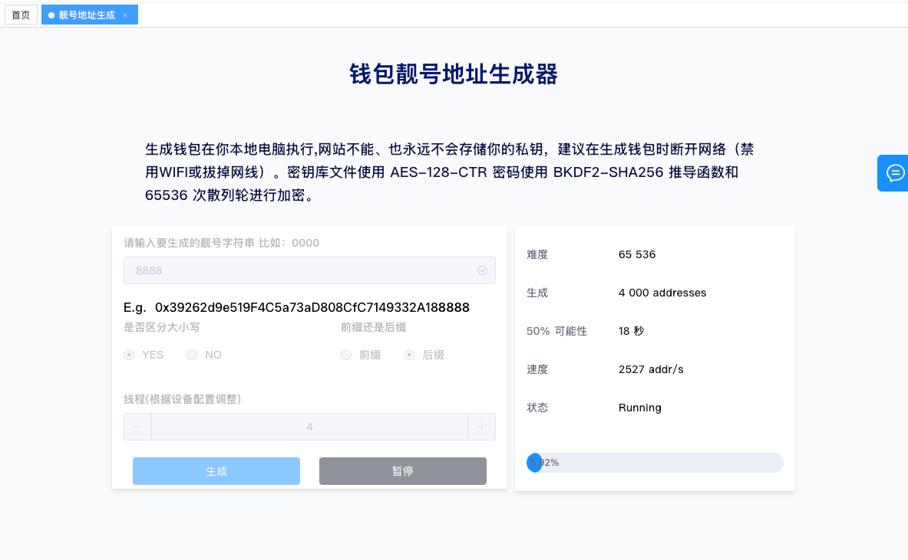
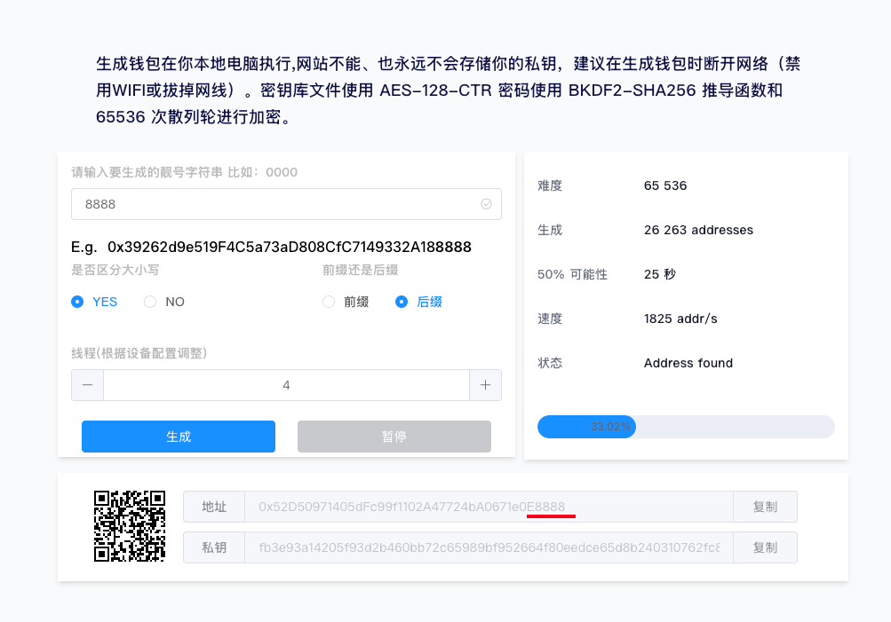
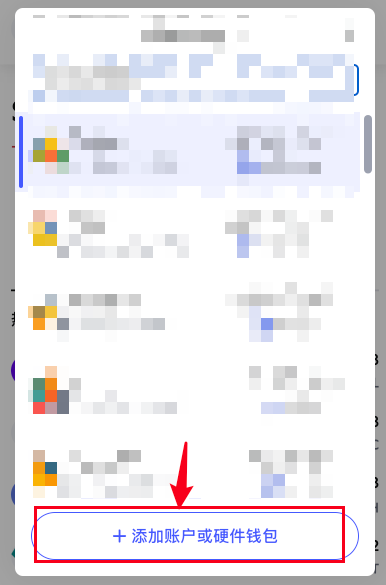
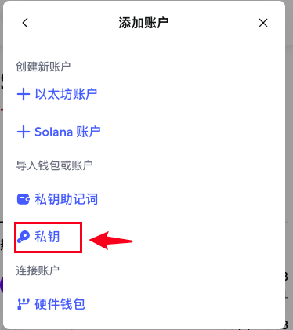
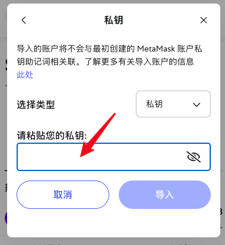

# EVM 链靓号钱包地址生成教程

你是否希望拥有一个特别、好记、酷炫的以太坊地址？  
比如以 `0x888888...` 开头，或以 `...999999` 结尾？

本教程将手把手教你如何生成 **靓号钱包地址（Vanity Wallet Address）**，完全离线、安全可靠，可用于 Ethereum、BSC、Arbitrum、Polygon 等所有 EVM 链的钱包地址。

---

## 🧠 什么是以太坊“靓号钱包地址”？

以太坊地址是一个 42 位的字符串（以 `0x` 开头），后面跟着 40 个十六进制字符。  
这些地址是通过私钥推导生成的，因此我们可以通过反复生成地址的方式，寻找符合某种模式的“靓号”。

例如：

- `0x888888CfAebbEd5554c3F36BfBD233f822e9455f`
- `0x226de9B08e19908668C63185a635218005999999`
- `0x00000000F34BC349AB2357aB51D3E47fD7654321`

这些都是靓号钱包地址。

---

## 📦 推荐工具：TokenTools 靓号钱包地址生成器

> 官网工具地址：  
> [https://tokentools.app/vanityAddressGenerator/bsc](https://tokentools.app/vanityAddressGenerator/bsc)

TokenTools 提供的生成器工具完全本地运行，**页面加载完成后可断网运行，保障私钥安全**。

---

## 🛠 使用步骤（离线操作更安全）

### 1️⃣ 打开生成器页面

访问：[https://tokentools.app/vanityAddressGenerator/bsc](https://tokentools.app/vanityAddressGenerator/bsc)

等待页面加载完成。

---

### 2️⃣ 断开网络，确保私钥不外泄

为了确保生成过程中的私钥不被任何服务收集，建议**在页面加载完成后，立即断网操作**（关闭 Wi-Fi 或拔掉网线）。

---

### 3️⃣ 输入你想要的地址特征

在搜索框中输入你想要包含的地址特征，比如：

- 前缀：`8888`
- 后缀：`999999`

你可以自定义匹配类型（前缀 / 后缀 ）和区分大小写。

---

### 4️⃣ 设置线程数，加速生成过程

页面会自动识别你电脑的 CPU 核数。你可以设置使用的线程数量（建议 4 线程起），根据电脑的配置，线程越多，搜索越快。

如果电脑是4核CPU，建议页面输入和电脑的CPU数量一致，CPU核数量在任务管理器中查看。

---

### 5️⃣ 等待结果，生成成功后保存信息

一旦匹配的地址被找到，你将看到以下信息：

- ✅ 匹配的钱包地址（Address）
- 🔐 对应的私钥（Private Key）

**请务必离线保存并妥善备份这些信息，不要泄露！**

---

## 🪪 如何使用这个钱包地址？

1. 打开 MetaMask、TokenPocket 等钱包
2. 选择“导入钱包”
3. 粘贴你生成的私钥
4. 即可开始在任意 EVM 链（Ethereum、BSC、Polygon、Arbitrum 等）上使用你的靓号地址

---

## ✅ 优势与注意事项

### ✔ 优点

- 个性化：酷炫、有辨识度的地址
- 安全性：工具离线运行，不联网即可生成
- 通用性：可在所有 EVM 兼容链使用

### ⚠ 注意事项

- 私钥必须保密！任何人一旦获得你的私钥，就可以完全控制你的资产。
- 建议将靓号地址用于展示类或接收用途，**避免直接长期存储大量资产**。
- 可以搭配硬件钱包使用，提升安全性。

---

## 🔗 相关链接

- 🎯 靓号钱包生成器：[https://tokentools.app/vanityAddressGenerator/bsc](https://tokentools.app/vanityAddressGenerator/bsc)
- 📘 官方文档入口：[https://docs.tokentools.app](https://docs.tokentools.app)

---

想拥有一个你专属的酷炫钱包地址？赶快试试靓号钱包生成器吧！

如有疑问或不清楚的地方，欢迎加入官方 Telegram 群获取帮助：[https://t.me/TokenTool_App](https://t.me/TokenTool_App)

