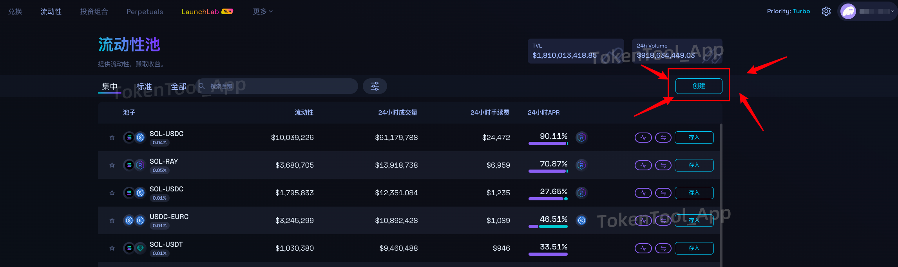
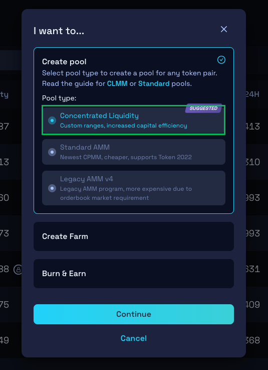
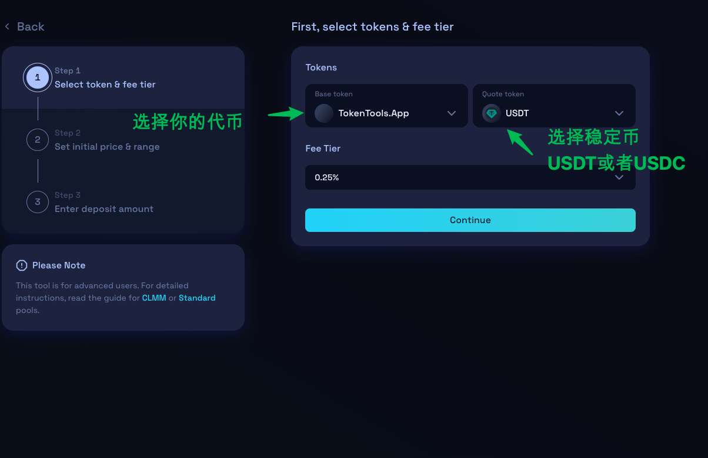
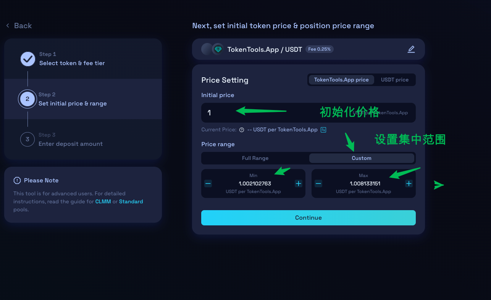
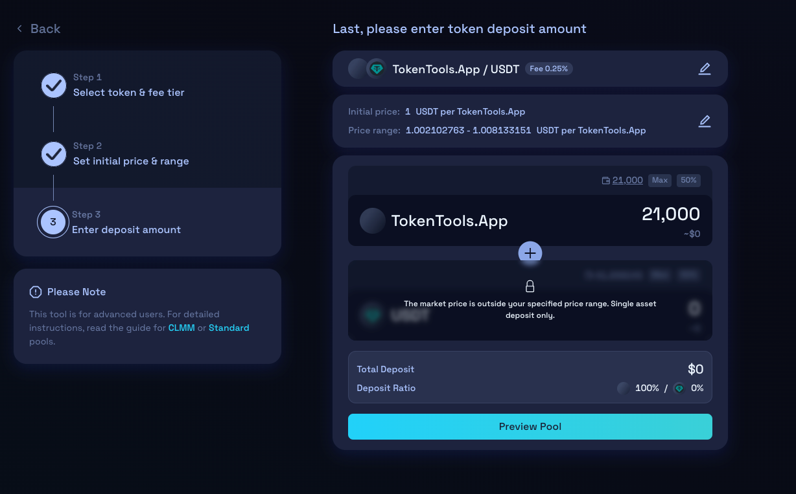
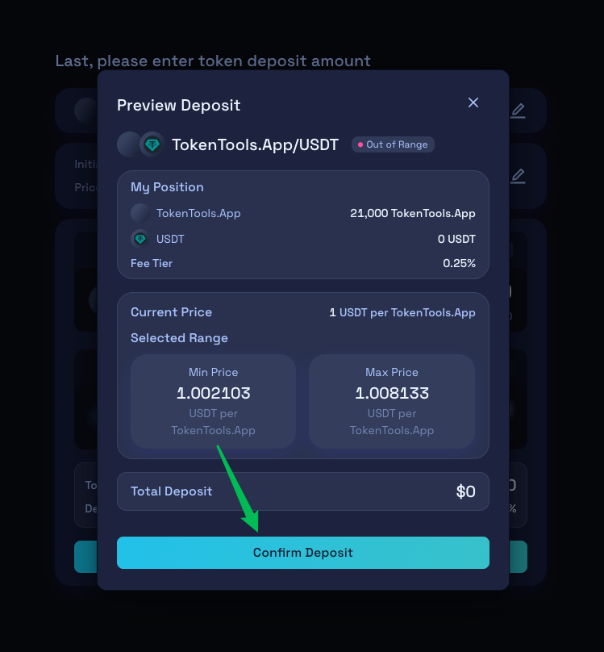
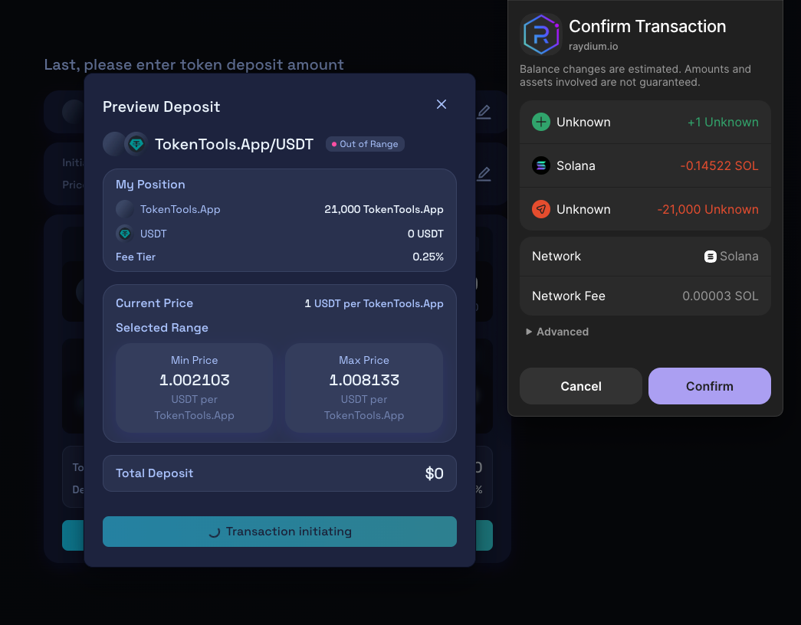

# Solana 上创建 Raydium CLMM 稳定池教程

## 什么是稳定池？

稳定池是 Raydium 推出的 **集中流动性池（CLMM）**，允许流动性提供者将资金集中部署在指定价格区间内，以实现更高的资本效率和价格稳定性。因此，市场中通常将 CLMM 称为“稳定池”。

## 为什么要创建稳定池？

CLMM 与传统的恒定乘积做市商（AMM）相比，优势显著：

- **高效资本利用**：只需在特定价格区间提供流动性，避免了资金在全区间摊薄。
- **收益更高**：更集中的流动性能带来更多交易手续费。
- **提升深度**：交易价格附近的流动性深度显著提升，滑点更低。
- **避免 MEV 套利**：代币价格维持在固定区间，有效防止机器人恶意套利。

对于大多数原生代币项目（如 RAW 项目）来说，价格的稳定对社区、生态建设和长期发展尤为重要。创建稳定池成本低、操作简单，是非常值得推荐的做法。

## 创建 Raydium CLMM 稳定池教程（Solana链）

###  1、创建池子
1. 访问 Raydium 官网：[https://raydium.io/liquidity-pools/](https://raydium.io/liquidity-pools/)
2. 点击右侧的 **“创建”** 按钮。
3. 在弹出的界面中选择 **Concentrated Liquidity（集中流动性池）**，然后点击“继续”。

> 💡 集中流动性池支持将资金集中在某个价格范围，实现价格稳定。
> 

## 2、设置代币参数与开盘信息

选择代币、填写代币的数量、配对的 SOL 数量，并设定开盘时间与价格：

- **选择代币及配对币种**：
- **Base Token（基础币）**：你的项目代币（手动输入或从钱包选择）
- **Quote Token（报价币）**：建议选择 USDT 或 USDC
- **Fee Tier（手续费等级）**：默认 0.25%（一般无需更改）

- **设置价格区间**：
- **Initial Price（初始价格）**：如 1.000 USDT
- **Price Range（价格区间）**：建议设置为如 1.002～1.008 USDT （1.002102763～1.008133151）

- **添加流动性**：
- 若初始价格在设置的区间内，**仅需添加你的代币即可**，不必添加 USDT。
- 系统会将你的代币在所设定的价格区间内自动分布提供流动性，形成一个高密度的稳定池。只要价格保持在该区间内，池中始终有充足的卖盘支持，确保**任何买方都无法突破价格上限或下限**，从而实现代币价格的有效锚定与稳定。

## 3、钱包确认

填写完所有参数后，点击“**Confirm Deposit**”按钮，连接钱包并确认交易。支付一笔小额费用后，即完成 CLMM 加池操作。

### 4.Solana Swap交易

初始加池时池中仅有项目代币，不含 USDT/USDC，导致代币无法卖出。因此，你需通过兑换方式向池中加入报价币：

1. 访问：[https://raydium.io/swap](https://raydium.io/swap)
2. 选择 USDT 与项目代币进行兑换。
3. 钱包确认后，系统会自动向池中注入等量的报价币。

> ✅ 此步骤完成后，池子将具备买入和卖出的完整交易功能。

## 疑问解答

**1、CLMM稳定池子，加池的时候代币和U需要1:1吗？**

- **答：** 不需要。初始加池只需添加项目代币即可，USDT 通过后续兑换注入。

**2、我可以创建双币池子吗？**

- **答：** 可以。如果你设置的价格区间跨度较大（如 0.999～100），系统会要求你提供部分 USDT。

**4、OKX Web3钱包显示的Raydium V3是不是CLMM池子？**

- **答：** 是的。Raydium V3 即为集中流动性版本（CLMM）。

如有其他问题，欢迎加入官方社区获取帮助：  
📢 [Telegram 社区：https://t.me/tokentool_app](https://t.me/tokentool_app)
