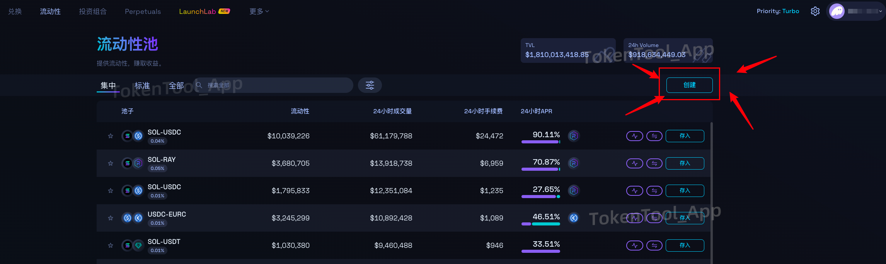

# Raydium CPMM 创建/移除池子教程

**CPMM** 是 Raydium 推出的新型流动性池产品，具备以下特性：

- **全新做市模型：** 基于 CPMM 算法，区别于此前的 V2 AMM 模式  
- **无需创建市场ID：** 节省 OpenBook 市场 ID 的创建成本  
- **费用更低：** 创建池子的费用约为 0.2 SOL，仅为原 AMM 的一半

---

## 1、创建池子

访问 Raydium 官网：[点击进入](https://raydium.io/liquidity-pools/)，点击右侧的 **“创建”** 按钮。

在弹出的界面中选择 **标准 AMM 池**，点击继续。

> ⚠️ 集中池（Concentrated Pool）价格变动限制较大，操作复杂，一般不推荐。

---

## 2、设置代币参数与开盘信息

填写代币的数量、配对的 SOL 数量，并设定开盘时间与价格：

- **代币数量：** 你打算添加到池子中的自定义代币数量  
- **SOL 数量：** 用于定价的 SOL 数量（通常为你的报价代币）  
- **开盘时间：** 池子开放交易的时间（UTC 时间，Raydium 会自动转换为本地时间）  
- **开盘价格：** 由代币数量和 SOL 数量决定  
  - 例如：1 亿代币 + 1 SOL，价格为 `0.00000001 SOL`

示例：

Raydium 提供自动时区转换功能，开盘时间设置更加便捷：

---

## 3、初始化池子

确认信息无误后，点击“初始化流动性”按钮，并在钱包中签署交易，支付约 0.2 SOL 的池子创建费用。

池子创建成功后，会显示如下提示：

---

## 4、移除流动性（撤池）

如需撤除流动性，可前往 [我的投资组合](https://raydium.io/portfolio/)，点击进入。

找到对应池子（标准池），点击右侧的 `“-”` 按钮。

> ⚠️ 如果设置了开盘时间，需等待正式开盘后池子才会显示。

选择撤除比例，点击 **“移除流动性”** 并在钱包中确认即可。

---

## 5、常见问题解答

### Q1：CPMM 的优势与限制有哪些？

- ✅ 优势：无需创建市场 ID，节省成本  
- ⚠️ 限制：部分自动狙击机器人暂不支持 CPMM V3

---

### Q2：可以对 CPMM 池子进行锁池操作吗？

可以，目前仍支持“烧池”或锁定流动性操作。

---

### Q3：出现“代币未关闭冻结权限”提示？

这是因为你的代币管理员权限仍然存在。

请前往：[Token 管理员页面](https://tokentools.app/createToken/sol)  
放弃冻结与增发权限后重试。

若仍提示异常，可尝试刷新页面或切换网络后重试。

---

### Q4：出现“应用程序错误：客户端异常”？

该问题通常由浏览器翻译插件引起。请关闭 Chrome 翻译功能并刷新页面。

---

如有其他问题，欢迎加入官方社区获取帮助：  
📢 [Telegram 社区：https://t.me/tokentool_app](https://t.me/tokentool_app)
