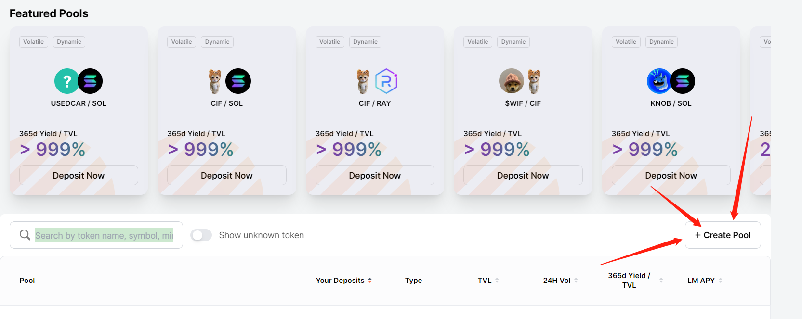
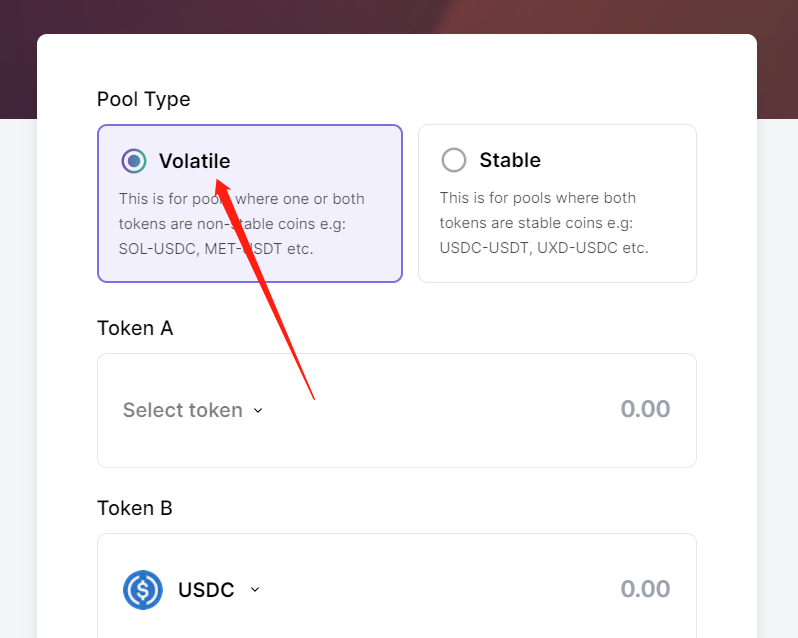
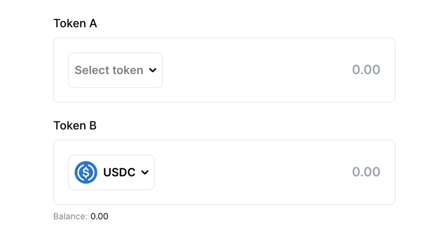
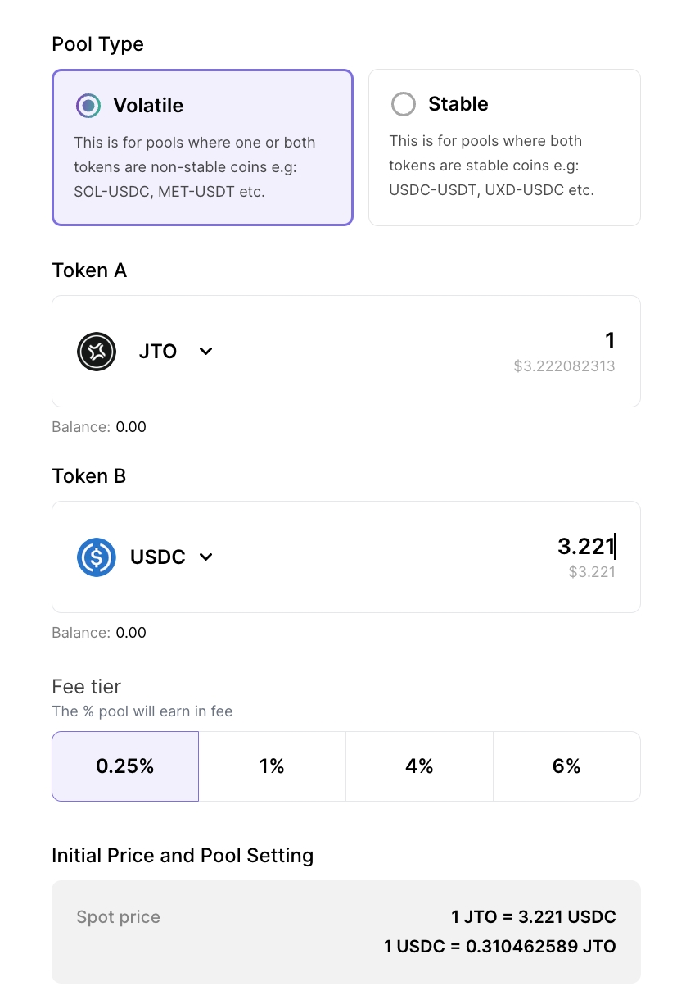
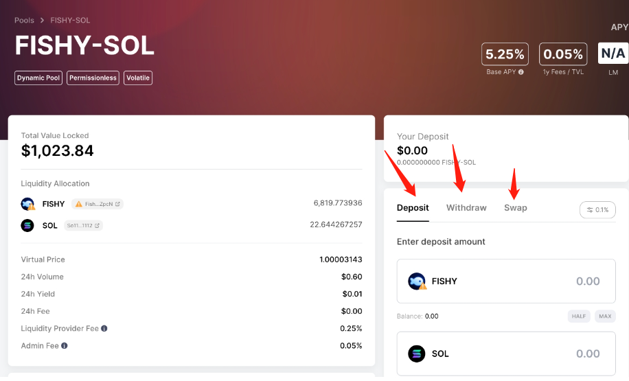

# Meteora 创建/移除池子教程

[Meteora](https://app.meteora.ag/) 是 Solana 上专注于 DeFi 收益基础设施的协议，由与 Jupiter 同一团队开发，致力于提供高资本效率的流动性池。通过 Meteora 创建的池子，有机会被集成进 Jupiter 交易路由，从而获得更多交易深度和曝光。

---

### 🧭 1. 访问官网并开始创建

打开 Meteora 官网：[https://app.meteora.ag/](https://app.meteora.ag/)

在页面中央找到 **“Create Pool”** 按钮，点击进入资金池创建流程：

---

### 🧩 2. 选择资金池类型

系统将提示你选择池子类型：

- **Volatile Pool（波动型）：** 适用于一般代币对（默认推荐）
- **Stable Pool（稳定型）：** 仅适用于稳定币之间的流动性（如 USDC/USDT）

> ❗ 如果你的代币不是稳定币，请选择 **Volatile Pool**

---

### 🔁 3. 选择代币对

在此步骤中选择你的交易对：

- **Token A：** 你发行的代币（建议通过合约地址搜索）
- **Token B：** 底池资产，如 SOL、USDC 等

---

### 💰 4. 输入初始流动性金额

根据选择的代币，输入两种资产的初始金额。

> ⚠️ 需特别注意：**初始总流动性需大于 500 美元（USDC 或等值 SOL）**，才有可能被 Jupiter 路由集成。

详细上币要求文档请参考：  
📘 [Jupiter 上币指南](https://station.jup.ag/docs/get-your-token-onto-jup)

---

### ✅ 5. 创建成功与后续操作

填写完所有信息后，钱包会弹出交易确认窗口，签署后即创建成功。系统将自动跳转至池子详情页：

你可以在该页面进行以下操作：

- **Deposit：** 增加流动性  
- **Withdraw：** 移除流动性  
- **Swap：** 使用该池交易代币

---

### 🙋‍♂️ 常见问题或获取帮助

若你在使用过程中有疑问或遇到问题，欢迎加入我们的官方社区进行咨询：  
📢 [https://t.me/tokentool_app](https://t.me/tokentool_app)
