# PUMP发币与捆绑买入教程

> **✅**  PUMP发币 | 捆绑交易 | 批量买入
>
> Pump.fun是Solana链上的MEME币发行平台，近期成为最受欢迎、最成功的Solana应用之一。为了帮助大家更方便地参与PUMP，我们推出了“一键发币”和“捆绑买入”工具。通过这些工具，用户可以在PUMP发币后迅速购买，避免被机器人抢先套利。
>
> - **一键发币：简化PUMP发币操作，轻松上手**
>
> -  **开盘买入：发币后立即买入，避免被机器人抢先套利**
>
> -  **多地址支持：最多可同时操作16个地址（包括发币地址，共17个地址），帮助分散风险和持仓**

### 前提条件：

- **在发币前，请确保已安装幻影钱包插件。安装教程 ➔ [点击这里](https://docs.tokentools.app/sol/phantom-wallet)**
- **每个地址建议准备至少0.1 SOL，避免因余额不足导致操作失败。**
- **请使用VPN或加速器翻墙，以防止网络问题。**
- **如果使用手机发币，请选择Phantom钱包或欧易Web3钱包，避免使用TP钱包，因为TP钱包不支持上传Logo。**

### Pump发币教程
#### 1、连接幻影钱包Phantom

首先，打开PUMP发币页面：[https://tokentools.app/sol/pump-launch](https://tokentools.app/sol/pump-launch)，然后点击右上角的“选择钱包”。接着会出现钱包选择界面，选择Phantom钱包进行连接。

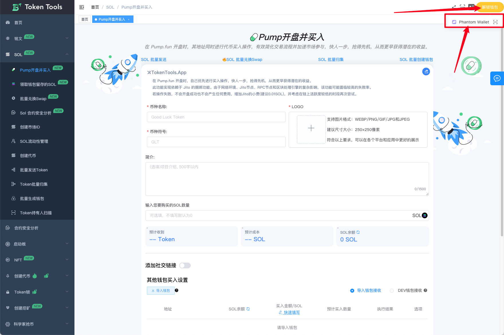

此时，钱包插件会弹出连接按钮，点击“连接”即可。如果之前已经连接过钱包，则无需重复操作。

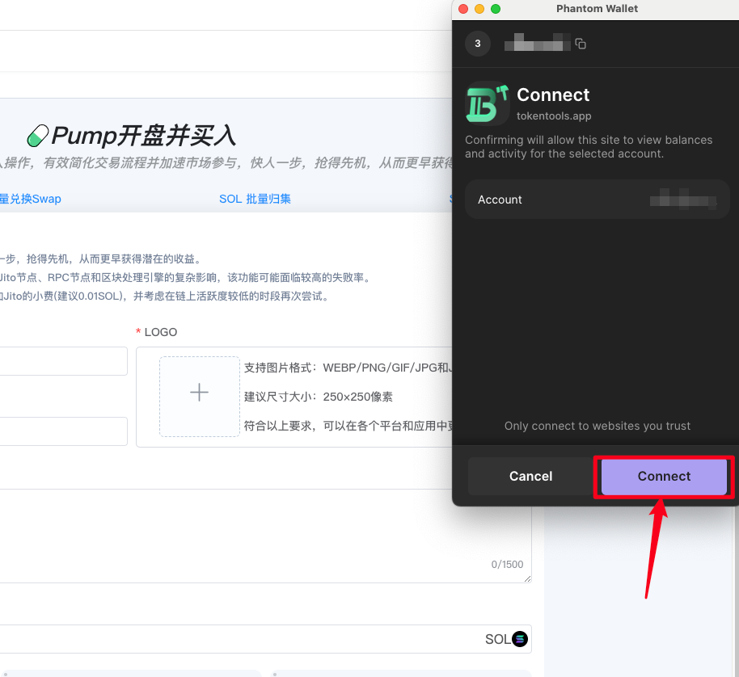

连接成功后，网站右上角会出现你的钱包地址，此时就可以进行操作了

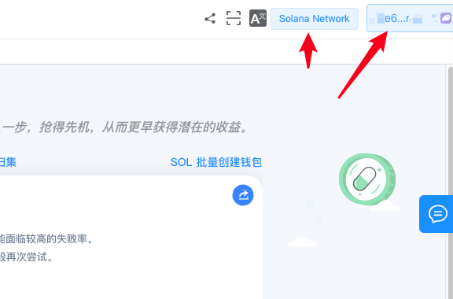

#### 2、必填代币参数

实际上，PUMP的发币流程与Sol的发币流程相同，主要是按照要求填写相关参数。唯一不同的是，PUMP的代币数量固定为10亿，精度固定为6，无需手动设置。

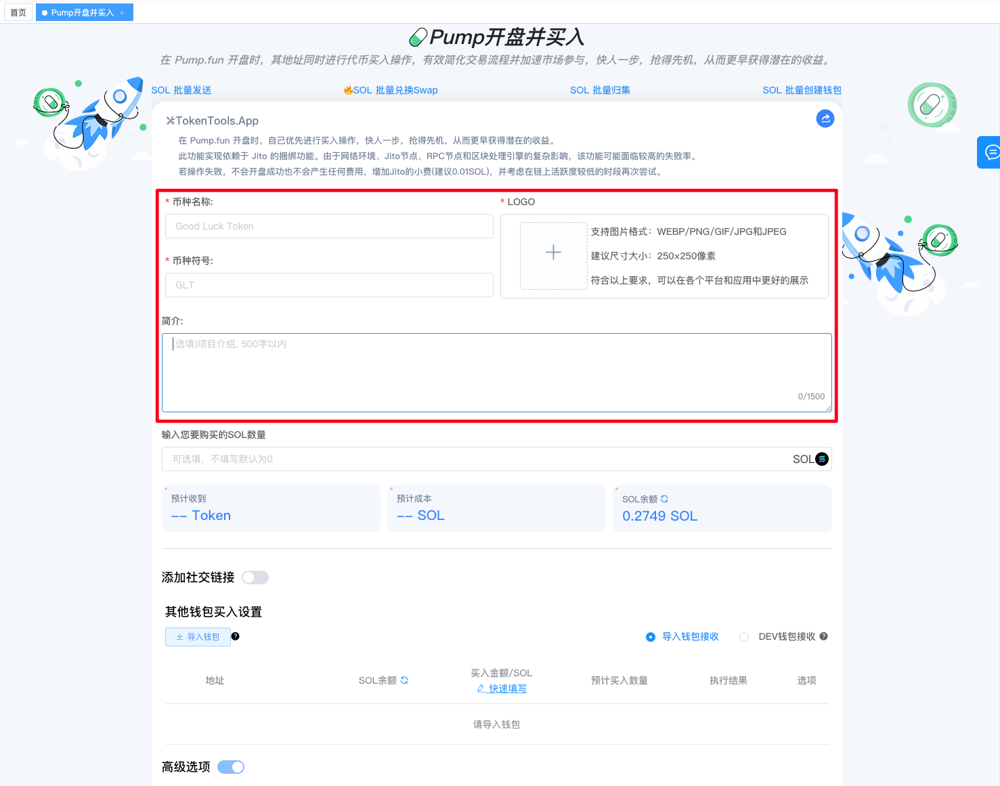

- **币种名称：** 代币全称，支持中文、英文和中英混合（如：Solana)

- **币种符号：** 代币简称，支持中文、英文和中英混合（如：SOL)

- **简介：** 代币基本信息介绍，最多500字

- **Logo：** 代币图标，支持jpg、png格式，最大100k

- **购买的SOL数量：** 发币地址（dev）需要花多少sol购买代币，与发币同步执行，默认为0



**数量：** 默认为1000000000，无法修改

**精度：** 默认为6，无法修改



#### 3、选填代币参数

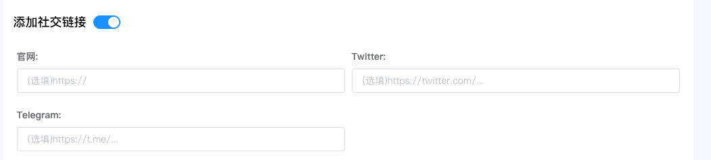

- **官网链接：** 代币的官方网站链接
- **Telegram群组：** 代币的Telegram群组链接
- **Twitter：** 代币的Twitter账号链接

到这里，如果您没有其他操作需求，可以点击“立即创建”按钮。等待大约10秒钟，钱包确认后，您的代币就会成功创建并上线PUMP进行交易。

如果您想使用捆绑交易，在发币后通过多个地址同时买入，请继续查看下面的教程。

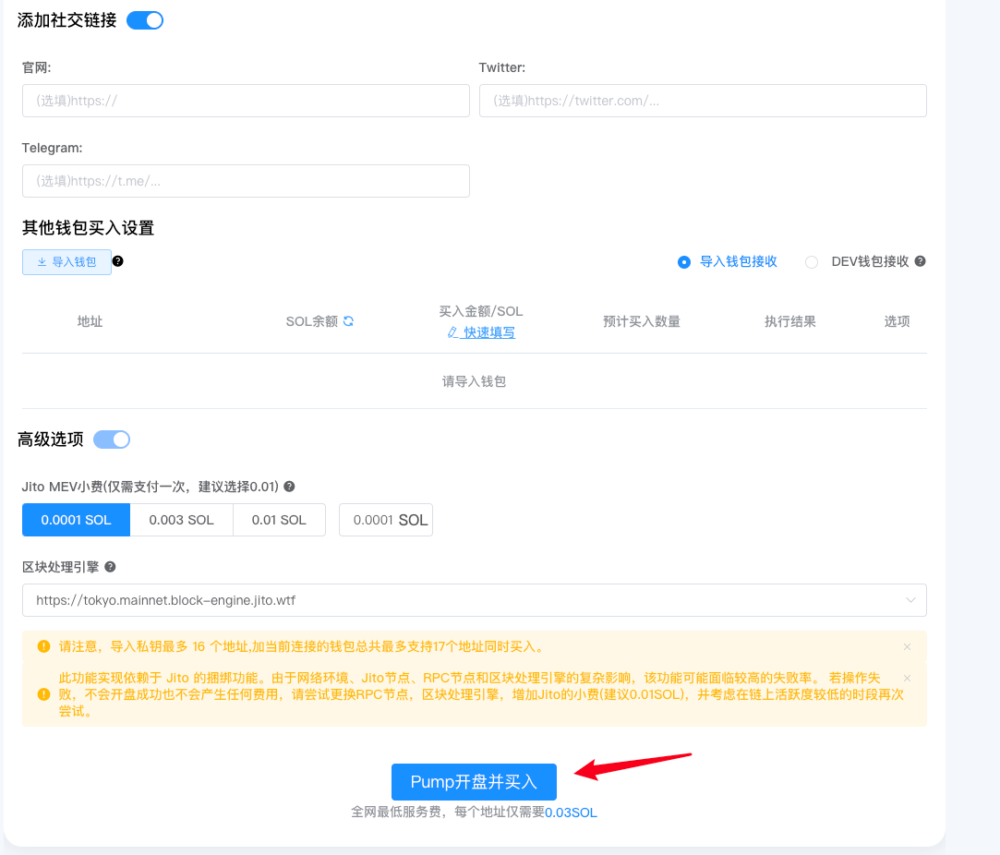

如果您还有捆绑买入的需求，我们再进行下一步

### PUMP捆绑买入教程

#### **什么是捆绑买入？**

PUMP平台上有很多抢购机器人，它们会在开盘时以低价购买大量代币，然后等价格上涨后抛售获利。虽然PUMP允许发币地址进行买入，但一个地址的购买量有限，为了避免被机器人套利，我们推出了捆绑买入功能。

简单来说，发币时，您可以将多个地址捆绑在一起，这样在发币的一瞬间，捆绑的地址会立即购买代币。通过引入Jito功能，捆绑地址的买入时间将远早于机器人，从而避免了机器人抢购的风险。

目前，平台最多支持16个地址捆绑，每个地址捆绑费用为0.03 SOL，目前是全网最低费用。

#### **如何进行捆绑买入？**

点击捆绑买入按钮后，您将看到如下页面。

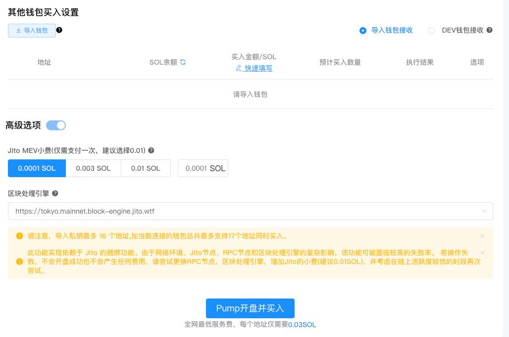

**Jito捆绑小费：**
 Jito是Solana区块链上的一个协议，其核心功能之一是交易捆绑，能将多笔交易打包成一笔一起完成。这个小费是支付给Jito的费用，帮助您完成捆绑交易。

**捆绑买入设置：**
 您可以通过私钥导入需要参与捆绑买入的钱包地址，并设置购买金额。

点击“导入钱包”后，输入钱包的私钥（每行一个私钥）。

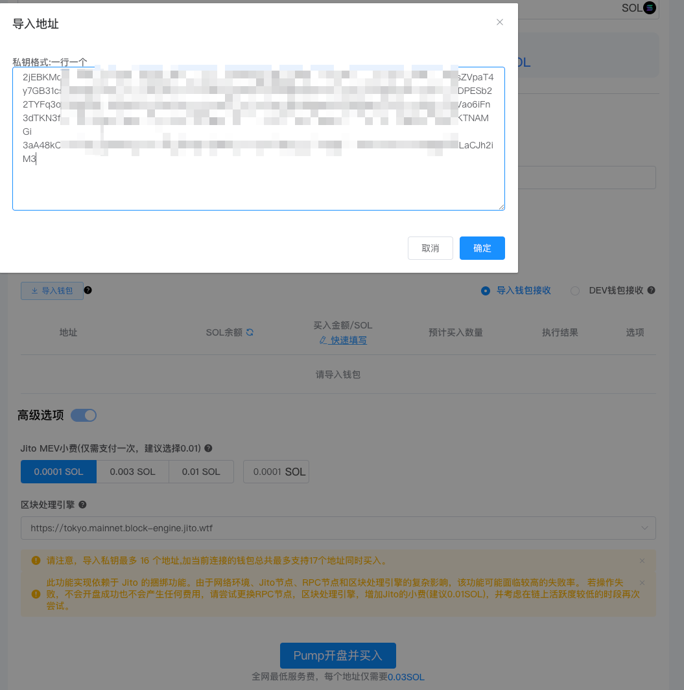

导入私钥后，您可以看到钱包中的SOL余额。接着，输入您要购买的SOL数量，或者点击“MAX”按钮自动填写最大购买数量。

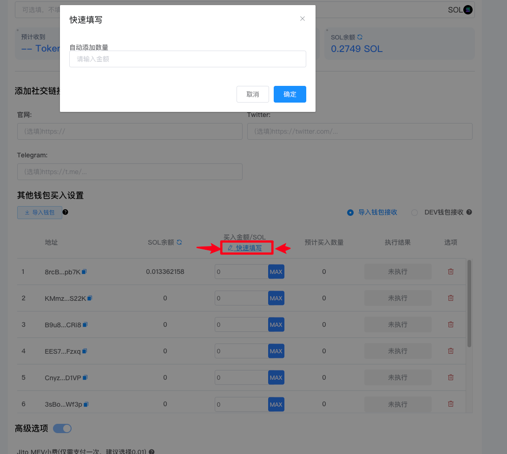

如果需要批量填写购买数量，可以点击【快速填写】进行操作。

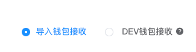

还可以选择购买后的币留存在小号地址中，还是发送到DEV钱包（当前连接的钱包）。

以上信息全部填写完毕后，【点击Pump开盘并买入】按钮。

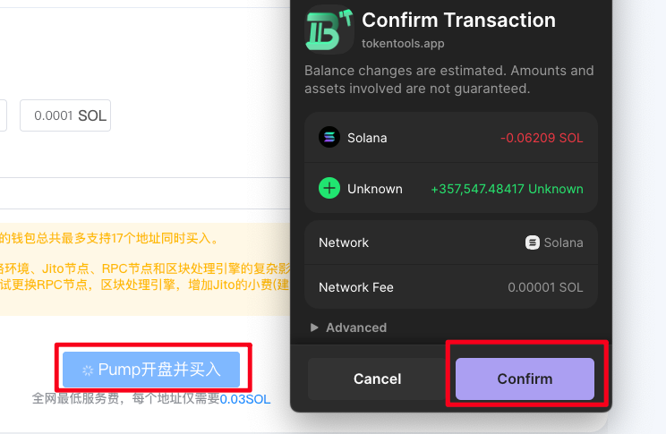

钱包确认后，代币就会在PUMP上架交易了，整个捆绑开盘的流程就算是完成了。完成后对话框可获取Token地址和Pump连接地址。

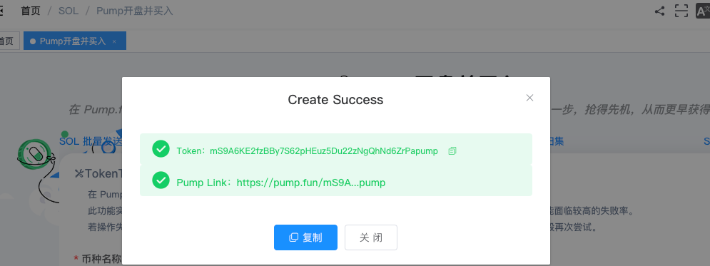

最后我们通过Pump.fun平台查询到多地址同时买入信息。

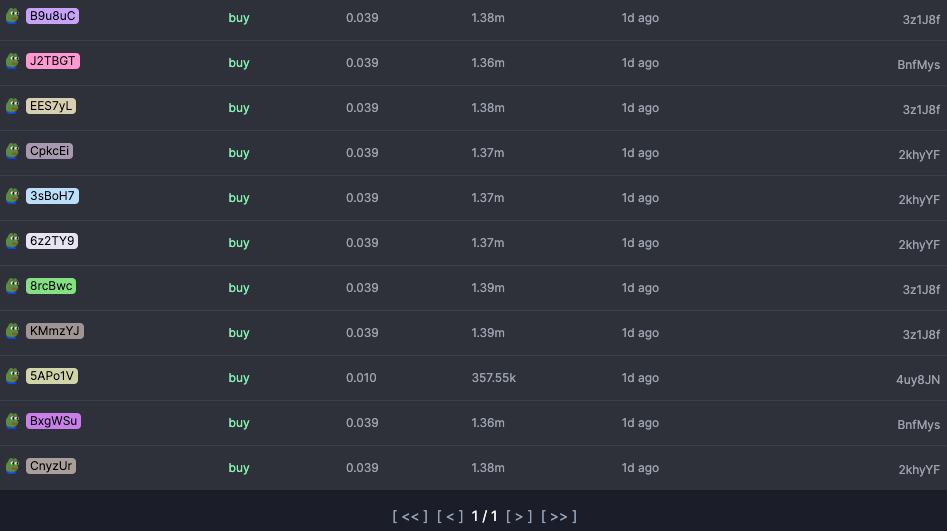

**PUMP开盘疑问解答**

1. **最多捆绑16个地址，是否包括发币地址？**
   
   答：不包括发币地址。总共最多支持17个地址（包括发币地址）同时参与买入。
2. **为什么点击“立即创建”后没有反应？**
   
   答：PUMP发币需要等待数据上链，大约需要10秒钟左右，之后会弹出钱包确认提示。
3. **PUMP发币的数量和精度是多少？**
   
   答：PUMP发的所有币数量固定为10亿，精度为6。
4. **PUMP发币后，能修改代币资料吗？**
   
   答：PUMP发的代币是没有权限修改的，不能增发、不能拉黑也不能修改代币资料。
5. **在TokenTools平台进行PUMP发币和捆绑交易怎么收费？**
   
   答：PUMP发币费用为0.03 SOL，每个地址的捆绑买入费用为0.03 SOL（可以通过页面下方提示查看费用）。
6. **合约后缀是“pump”吗？**
   
   答：是的，随着PUMP代币数量的增加，我们加入了后台算力，确保用户每次发币时都是pump后缀地址，只有1%的概率可能出现 合约后缀不适“pump”后缀，这只是算力不足的原因。
7. **PUMP发币需要添加流动性池吗？**
   
   答：不需要。用户购买后，PUMP会自动形成联合曲线流动性，无需手动添加池子。
8. **PUMP发币满足什么条件才能上Raydium？**
   
   答：当PUMP联合曲线的资金池达到85 SOL时，PUMP会帮助代币在Raydium V2上创建流动性，并销毁LP，这个过程也叫做内盘转成外盘。
9. **导入钱包接收 和 DEV钱包接收有什么区别？**
   
   **导入钱包接收：** 捆绑交易每个地址买入后，代币会存放在导入的每个钱包地址中。
   
   **DEV钱包接收：** 代币买入后，会转移到当前连接的DEV钱包地址（即您登录时使用的钱包）。
10. **PUMP代币开盘初始价格是多少?**

      答：PUMP开盘初始价格默认是0.000000028sol

如果您还有其他任何问题，都可以进入Telegram电报群。

TokenTools | 创建代币、批量空投和做市机器人等Solana工具集(https://tokentools.app)

TokenTools | 安全、开源，给Solana用户带来最便利的一站式体验。

TokenTools社群

- website: [https://tokentools.app](https://tokentools.app)

- telegram: [https://t.me/tokentool_app](https://t.me/tokentool_app)

- Twitter: [https://twitter.com/tokentool_app](https://twitter.com/tokentool_app)

- Github: [https://github.com/tokenTool-App](https://github.com/tokenTool-App)

- youtube: [https://www.youtube.com/@tokentool_app](https://www.youtube.com/@tokentool_app)

- Email [tokentool.app@gmail.com](tokentool.app@gmail.com)

- Gitbook：[https://docs.tokentools.app](https://docs.tokentools.app)