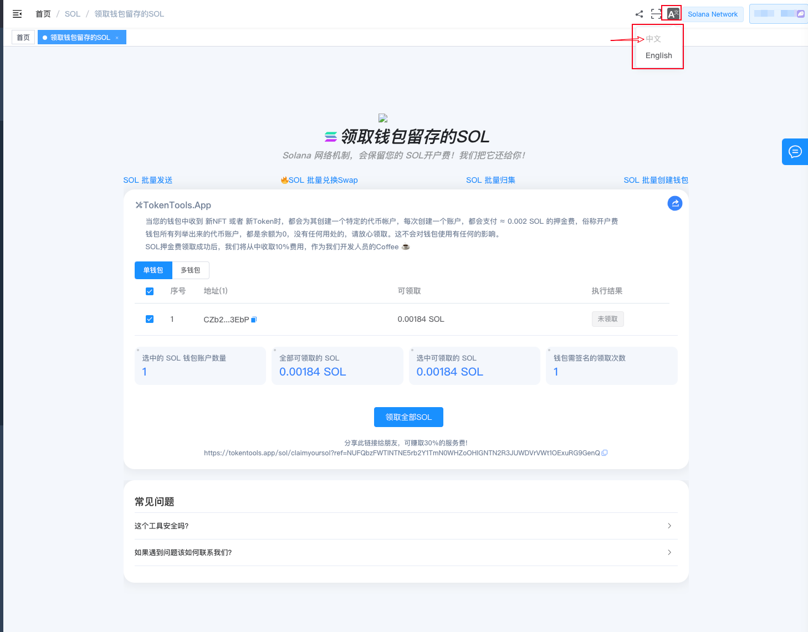
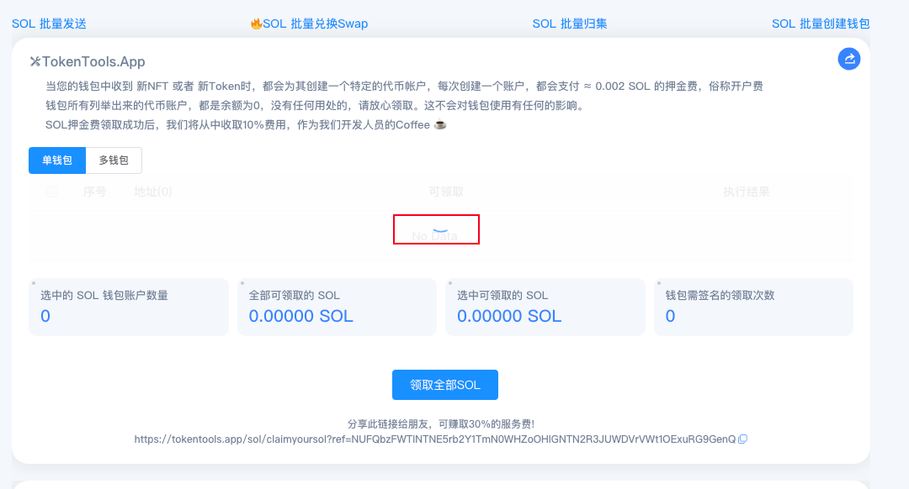
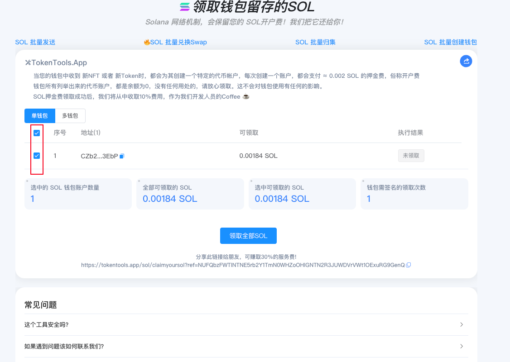
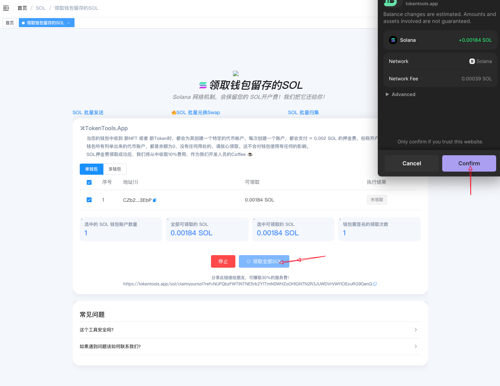

# 租金回收-领取钱包存留的SOL

> **✅**  Solana关闭账户 | 批量回收账户租金 | 领取您的Solana
>
> 在 Solana 上，每个 Token 或 NFT 都需支付 SOL 租金。通过简单步骤，批量销毁不需要的 NFT 或代币，快速回收账户租金。
>
> 你可以在 SOL 官方文档了解更多租金相关信息 [Link ](https://solana.com/docs/core/accounts)
>
> 全网最低GAS费用，分享赚钱还可获得30%服务费。

### **如何使用 Solana 关闭账户，回收租金工具**

1. **链接钱包**
2. **等待查询账户信息**
3. **选择要关闭并回收的账户**
5. **确认关闭发送上链等待租金回收完成**

### **具体步骤：**
1. **链接钱包**

**Solana租金回收**：[https://tokentools.app/sol/pump-launch](https://tokentools.app/sol/pump-launch)

进入 [TokenTools](https://tokentools.app/sol/pump-launch) 租金回收页面，右上角支持切换语言。

2. **等待查询账户信息**

   

3. **选择要关闭并回收的账户**

- 当您的钱包中收到 新NFT 或者 新Token时，都会为其创建一个特定的代币帐户，每次创建一个账户，都会支付 ≈ 0.002 SOL 的押金费，俗称开户费

- 钱包所有列举出来的代币账户，都是余额为0，没有任何用处的，请放心领取。这不会对钱包使用有任何的影响。

  

4. **确认关闭发送上链等待租金回收完成**

   如果需要关闭的账户较多，需要统计账户相关信息，还请耐心等待。

**温馨提醒，必读！**

> 1. 钱包所有列举出来的代币账户，都是余额为0，没有任何用处的，请放心领取。这不会对钱包使用有任何的影响。

> 2. SOL押金费领取成功后，我们将从中收取10%费用，作为我们开发人员的Coffee ☕️

> 3. 分享此链接给朋友，可赚取30%的服务费!

TokenTools | 创建代币、批量空投和做市机器人等Solana工具集(https://tokentools.app)

TokenTools | 安全、开源，给Solana用户带来最便利的一站式体验。

TokenTools社群

- website: [https://tokentools.app](https://tokentools.app)

- telegram: [https://t.me/tokentool_app](https://t.me/tokentool_app)

- Twitter: [https://twitter.com/tokentool_app](https://twitter.com/tokentool_app)

- Github: [https://github.com/tokenTool-App](https://github.com/tokenTool-App)

- youtube: [https://www.youtube.com/@tokentool_app](https://www.youtube.com/@tokentool_app)

- Email [tokentool.app@gmail.com](tokentool.app@gmail.com)

- Gitbook：[https://docs.tokentools.app](https://docs.tokentools.app)
