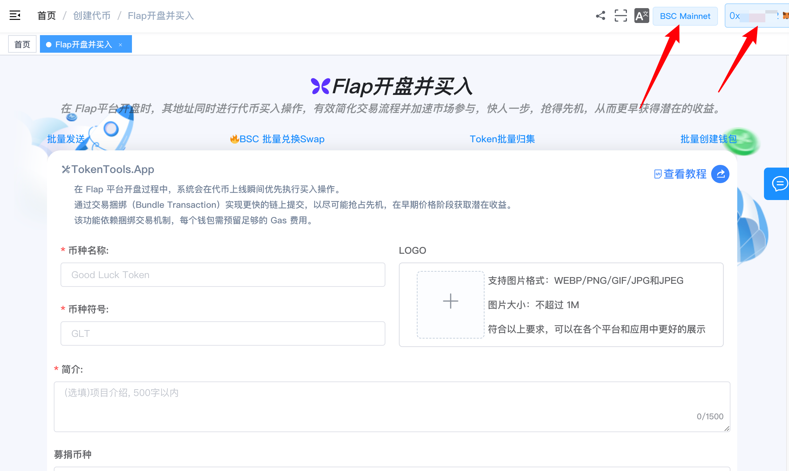
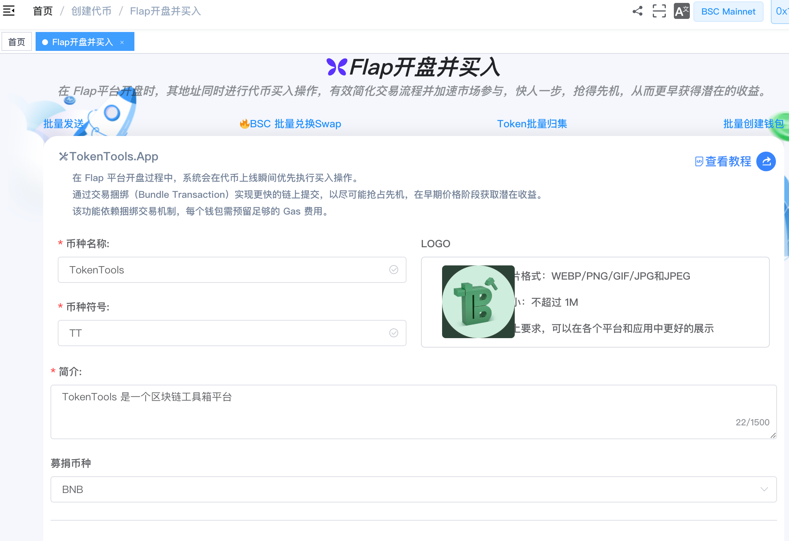
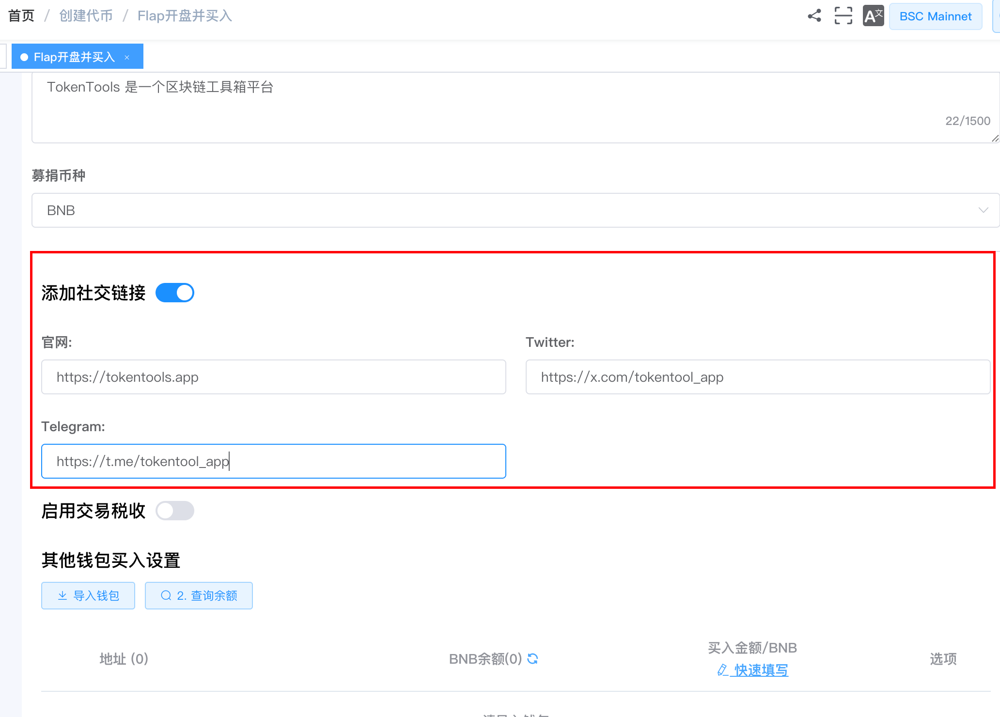
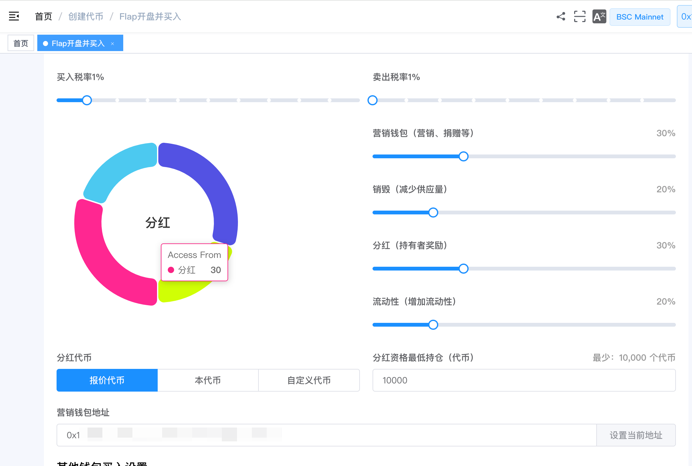
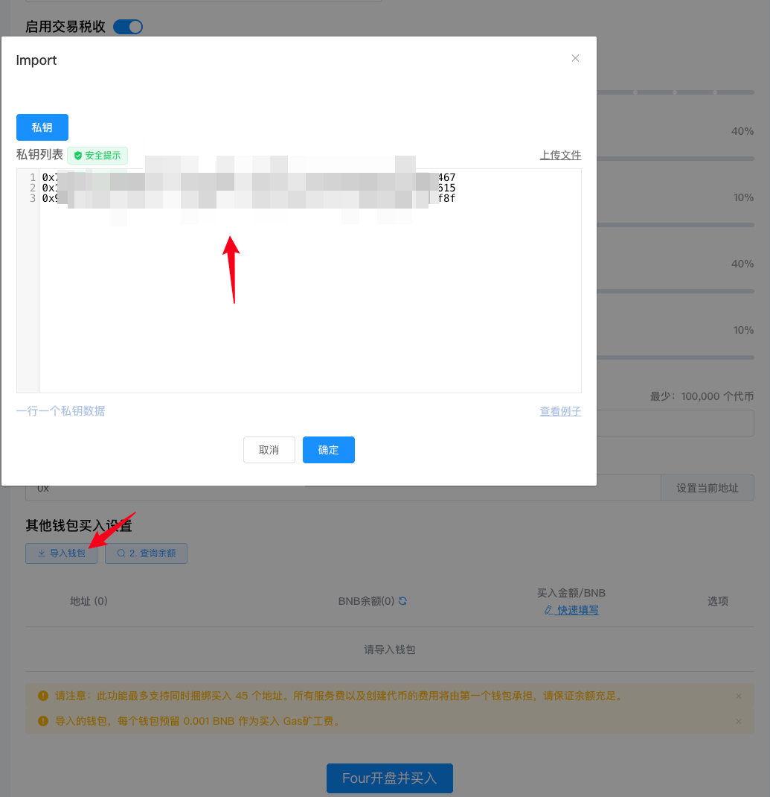
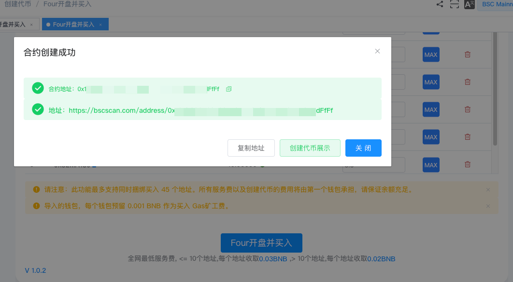
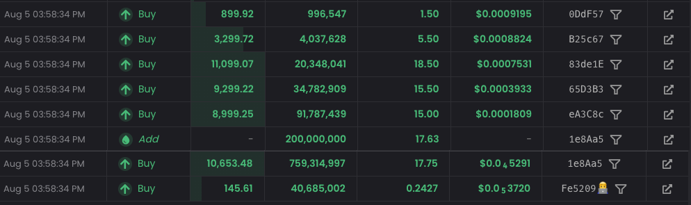

# FLAP创建代币并捆绑买入教程

> 在 Flap 平台创建代币的同时进行代币买入操作，保证 **100% 最早买入**，有效简化交易流程并加速市场参与，快人一步，抢得先机，从而更早获得潜在的收益。

> **点击加入 [TokenTool官方交流群](https://t.me/tokentool_app) 交流反馈**
> **推荐使用电脑版谷歌浏览器 + `Metamask` 插件钱包进行操作**
> **手机用户也可以在 `TP钱包`-发现-输入官网链接 进行操作**

---

## 简介

[Flap.sh](https://flap.sh) 是一个去中心化的代币发行与交易平台，用户可以在平台上快速创建代币并进行交易。

TokenTool 的 **FLAP 创建代币并捆绑买入**工具专为 Flap 生态设计，实现**发币与初始吸筹的同步执行**。该工具具备一键捆绑交易、多地址自动买入、防御机器人狙击等特点。

### 📌 核心摘要

**功能定位**：专为 Flap 生态打造的"发币+吸筹"一体化进阶工具。支持在创建代币的同一瞬间完成初始买入，实现真正意义上的"开盘即持仓"。

**技术特性**：

- **原子化捆绑交易**：将发币与买入指令打包在同一区块执行，确保项目方获得 100% 最早买入权，锁定极低初始成本。
- **多地址协同吸筹**：支持自动化配置多个钱包地址同步买入，优化持币分布结构，模拟真实的社区热度。
- **智能防夹/防狙击**：通过捆绑机制有效规避外部 MEV 机器人狙击，保障项目启动初期筹码的安全性。

## 准备事项

1. 一台电脑或一部手机，支持桌面端和移动端访问
2. MetaMask（小狐狸）钱包，[安装下载](https://metamask.io/download/)
3. 钱包最少准备 **0.001 BNB** 作为 Gas 汽油矿工费用
4. 要买入的地址私钥，准备多个钱包私钥（最多 45 个），用于批量买入
5. 买入资金，确保主钱包和各子钱包有足够 BNB 用于买入和支付服务费 


**安全提醒**：涉及私钥操作存在风险。建议您使用**全新创建的一次性钱包**进行代币发行操作，完成后及时将资产转移至安全钱包。


## 操作步骤

### 第 1 步：连接钱包

1. 打开页面：[https://tokentools.app/createToken/flap](https://tokentools.app/createToken/flap)
2. 点击右上角，连接 **MetaMask（小狐狸）钱包**
3. 确保钱包网络已切换到 **币安链主网（BSC Mainnet）**


连接成功后，页面会显示当前链名称和您的钱包地址。


---

### 第 2 步：填写代币信息并上传 Logo

填写您要创建的代币的基本信息：

**Logo**：代币图标，支持所有图片格式，最大 **2MB**

**币种名称**：代币的全称

**币种符号**：代币的简称（通常 3-5 个大写字母）

**描述**：代币的介绍文案，最长 1500 字

**募捐币种**：选择用户购买您的代币时需要用哪种币来兑换


**提示**：Logo 图片建议使用正方形或圆形，展示效果最佳。


---

### 第 3 步：添加社交链接（选填）

您可以添加代币项目的社交链接，帮助投资者了解项目：

**官网**：项目官网地址，示例：https://tokentools.app

**Twitter**：X（推特）链接，示例：https://x.com/tokentool_app

**Telegram**：电报群链接，示例：https://t.me/tokentool_app


**注意**：所有链接必须以 `https://` 开头，格式不正确可能导致创建失败。


---

### 第 4 步：设置税率（选填）


**什么是交易税？** 交易税是指每次买卖代币时，从交易金额中扣除一定比例分配给特定用途（如营销、销毁、分红、流动性等）的机制。


如果您要创建**有税代币**，请打开"启用交易税收"开关：

**买入税**：买入时收取的税率（0% - 10%）

**卖出税**：卖出时收取的税率（1% - 10%）

**营销税**：分配给营销钱包的比例（0% - 100%）

**销毁税**：直接销毁的比例，通缩机制（0% - 100%）

**分红税**：分配给持币者的比例（0% - 100%）

**流动性税**：自动添加流动性的比例（0% - 100%）

**分红模式**：分红代币类型，支持 底池代币 / 本代币 / 自定义合约 三种

**营销钱包**：营销税的接收地址

**分红最低持币**：获得分红需要持有的最少代币数（最少 10,000）


**重要**：四项税收分配比例（营销 + 销毁 + 分红 + 流动性）**必须合计等于 100%**，否则无法提交。右侧饼图会实时显示分配比例。



**分红模式说明**：Flap 支持三种分红代币类型：

- **底池代币（默认）**：持有者获得底池代币（如 BNB）作为分红
- **本代币**：持有者获得本代币作为分红
- **自定义合约**：持有者获得您指定的其他 ERC20 代币作为分红（需填写合约地址，系统会自动查询代币符号）


---

### 第 5 步：导入钱包

这是批量买入的关键步骤。

1. 点击 **「导入钱包」** 按钮
2. 在弹窗中粘贴私钥，**一行一个私钥**
3. 点击确认完成导入


**重要说明**：

- 最多可导入 **45 个地址**进行捆绑买入操作
- **所有服务费由第一个钱包支付**，请确保第一个钱包的 BNB 余额充足
- 每个钱包需预留 **0.001 BNB** 作为买入 Gas 费
- 建议使用**一次性钱包**，操作完成后及时更换


导入钱包后，每个钱包下方会显示余额和买入金额输入框：

- **手动输入**：在买入金额框中直接输入每个钱包要买入的金额
- **一键最大值**：点击 `MAX` 按钮自动填入该钱包可用的最大金额
- **快速填写**：点击"快速填写"链接，批量设置所有钱包的买入金额


**MAX 计算规则**：点击 `MAX` 时，第一个钱包会自动扣除服务费（根据钱包总数计算）和 0.001 BNB 的 Gas 预留，其余钱包只扣除 Gas 预留。这样不会因余额不足导致买入失败。


---

### 第 6 步：一键创建并买入

一切准备就绪后，点击 **「Flap开盘并买入」** 按钮。


系统会自动完成以下操作：
1. 上传代币图标
2. 生成带自定义后缀的 靓号合约地址
3. 在 Flap 平台创建代币
4. 多个钱包同时在开盘瞬间买入（Bundle 打包）

整个过程无需人工干预，一键完成！


等待片刻后，弹出成功对话框，您可以**复制代币地址**或点击链接**在区块浏览器中查看**代币信息。


🎉 恭喜！您的代币已成功在 Flap 上创建，买入操作也已完成！


## 常见问题 FAQ

**Q：我的代币创建成功后在哪里查看？**

A：创建成功后，弹窗会显示代币合约地址。您可以：

- 复制地址后在 [Flap.sh](https://flap.sh) 上搜索
- 在 BSC 区块浏览器上查看代币详情
- 在 [PancakeSwap](https://pancakeswap.finance) 上交易（流动性迁移后）

**Q：买卖税率设置后可以修改吗？**

A：代币创建后，税率等相关参数已固定在智能合约中，无法修改。请在创建前仔细确认各项配置。

---

## 联系与支持

如果在使用过程中遇到任何问题，欢迎通过以下方式联系我们：

- 📧 Email：tokentool.app@gmail.com
- 📱 Telegram：[https://t.me/tokentool_app](https://t.me/tokentool_app)
- 🐦 Twitter / X：[https://x.com/tokentool_app](https://x.com/tokentool_app)

