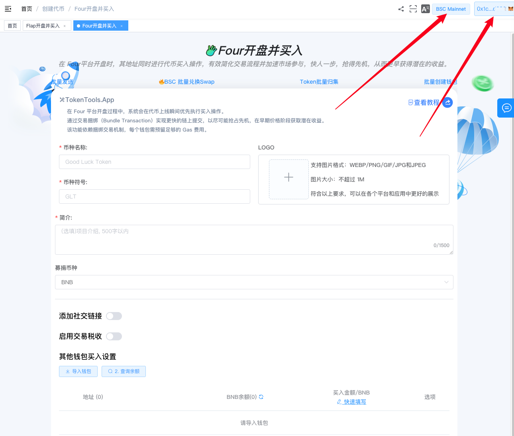
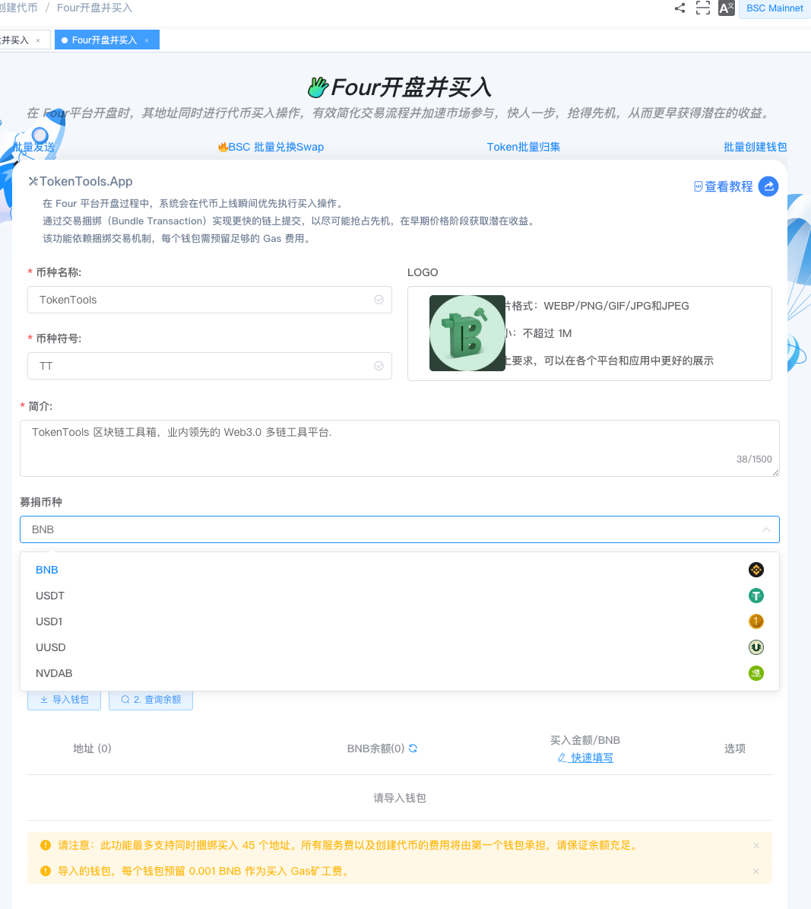
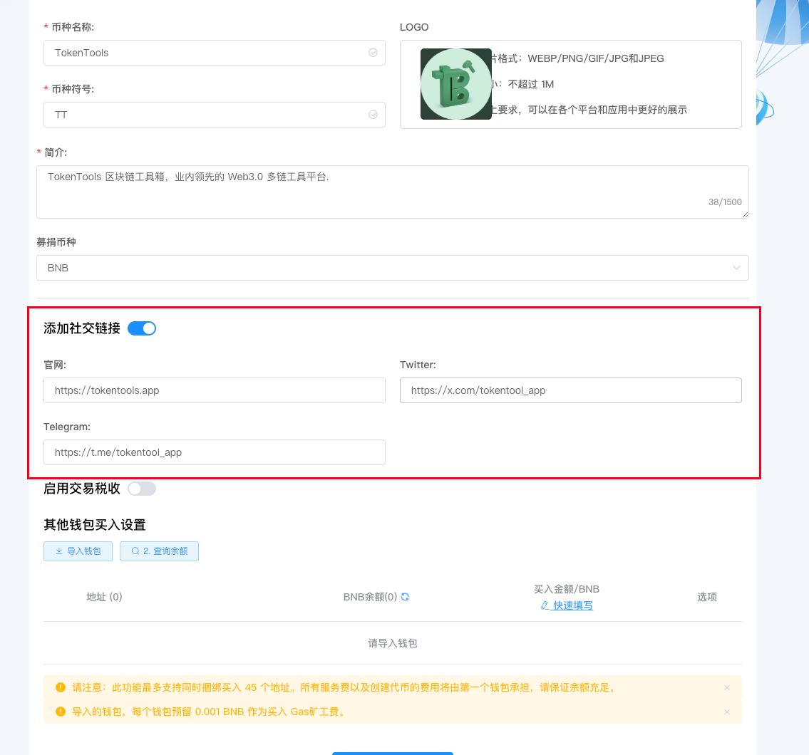
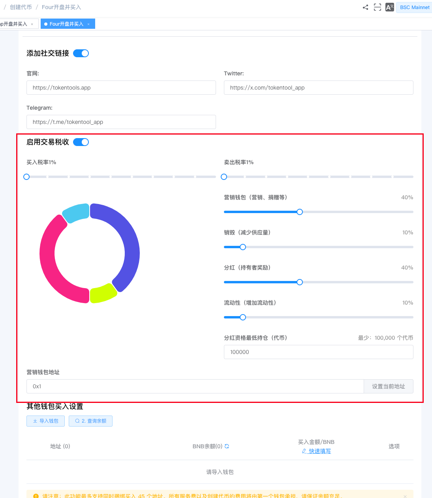
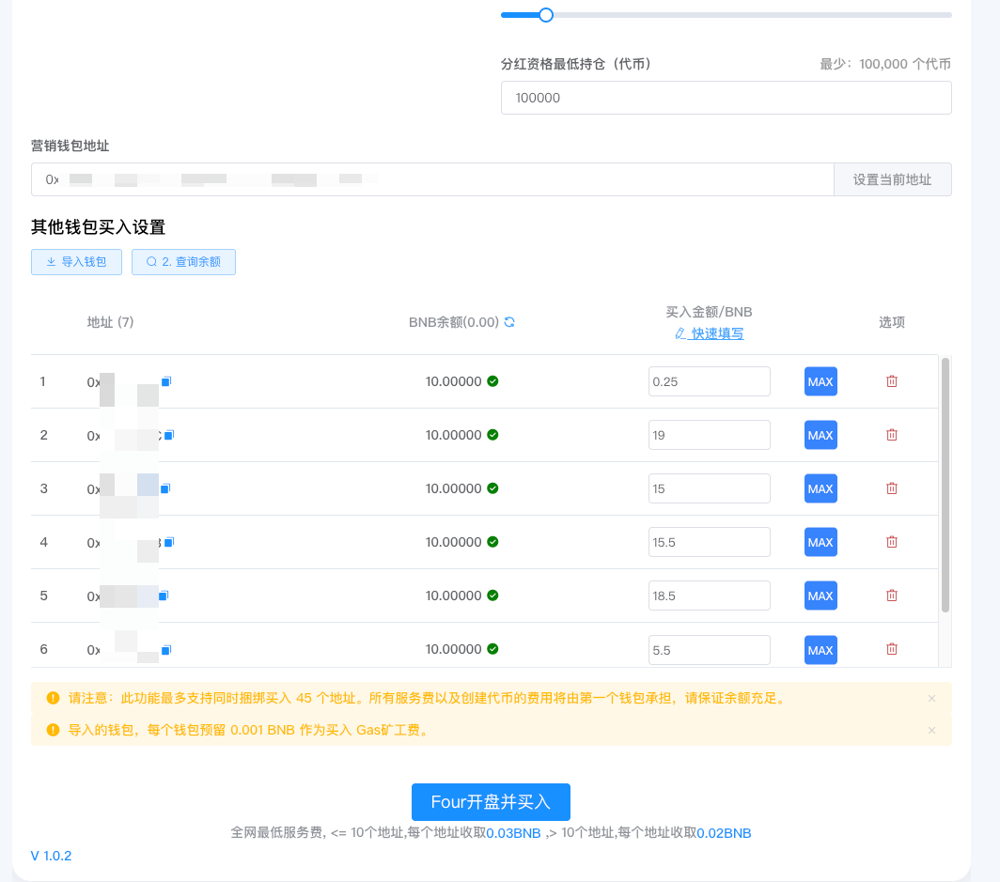

# Four创建代币并捆绑买入教程

> 在 FourMeme 创建代币的同时进行代币买入操作，保证 **100% 最早买入**，有效简化交易流程并加速市场参与，快人一步，抢得先机，从而更早获得潜在的收益。

> **点击加入 [TokenTool官方交流群](https://t.me/tokentool_app) 交流反馈**
> **推荐使用电脑版谷歌浏览器 + `Metamask` 插件钱包 进行操作.**
> **手机用户也可以在 `TP钱包`-发现-输入官网链接 进行操作.**

## 简介

[Four.Meme](https://four.meme) 是 **BSC 链上首个 Meme 代币公平发布平台**，旨在为部署者和投资者提供一种无缝且低成本的启动 Meme 代币的方式。其核心功能是帮助用户创建和发行 Meme 代币。

TokenTool 的 **FOUR 创建代币并捆绑买入**工具专为 Four / Flap / Pump 生态设计，实现**发币与初始吸筹的同步执行**。该工具具备一键捆绑交易、多地址自动买入、内外盘超额买入、防御机器人狙击等特点。

### 📌核心摘要

**功能定位**：专为 FourMeme 生态打造的"发币+吸筹"一体化进阶工具。支持在创建代币的同一瞬间完成初始买入，实现真正意义上的"开盘即持仓"。

**技术特性**：

- **原子化捆绑交易**：将发币与买入指令打包在同一区块执行，确保项目方获得 100% 最早买入权，锁定极低初始成本。

- **多地址协同吸筹**：支持自动化配置多个钱包地址同步买入，优化持币分布结构，模拟真实的社区热度。

- **智能防夹/防狙击**：通过捆绑机制有效规避外部 MEV 机器人狙击，保障项目启动初期筹码的安全性。

- **内盘+外盘联合买入**："内盘 + 外盘联合买入"功能。当内盘额度打满后，剩余钱包自动切换到 PancakeSwap 外盘继续买入，彻底解决了"买不够"的痛点，市面上同类工具大多只能买入内盘部分。

> **什么是内盘 / 外盘？**
>
> 以 Four.Meme 为例，代币发行后首先在平台内置的流动性池中交易，这个阶段称为 **"内盘"**。以内盘 BNB 交易对为例，当累积买入达到 18 BNB 后，Four.Meme 会自动将剩余流动性迁移到 PancakeSwap V2，此后代币在 PancakeSwap 上自由交易，这个阶段称为 **"外盘"**。
>
> **举个例子**：假设您想用 100 个 BNB 分 10 个地址（每个 10 BNB）来买入。由于内盘限额是 18 BNB，前两个地址买入后内盘就打满了。我们的工具会自动识别——**从第三个地址开始，自动切换至 PancakeSwap 外盘继续买入**，保证您规划的 100 BNB 全部用于吸筹，一个地址都不浪费。



**Four.Meme创建代币并买入 | 简化交易流程 | 抢得交易先机｜全网最低费用**

币安BSC内盘创建代币的同时进行代币买入操作，有效简化交易流程并加速市场参与，快人一步，抢得先机，从而更早获得潜在的收益。

 [立即体验>>>](https://tokentools.app/createToken/four) 



## 操作步骤

### 第 1 步：连接钱包

1. 打开页面：[https://tokentools.app/createToken/four](https://tokentools.app/createToken/four)
2. 点击右上角，连接 **MetaMask（小狐狸）钱包**
3. 确保钱包网络已切换到 **币安链主网（BSC Mainnet）**


连接成功后，页面会显示当前链名称和您的钱包地址。


---

### 第 2 步：填写代币信息并上传 Logo

填写您要创建的代币的基本信息：

**Logo**：代币图标，支持所有图片格式，最大 **1MB**

**币种名称**：代币的全称

**币种符号**：代币的简称（通常 3-5 个大写字母）

**描述**：代币的介绍文案，最长 1500 字

**募捐币种**：选择用户购买您的代币时需要用哪种币来兑换。目前支持以下 5 种募捐币种。


**提示**：Logo 图片建议使用正方形或圆形，在 Four.Meme 上展示效果最佳。


### 第 3 步：添加社交链接（选填）

您可以添加代币项目的社交链接，帮助投资者了解项目：

| 字段 | 说明 | 示例 |
|------|------|------|
| 官网 | 项目官网地址 | https://tokentools.app |
| Twitter | X（推特）链接 | https://x.com/tokentool_app |
| Telegram | 电报群链接 | https://t.me/tokentool_app |


**注意**：所有链接必须以 `https://` 开头，格式不正确可能导致创建失败。


---

### 第 4 步：设置税率（选填）


**什么是交易税？** 交易税是指每次买卖代币时，从交易金额中扣除一定比例分配给特定用途（如营销、销毁、分红、流动性等）的机制。


如果您要创建**有税代币**，请打开"启用交易税收"开关：

| 配置项 | 说明 | 范围 |
|--------|------|------|
| 买入税 | 买入时收取的税率 | 1% - 10% |
| 卖出税 | 卖出时收取的税率 | 1% - 10% |
| 营销税 | 分配给营销钱包的比例 | 0% - 100% |
| 销毁税 | 直接销毁的比例（通缩） | 0% - 100% |
| 分红税 | 分配给持币者的比例 | 0% - 100% |
| 流动性税 | 自动添加流动性的比例 | 0% - 100% |
| 营销钱包 | 营销税的接收地址 | — |
| 分红最低持币 | 获得分红需要持有的最少代币数 | 最少 100,000 |


**重要**：四项税收分配比例（营销 + 销毁 + 分红 + 流动性）**必须合计等于 100%**，否则无法提交。右侧饼图会实时显示分配比例。


---

### 第 5 步：导入钱包

这是批量买入的关键步骤。

1. 点击 **「导入钱包」** 按钮
2. 在弹窗中粘贴私钥，**一行一个私钥**
3. 点击确认完成导入


**重要说明**：

- 最多可导入 **45 个地址**进行捆绑买入操作
- 所有服务费由**第一个钱包**支付，请确保其 BNB 余额充足
- 每个钱包需预留 **0.001 BNB** 作为买入 Gas 费
- 建议使用**一次性钱包**，操作完成后及时更换


导入钱包后，每个钱包下方会显示余额和买入金额输入框：

- **手动输入**：在买入金额框中直接输入每个钱包要买入的金额
- **一键最大值**：点击 `MAX` 按钮自动填入该钱包可用的最大金额
- **快速填写**：点击"快速填写"链接，批量设置所有钱包的买入金额


**智能超额买入**：如果您设置的买入金额超过了内盘限额，**剩余的钱包会自动到 PancakeSwap 外盘进行买入**，无需手动切换，系统全自动处理。


---

### 第 6 步：一键创建并买入

一切准备就绪后，点击 **「Four开盘并买入」** 按钮。


系统会自动完成以下操作：

1. 上传代币图标
2. 在 Four.Meme 平台创建代币
3. 多个钱包同时在开盘瞬间买入（Bundle 打包）
4. 如果内盘额度满了，自动到外盘 PancakeSwap 继续买入

整个过程无需人工干预，一键完成！


等待片刻后，弹出成功对话框，您可以**复制代币地址**或点击链接**在区块浏览器中查看**代币信息。


🎉 恭喜！您的代币已成功在 Four.Meme 上创建，买入操作也已完成！


## 常见问题 FAQ

**Q：这个功能支持哪些链？**

A：目前仅支持 **BSC 链（币安智能链）**。后续会扩展支持更多链。

**Q：创建代币失败怎么办？**

A：请检查以下几点：

- 第一个钱包（主钱包）的 BNB 余额是否足够支付服务费 + Gas 费
- 如果创建的是有税代币，四项税收分配是否合计 100%

**Q：是否可以超额买入？**

A：当然可以！如果您设置的总买入额超过内盘额度，系统会自动将剩余钱包的买入操作切换到 **PancakeSwap 外盘**进行，确保每一分钱都花在刀刃上。外盘可购买的份额 = 外盘 PancakeSwap 流动性池中的所有代币。

**Q：交易会在同一时间执行吗？**

A：是的。所有钱包的创建 + 买入交易通过**捆绑（Bundle）机制**打包在同一个区块中执行，确保您获得最早买入权，有效防止机器人狙击。

**Q：最多支持多少个钱包？**

A：最多 **45 个钱包**。

**Q：为什么选择 BNB 以外的币种需要先授权？**

A：如果您选择 USDT、USD1、UUSD、NVDAB 等 ERC20 代币作为募捐币种，每个钱包都需要先授权（Approve）给智能合约才能完成买入。系统会自动检测并处理授权，授权交易也会打包在同一次 Bundle 中，您不需要额外操作。

**Q：私钥是否安全？**

A：TokenTools 不会在服务端存储您的私钥。私钥仅在您的浏览器本地进行交易签名使用。但为了最大程度的安全，我们强烈建议您：

- 使用**专门创建的、仅用于本次操作的钱包**
- 操作完成后**及时将资产转移**
- 不要在联网设备上长期保存私钥

**Q：操作失败后费用会退还吗？**

A：如果在执行阶段 **捆绑（Bundle）** 发送失败，不会产生任何费用，也代表没有上链成功。

**Q：我的代币创建成功后在哪里查看？**

A：创建成功后，弹窗会显示代币合约地址。您可以：

- 复制地址后在 [Four.Meme](https://four.meme) 上搜索
- 在 BSC 区块浏览器上查看代币详情

**Q：买卖税率设置后可以修改吗？**

A：代币创建后，税率等相关参数已固定在智能合约中，无法修改。

## 联系与支持

如果在使用过程中遇到任何问题，欢迎通过以下方式联系我们：

- 📧 Email：tokentool.app@gmail.com
- 📱 Telegram：[https://t.me/tokentool_app](https://t.me/tokentool_app)
- 🐦 Twitter / X：[https://x.com/tokentool_app](https://x.com/tokentool_app)
