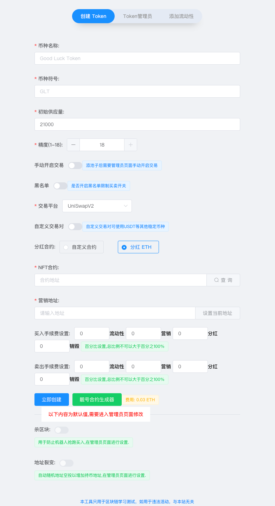
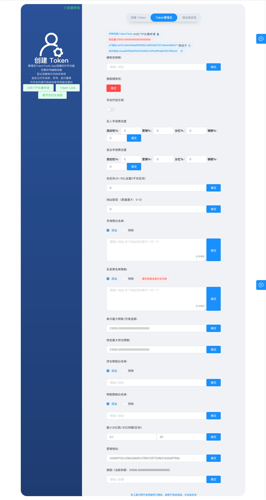

# 创建一个【持有NFT分红】代币

> **TokenTool是一个区块链工具箱，支持ETH、BSC、等超多公链，可以创建多种不同机制模型代币，轻松解决发币问题，可在几分钟内创建一个属于你自己的Token。**


> **点击加入 [TokenTool官方交流群](https://t.me/tokentool_app) 交流反馈**

> **推荐使用电脑版谷歌浏览器 + `Metamask` 插件钱包 进行操作.**
> **手机用户也可以在 `TP钱包`-发现-输入官网链接 进行操作.**
> 

### 模板机制说明

```
NFT可作为项目股东的凭证
该模板可用于给持有NFT的股东分红交易税费

营销 : 扣除代币,'触发时'兑换U进营销钱包
回流 : 扣除代币,'触发时'自动加池子
销毁 : 扣除代币,直接送进黑洞销毁
NFT分红 : 扣除代币,'触发时'兑换分红代币分给持有NFT的用户
```


查看以下步骤，了解如何使用PC电脑端的Matamask钱包通过TokenTool创建持币分红代币。

1. MateMask钱包链接到区块链网络。
2. 打开创建代币链接地址 [https://tokentools.app/createToken/v5](https://tokentools.app/createToken/v5)
3. 输入必要的信息，在此之前，让我们回顾一下所有需要填写的重要字段：





**币种名称：** 代币的名称信息（如BitCoin）

**币种符号：** 代币的符号信息（如BTC）

**初始供应量：** 代币的总供应量

**精度：** 代币的精度位数（精度是代表币的小数位数`如：0.000001`代表有6为精度）

**手动开启交易：** 添池子后需要管理员在页面手动开启交易。

**黑名单：** 黑名单限制买卖开关（开启后可在管理员页面进行操作添加某些地址无法进行`交易`,`转账`）

**交易平台：** 不同的链会有不同的交易平台（如ETH链有`uniswap`,BSC链有`pancakeSwap` 等）， **代币创建完成后需要在对应的交易平台添加流动性。**

**自定义交易对：** 默认创建代币使用BNB交易对，通过自定义交易对开关，可输入 USDT、BUSD等合约地址来组合交易对信息

**NFT分红合约：** **给予NFT持有者地址奖励合约**，可以使用`USDT`、`DOGE`、`SHIB`等主流币，或者也可以使用链币分红（BSC链是BNB，ETH链是ETH）。

**NFT地址** : 填写你创建好的NFT合约(注意需要是标准的ERC721协议的)

**营销钱包：** `营销税`部分的代币将会兑换成底池币`BNB`或者`USDT`（取决于你的池子交易对）发送到该地址。

**流动性 (%)：** 每笔交易都会扣除对应比例代币送进`合约地址`,在 **触发机制** 时会自动加池子,使池子更厚。

**营销 (%)：** 每笔交易都会扣除对应比例代币送进`合约地址`,在 **触发机制** 时会自动兑换成底池币(这取决于你使用什么底池,营销就进什么币) 发送到你的营销钱包地址

**NFT分红 (%)：** 每笔交易都会扣除对应比例代币送进`合约地址`,在 **触发机制** 时会自动兑换成分红币(取决于你选择的分红代币)发放给**持有NFT**的用户地址

**销毁(%)：** 每笔交易中会根据比例数量进行销毁基础代币，转入到`0x000000000000000000000000000000000000dead` 黑洞地址


⚠️注意：
> (不需要税的部分可以填0)

> 注意！NFT需要是标准的ERC721协议 并且要确保NFT中用于获取nft持有者的函数 (*ownerOf*) 的正常调用！ 为了确保ownerOf的正常调用 不建议对NFT进行Burn销毁处理。

> 推荐使用平台[创建的NFT功能](https://tokentools.app/nft/createNft/bsc)进行创建


## Token管理员介绍

当前拥有者(owner)在没有放弃权限时，可通过token管理员页面进入后台，对其参数等信息进行可视化修改。我们提供了友好的交互页面，让管理者更加方便的操作合约/修改参数。




1. **币种全称 :** 代币全称

2. **LP地址 : ** 显示池子LP的合约地址，可点击`锁池子` 按钮跳转锁池子页面

3. **合约地址 : ** 显示当前代币合约地址

4. **拥有权转移：** 可以将来owner权限转移给第三者 或者 其他地址

5. **销毁权限：** 将owner地址转移给 `0x0000000000000000000000000000000000000000`地址

6. **买卖手续费：** 可编辑修改你的交易手续费（手续费在swap交易时收取，转账不会收取手续费）

7. **杀区块：** 自动杀区块,输入3代表杀3区块，意思就是前3区块(bsc大概9秒)买入的地址自动让代币转移到管理员地址中。

8. **地址裂变：** 每笔交易都会自动向随机地址空投`一点点`代币,达到增加持币地址的效果

9. **手续费白名单：** 添加为白名单的地址，在交易时将不会产生税费。地址批量添加多个地址，一行一个地址。可根据添加和移除控制。

10. **买卖黑名单限制：** 添加为黑名单的地址将会无法【转账】/【交易】/【买卖】，可根据添加和移除控制。

11. **单次最大转账金额：** 限购/转账 限制（普通用户在买卖/转账时不可超过单次最大转账数量）

12. **钱包最大持仓限制：** 一个地址的数量不可超过（钱包最大持仓限制量）

13. **持仓限制白名单：** 如设置了持仓限制将会对所有的地址进行限制钱包的最大数量，如要解除限制，将可加入白名单

14. **转账/买卖限制白名单：** 如设置了转账限制用户将在交易时受到限制，如加入白名单将不会收到限制

15. **最小分红/分红间隔：** 

    1. **最小分红：** 指的是给NFT分红地址每个地址分红多少，比如（分红`USDT`，最小数量填写10，在合约地址中的USDT达到10U之后才开始分红）。
    2. **分红间隔：** 上次排队分红后，间隔多长时间开始进行下一轮分红。
    3. **温馨提示：分红是循环分红，如NFT第一个开始分红一直分红到最后一个NFT，然后又在从第一个开始分红，循环分红。**

16. **营销地址：** 可以二次修改地址，底池使用什么交易对进营销也是什么币。

17. **销毁：** 销毁将币的数量进行销毁转入黑洞地址，转入到`0x000000000000000000000000000000000000dead` 地址。

    

### 常见问题解答

- **分红都可以分红什么币？**
  - 解答：可以分红链币(如BSC链BNB，ETH链ETH链币)和其他主流币
  
  - 其他主流币：其他主流币需要有BNB池子，分红币是根据收取的本币进行兑换成分红币
  
    
  
- **请问这个NFT分红的逻辑是什么样的？**
  
  - 举个例子, 当前Token会给持有NFT的用户分红USDT, 并且设置了分红税为2%, 那么在代币交易时的扣税会自动转换成USDT,并且自动分发给用户, 由于默认的分红数量是0.1U, 当开始分红的时候, 会从NFT编号为1的持有者开始分红

  - 发送给 NFT编号1的持有者 0.1 USDT
  
  - 发送给 NFT编号2的持有者 0.1 USDT
  
  - 发送给 NFT编号3的持有者 0.1 USDT
  
  - 。。。。。
  
  - 以此类推 周而复始 0.1这个数量可以在控制台中修改 如果NFT发行量过高的话 此值不建议调整太高
  
    
  
- **上面描述中提到的分红池是什么概念？**
  - 解答：非白名单地址买卖时，会收取手续费，手续费在卖时会 **触发兑换机制** ，比如分红 **`USDT`**，分红部分的税根据分红合约兑换后进入合约地址中，合约地址中的`USDT` 大于 **`最小分红数`** 并且上一次分红和本次分红间隔区块满足时，触发分红机制，开始给NFT持有者地址进行分红。

    

- **分红是一次性给所有NFT持有者分红的吗？**

  - 解答：不是，排队分红，每次触发分红（达到上述条件）时会进行7～10地址左右进行排队分红，分红到最后一位地址时，又会开始从第一个地址循环。

    

- **我创建的代币可以在多个swap，比如 `博饼swap` `BabySwap` .. 加池子吗？**
  - 解答：创建代币的时候会有平台选择，你选择了什么swap，（比如你选择的是 `博饼swap` ），就要在`博饼swap` 添加池子。

    


- **我创建的NFT分红机制的代币，可以用`USDT`，`BUSD` 或`自己的子币` 加池子吗?**
  
  - 解答：根据你创建时使用的交易对，如没有自定义设置，默认使用的是链本币 BSC链是 `BNB`, 以太坊是`ETH`币 ，自定义交易对是什么币，添加池子也需要一致。
  
    
  
- **代码是自动开源的吗?**
  - 解答：是的,在区块浏览器设施完善的链上都是自动开源的,包括`ETH` `BSC` `ARB`…等等

    
  
- **营销进的是代币还是USDT?**
  - 解答：营销钱包进的取决于你的交易对，你创建的是默认交易对就是BNB，自定义交易对就是自定义时的币，例如（自定义`USDT`等）。

    
  
- **我在创建代币的时候，忘记打开黑名单开关，我还能用黑名单功能吗？**
  - 解答：不可以，如果你没打开黑名单功能，合约代码中将不会存在黑名单逻辑代码，检测合约机器人也将也不会检测到黑名单开关。 

    
  
- **我在BSC链上，可以创建分红XX币，或者我自己创建的子币吗？**
  
  - 解答：只要你的XX币有BNB的交易对存，就可以分红，主流币大部分都有BNB交易对，如`USDT` 、`BUSD` 、 `BTC` 、 `ETH ` 等等。
  
    
  
- **回流自动加池子的这部分LP到哪去了呢？**
  - 解答：回流到池子后产生的`LP`自动发放到`管理员钱包`。
  
    

  