# DeDust 加池子（创建流动性）教程

[DeDust](https://dedust.io/) 是 TON 链上新兴且增长迅速的去中心化交易所（DEX），基于 DeDust 协议 2.0 构建，具备出色的用户体验、gas 效率和可扩展性。

## 为什么选择DeDust

截至 2025 年 6 月，DeDust 的 TVL（总锁仓量）已超过 3 亿美金，是 TON 上排名第一的 DEX。它具备：

- 🌉 跨链桥：支持 TON 与 ETH 互通
- 🧱 多种池类型：AMM 池 & 稳定池
- 🏦 Vault 机制：提升资金效率与交易路径
- 🏗️ 工厂合约：集中管理创建的池子和金库

## DeDust 添加流动性教程（加池子）

### 步骤一：连接钱包

1. 打开官网：[https://dedust.io/](https://dedust.io/)
2. 点击右上角 `Wallets` → 选择 `Connect Wallet`
3. 选择 Tonkeeper（推荐）或 OpenMask 等钱包
4. 钱包弹窗出现后，确认连接

首先，我们打开DeDust的官网：https://dedust.io/，点击右上角`Wallets`，根据提示再点击`Connect Wallet`连接钱包

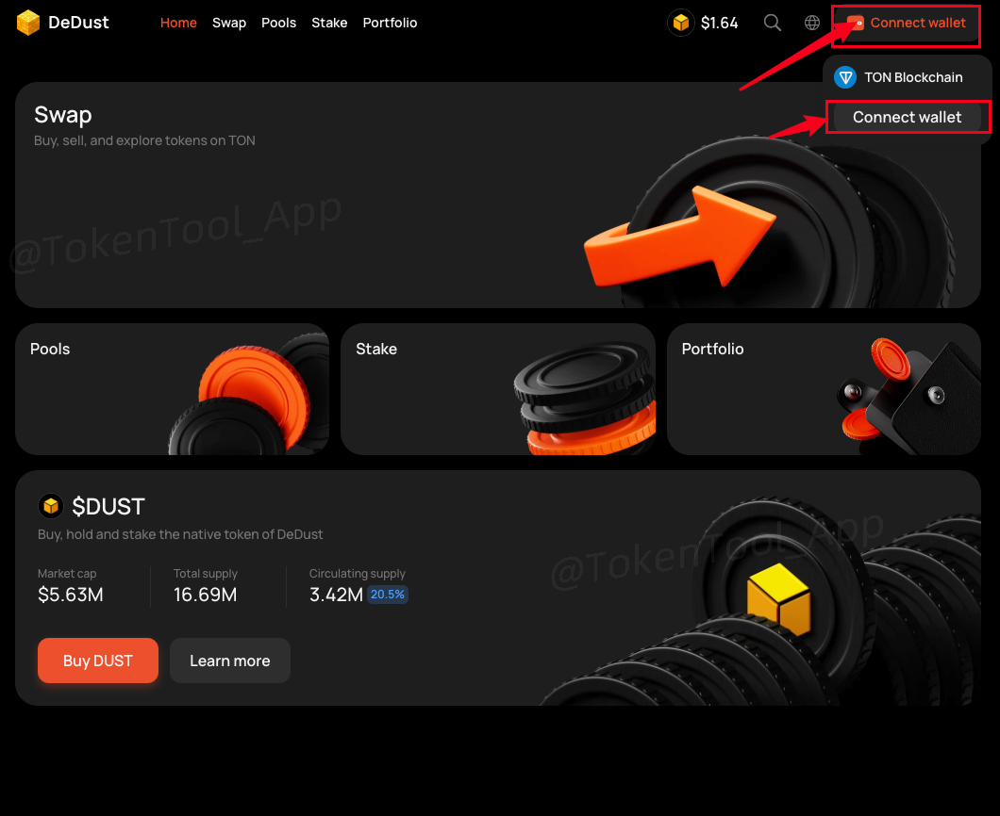

此时会弹出一列钱包让你选择，如果你安装了`Tonkeeper`，就选择这个（[Tonkeeper安装教程](https://docs.tokentools.app/ton/tonkeeper)）。如果你安装了OpenMask，就选择OpenMask。一般来说，我们会推荐大家使用Tonkeeper

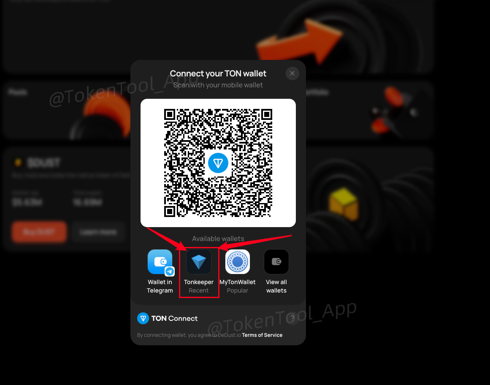

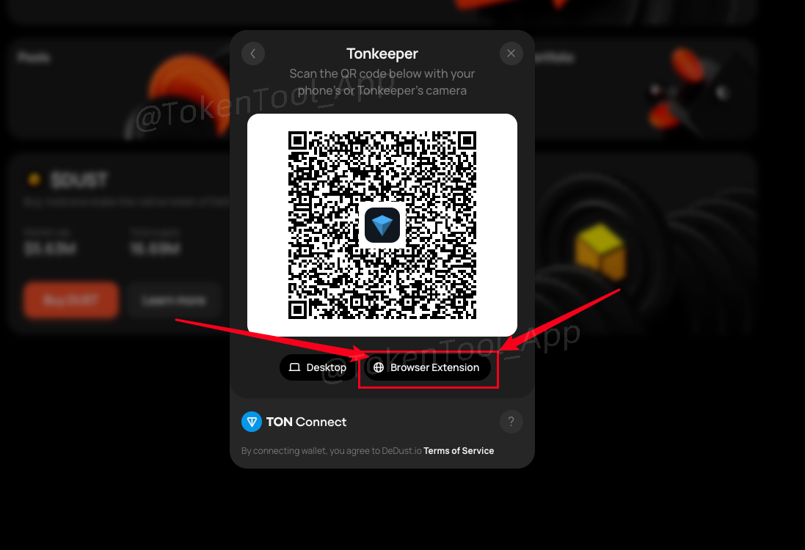

然后会弹出钱包插件，点击`连接钱包`即可

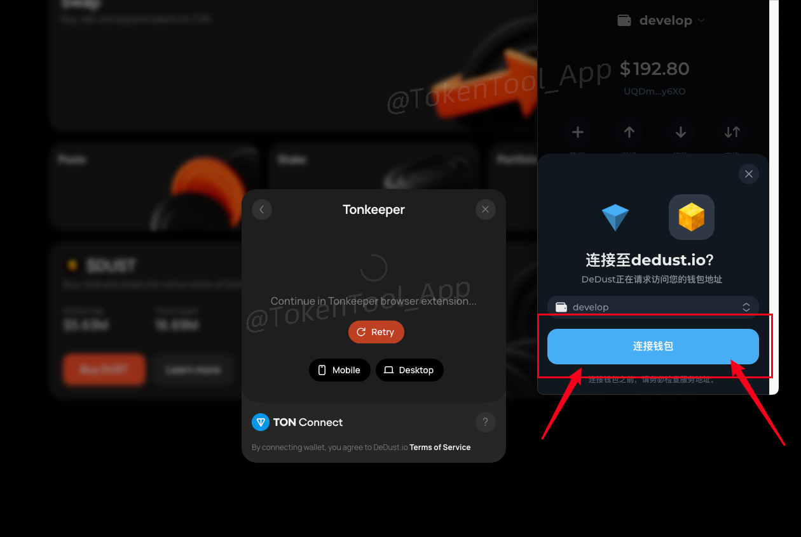

连接成功之后，右上角会出现你的钱包地址，如下图

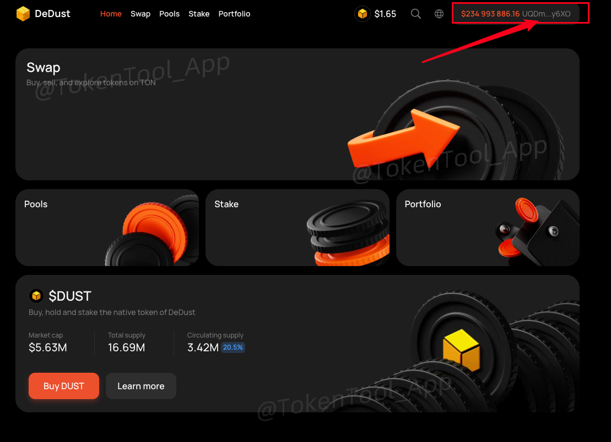

钱包连接成功后，接下来我们进行加池操作

###  步骤二：创建流动性池

1. 进入 Pools 页面：[https://dedust.io/pools](https://dedust.io/pools)
2. 点击右上角 `Create a pool`

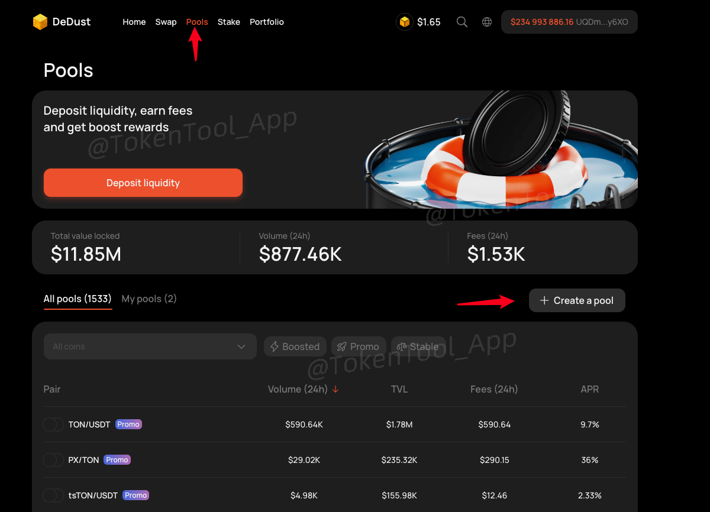

3. 输入两个代币的合约地址，分别为：
   - 你的项目代币（如 TT）
   - TON（或者 USDT，如果你部署了 Jetton USDT）

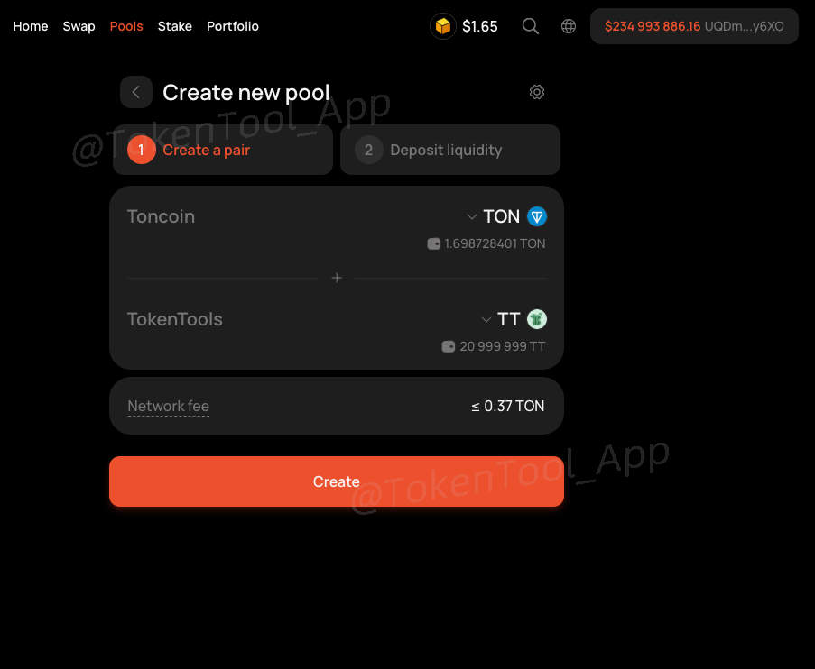

输入合约地址并查找代币

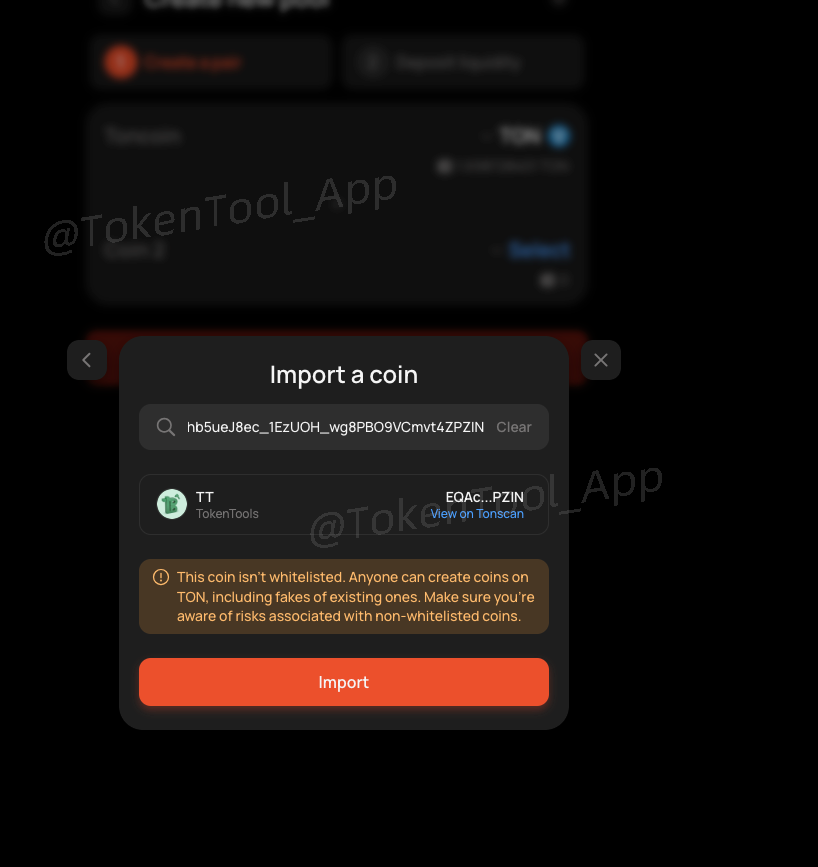

4. 点击 `Create` 创建池子  
   > DeDust 与 STON 的不同之处在于，**需要先建池，再加流动性**

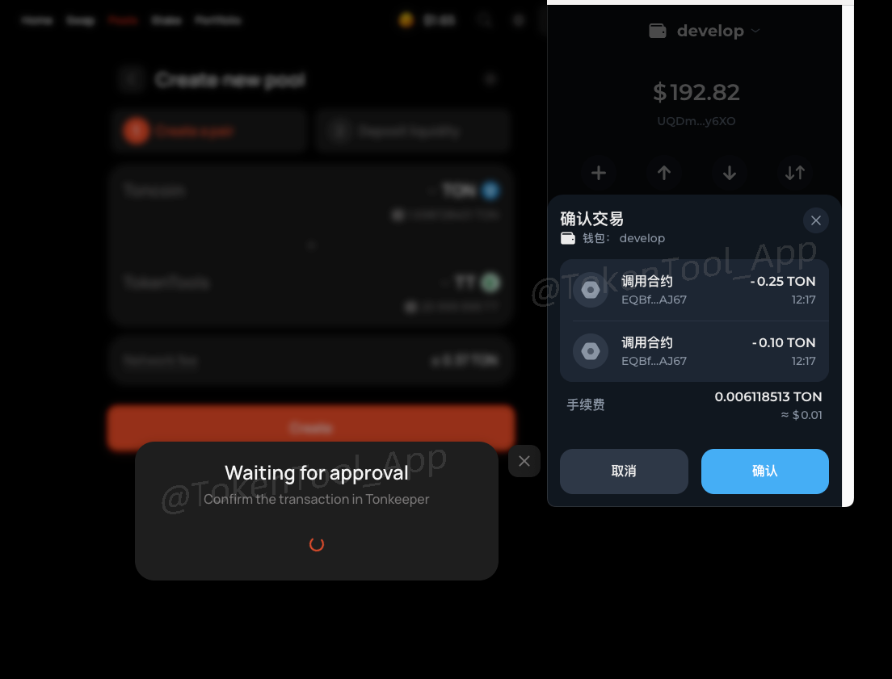

5. 添加代币数量  
   这个数量比例将决定代币上线初始价格：
	填入要添加的数量。注意代币数量的比例将**决定初始交易价格**  
   
   > 例：0.1 TON + 100,000 TT → 初始价格 1 TT = 0.000001 TON    
   > TON 当前 $5.9，TT 的初始价格为 $0.000059

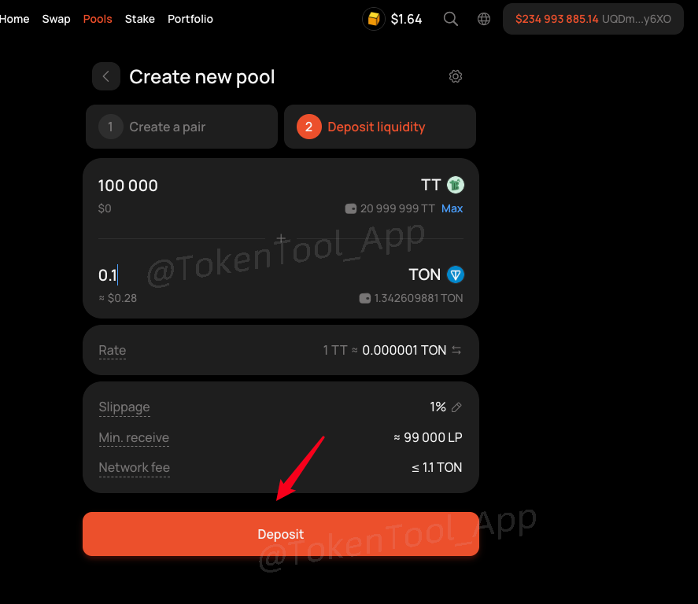

6. 点击 `Deposit` 添加流动性  
   确认钱包弹窗，完成支付。

> ⚠️ 添加过程需要消耗 0.6～1.1 TON，请预留 2 TON 以上以避免失败。

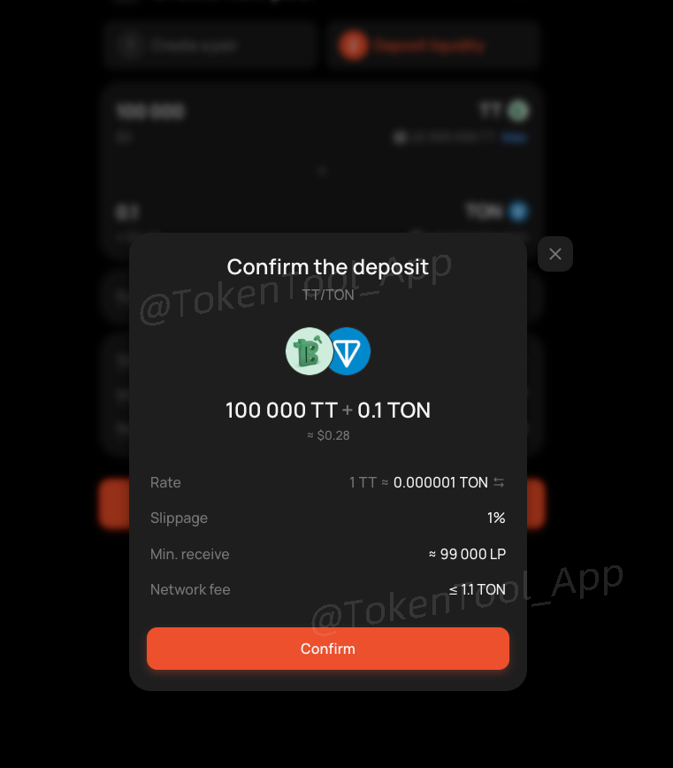

确认无误后，点击Confirm，会弹出钱包，钱包确认就可以了

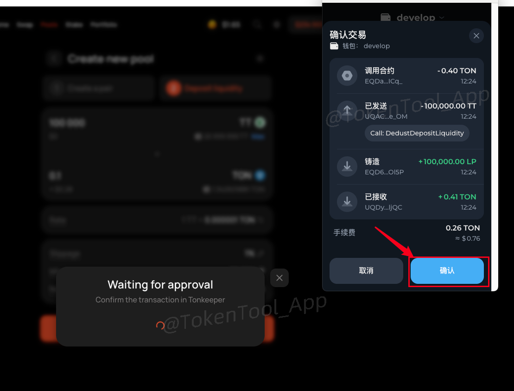

## DeDust加池子注意事项

**1、DeDust上面能看到代币头像吗？**

- 答：可以的，只要链上有头像，钱包能看到头像，DeDust上就有头像

**2、DeDust创建流动性需要收费吗？**

- **答：**在DeDust创建池子，授权的时候需要支付0.35TON，创池子(Creat Pair)的时候需要支出0.9TON左右，所以累积差不多要支出1.2TON左右

如遇问题欢迎加入官方 Telegram：

👉 [https://t.me/tokentool_app](https://t.me/tokentool_app)