## 发币前准备

- 💼 发币之前，务必使用安装Tonkeeper钱包插件，[安装教程](https://docs.tokentools.app/ton/tonkeeper)➔ https://docs.tokentools.app/ton/tonkeeper
- 💰 钱包余额建议 ≥ 10 TON（用于部署合约和支付 Gas）

## TON发币教程

### 1、连接Tonkeeper钱包
1. 打开发币平台地址：  👉 [https://tokentools.app/createToken/ton](https://tokentools.app/createToken/ton)

2. 点击右上角 `解锁钱包` → 选择 `Ton Wallet`

3. 在弹出选项中，点击 `Tonkeeper` → 选择浏览器插件钱包 → 确认连接

成功连接后，右上角会显示你的钱包地址 ✅

首先，我们打开TON链发币链接：[https://tokentools.app/createToken/ton](https://tokentools.app/createToken/ton)，点击右上角“解锁钱包” —> “TonWallet” 钱包进行连接

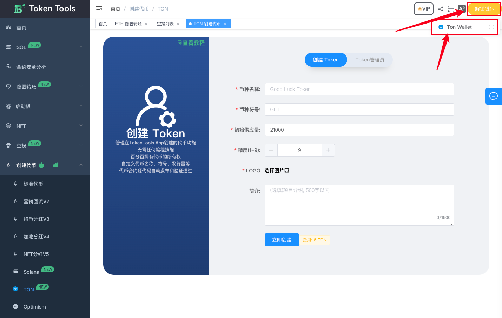

之后会弹出很多钱包让你选择，找到Tonkeeper，点击连接

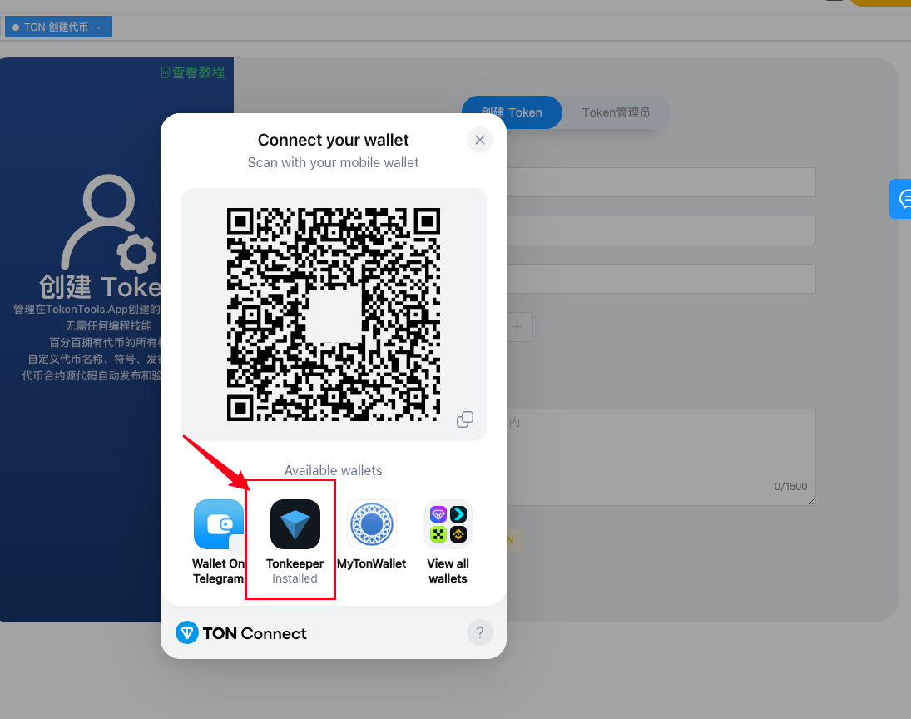

选择浏览器插件钱包，推荐使用 [Tonkeeper 钱包安装教程](https://docs.tokentools.app/ton/tonkeeper) 插件钱包

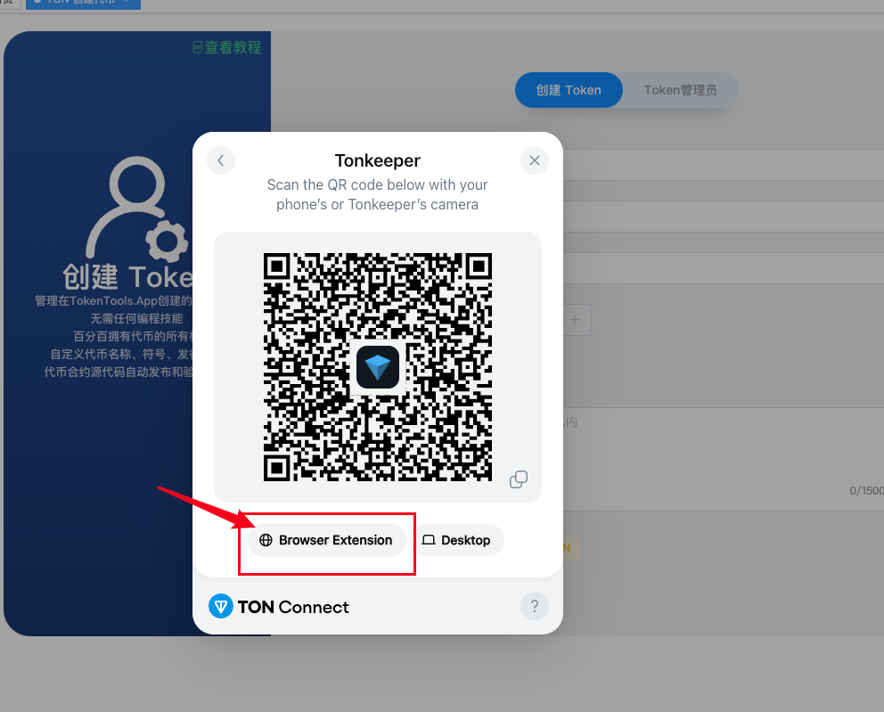

此时钱包会提示让你点击确认连接

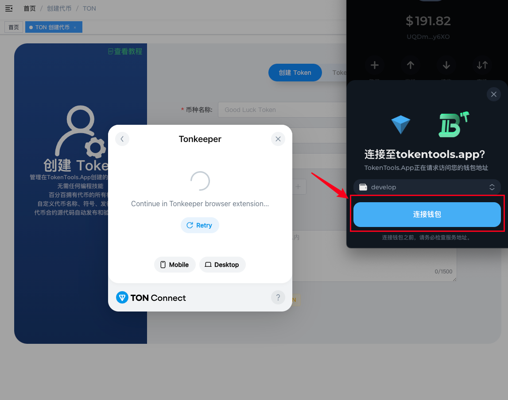

连接成功后，能在右上角看到你的钱包地址

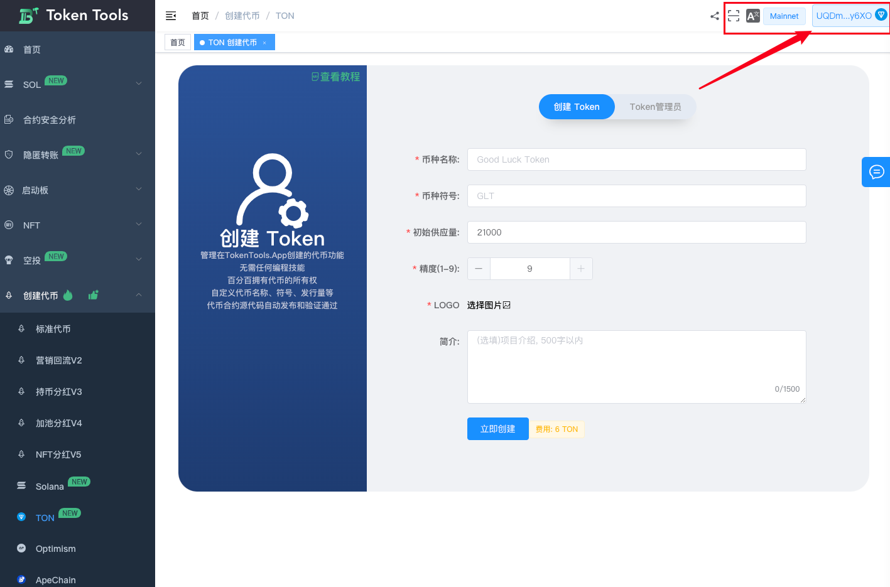

### 2、填写代币参数

- 按照以下顺序填写代币参数：

  | 字段       | 说明                             |
  | ---------- | -------------------------------- |
  | 🏷️ 代币名称 | 例如：Bitcoin                    |
  | 💡 代币符号 | 例如：BTC                        |
  | 📐 精度     | 默认 9，不建议修改               |
  | 🔢 发行量   | 总供应量（结合精度设置）         |
  | 📄 简介     | 可简要介绍用途、定位等           |
  | 🖼️ Logo     | 上传代币图标（建议 512x512 PNG） |

  > **注意事项：**  
  > 精度为 9 时，最大可发行总量为：1,000,000,000,000,000,000,000,000,000。  
  > 如需更大发行量，请降低精度，例如 6。

  确认填写无误后，点击 `创建代币` → 钱包弹窗中确认交易。

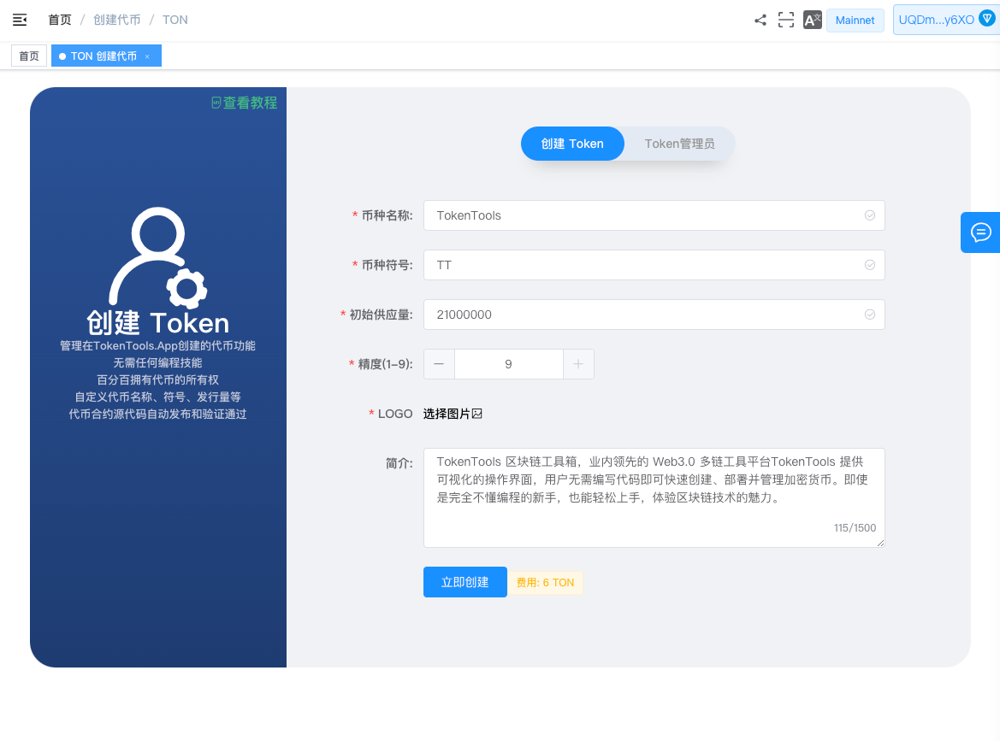

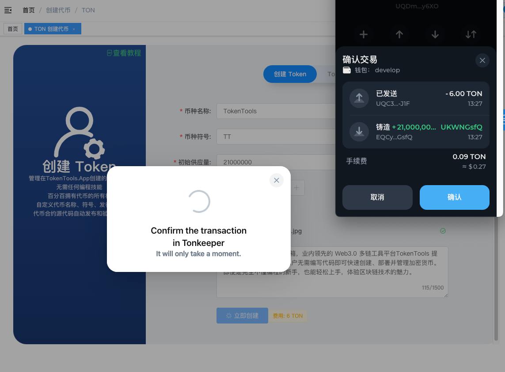

确认信息无误后，点击创建代币，弹出钱包进行确认就可以了

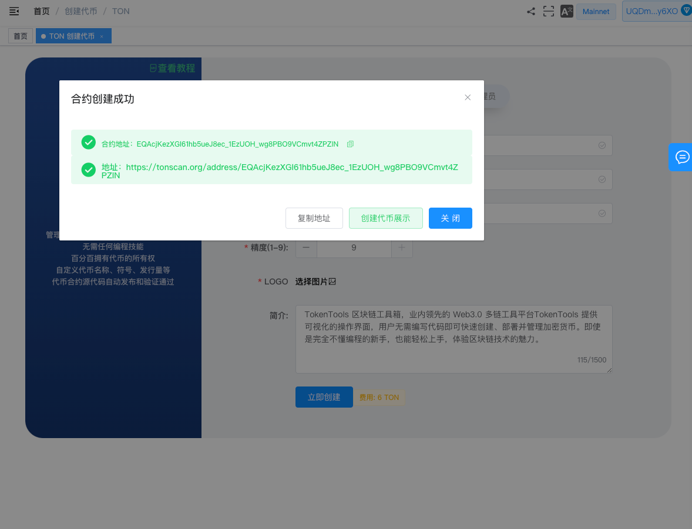

### 3、Token管理员介绍

成功创建了代币，生成了代币的地址 ，代币拥有者可通过 `token管理员` 功能进行代币管理

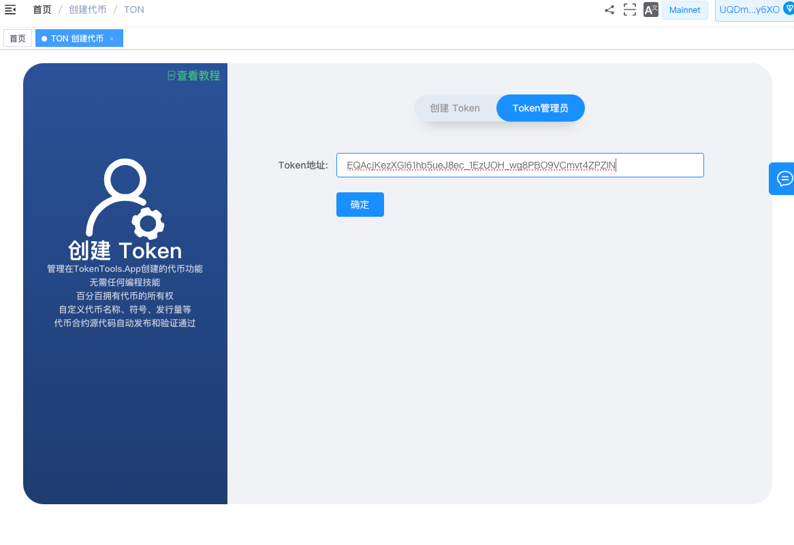

发币成功后，可以通过 Token 管理员界面管理代币：

| 功能         | 说明                                 |
| ------------ | ------------------------------------ |
| 🔥 销毁拥有权 | 放弃管理权限，转为社区代币           |
| 🖌️ 更新 Logo  | 修改图标、名称、官网链接等信息       |
| 🔥 燃烧数量   | 减少总供应量，将部分代币打入销毁地址 |
| 🧱 铸币数量   | 增加供应量，并将新币发送至指定地址   |

> TON 链的代币在发币后仍可修改名称、图标，非常灵活！

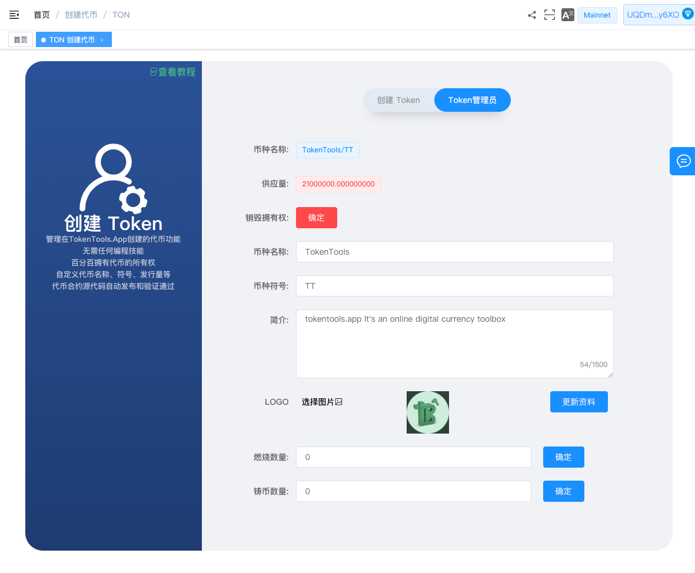

**销毁拥有权：** 放弃丢弃权限

**更新logo：** 修改logo图片，以及币的名称和简称，官网地址链接信息等等。TON链不同在创建完成后还可以修改名称和简称以及logo图片。

**燃烧数量：** 缩量缩少代币的流通，将总量打入燃烧地址中。

**铸币数量：** 扩大供应量，铸币需要填写地址，将铸出来的币发送到某个地址中。

### 4、钱包添加代币

在代币发行完成后，我们会发现钱包里并没有看到币，这个时候应该在钱包里`添加显示`一下才行，具体的操作是这样的

打开Tonkeeper，点击设置

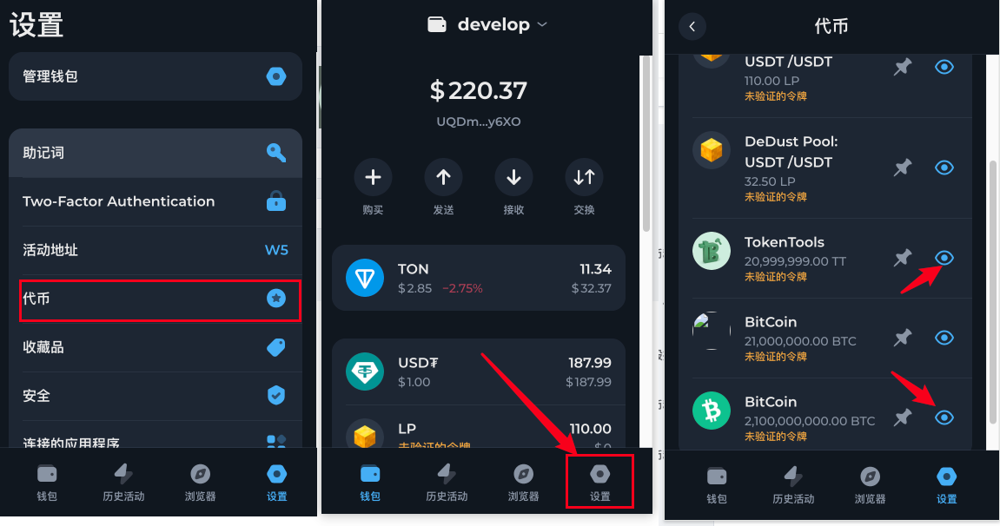

### 常见问题解答

- **Tonkeeper显示代币未验证怎么办**
  - 答：需要在Github提交代币信息，由官方团队审核后完成验证，提交地址：https://github.com/tonkeeper/ton-assets
- **为什么我在Tonkeeper钱包里没有看到代币选项**
  - 答：请先确认自己的地址是否正确。TON地址与比特币类似，有个多个，需要切换到正确的活动地址
  - 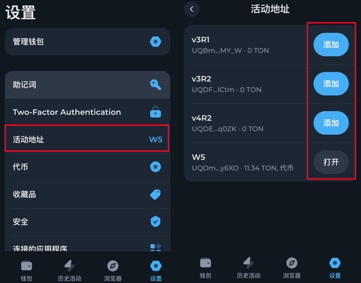

如有任何疑问或技术问题，欢迎加入官方 Telegram 社群交流：

👉 [https://t.me/tokentool_app](https://t.me/tokentool_app)