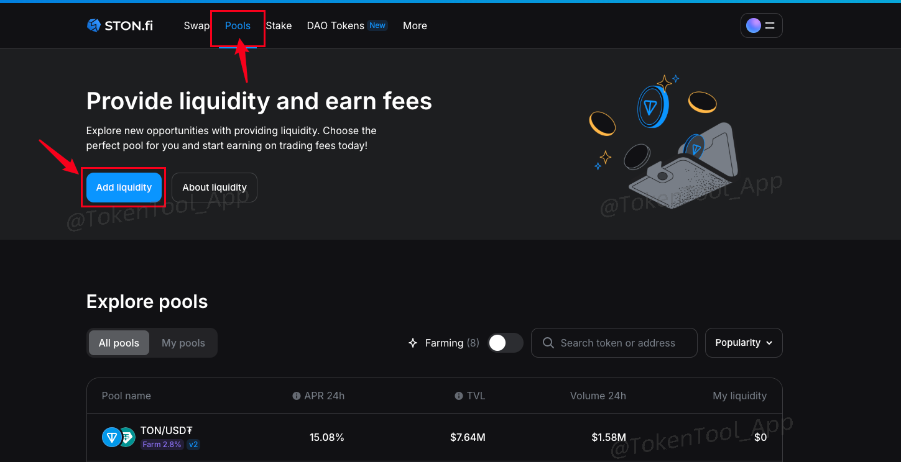

# STON.fi 加池子（创建流动性）完整教程

[STON.fi](https://ston.fi/) 是基于 TON 区块链的去中心化自动做市商（AMM），同时也是 TON 链上交易深度最强、用户最多的 DEX。STON.fi 提供极低滑点、几乎零费用的交易体验，并与 TON 系生态钱包深度集成。

## ✅ 为什么选择 STON.fi？

- 🌍 成立于 2022 年，致力于为 Telegram 用户打造便捷的 Web3 入口
- ⚡ 支持 TON 网络的高性能架构，TPS 达百万级别
- 🧠 简洁直观的 UI 界面
- 💬 强社区导向，快速响应用户需求
- 🔐 支持主流 TON 钱包（Tonkeeper / OpenMask 等）

如果你在 TON 上发行了代币，STON.fi 是最推荐的流动性添加平台。

## STON加池子教程

### 步骤一：连接钱包

1. 打开官网：[https://app.ston.fi/pools](https://app.ston.fi/pools)
2. 点击右上角 `Connect Wallet` 按钮

3. 选择钱包：
   - 推荐使用 [Tonkeeper 钱包安装教程](https://docs.tokentools.app/ton/tonkeeper)
   - 也支持 OpenMask 等 TON 插件钱包

4. 钱包弹窗出现后，点击确认连接  
   
5. 

连接成功之后，右上角会出现你的钱包地址

### 步骤二：创建流动性池（加池子）

1. 点击页面的 `Add liquidity` 按钮  

2. 输入两个代币的合约地址，分别为：
   - 你的项目代币（如 TT）
   - TON（或者 USDT，如果你部署了 Jetton USDT）

3. 填入要添加的数量。注意代币数量的比例将**决定初始交易价格**  
   > 示例：如果添加 1 TON + 1,000,000 TT，初始上线价格为 1 TT = 0.000001 TON  
   > TON 当前约 $5.9，则 TT 上线价格为约 $0.0000059

4. 点击 `Create Pool` 按钮，并确认提示  
   添加流动性通常需要支出 0.3～1.6 TON，请确保钱包余额至少 ≥ 2 TON。

确认无误后，点击Confirm，会弹出钱包，钱包确认就可以了

## ℹ️ STON.fi 常见问题答疑

#### Q1：我加池后为什么没显示代币 Logo？

A：STON.fi 会默认隐藏低流动性代币的图标。你需要：
- 在池子中添加至少 $10,000 等值流动性
- 提交添加请求：[代币列表申请表](https://docs.google.com/forms/d/e/1FAIpQLScGTZjf5DVRutqykFKF477MHoFS9-qzPhkdbOKmo_hZn66FVA/viewform)

#### Q2：为什么加池时提示余额不足？

A：STON.fi 创建池子需要：
- 支出 gas ≈ 1.7 TON
- 推荐钱包预留 ≥ 2.7 TON，以确保操作顺利完成

#### Q3：在 STON.fi 上交易要付手续费吗？

A：是的，每笔交易将收取 **0.3% 手续费**：
- 其中 0.2% 分给 LP（流动性提供者）
- 0.1% 分给 STON.fi 协议本身

####  ✅ 教程小贴士

- 建议使用 [Tonkeeper 钱包](https://docs.tokentools.app/ton/tonkeeper)
- 添加完池子后，你的代币即可支持 TON 上交易
- 如果想支持稳定币交易，可部署 Jetton USDT/USDC 合约并添加流动性对

## 📢 社群支持

如遇问题欢迎加入官方 Telegram：

👉 [https://t.me/tokentool_app](https://t.me/tokentool_app)