# Tonkeeper 钱包安装与使用教程

Tonkeeper 是 TON 链上最受欢迎的钱包之一。它是一款非托管钱包，界面简洁，功能全面，适合初学者与进阶用户，支持资产管理、转账、质押、内置交易等功能。

## 一、Tonkeeper 钱包介绍

Tonkeeper 是由官方认证的 TON 钱包之一，支持浏览器插件与移动端版本，能便捷地管理 TON 资产和使用 TON 生态 DApp。

## 二、安装 Tonkeeper 插件钱包（以 Chrome 为例）

### 步骤 1：访问官网

打开浏览器，进入官方地址：[https://tonkeeper.com/](https://tonkeeper.com/)

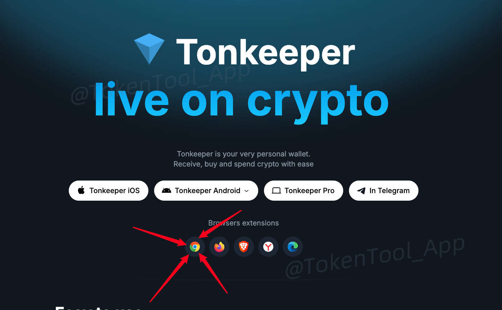

点击右上角的插件安装按钮，跳转至 Chrome 商店插件页面：

👉 [Tonkeeper 插件页面](https://chromewebstore.google.com/detail/tonkeeper-%E2%80%94-wallet-for-to/omaabbefbmiijedngplfjmnooppbclkk)

点击 **“添加至 Chrome”**，并在弹窗中选择“添加扩展程序”。

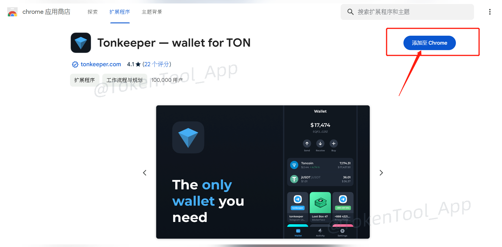

## 三、创建钱包地址
插件安装完成后，在浏览器右上角点击 Tonkeeper 图标，开始创建钱包。

### 步骤 2：创建新钱包或导入钱包
你可以选择：

- ✅ 创建新钱包（自动生成助记词）
- ✅ 导入已有钱包（输入助记词）

> 此处我们以“创建新钱包”为例。

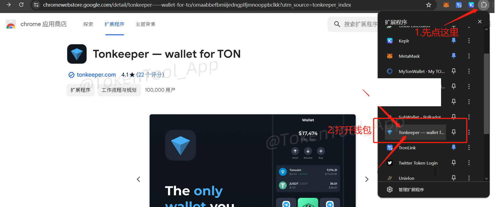

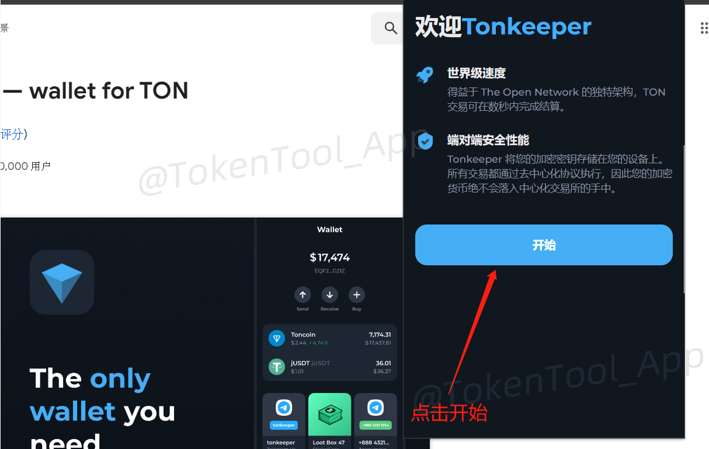

之后会提示你让你选择：`创建新钱包`或者`导入现有钱包`。如果你有钱包助记词，就导入钱包。如果没有助记词，就选择创建新钱包

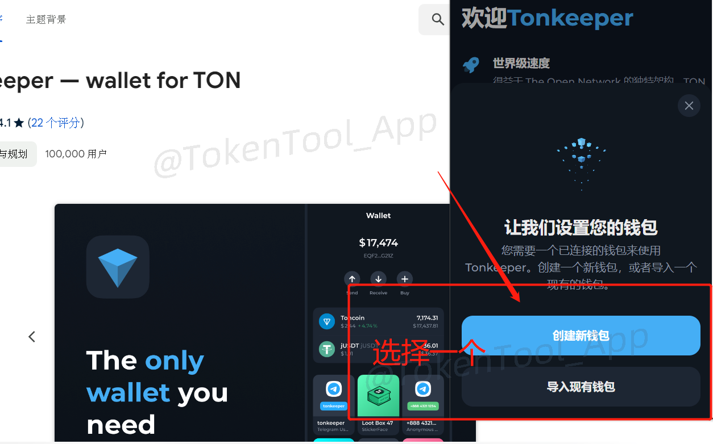

假设我们选择创建新钱包，之后会跳转到一个页面，让你准备记录下你的助记词

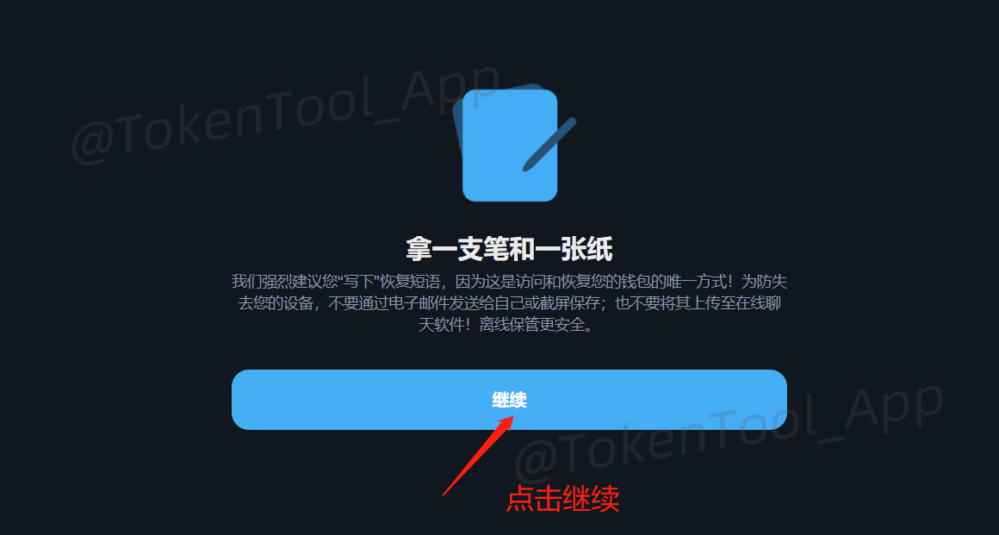

之后会弹出助记词页面，记录下你的钱包助记词。注意，为防止助记词泄露，请不要在有人观看，或者附近有摄像头的环境下操作

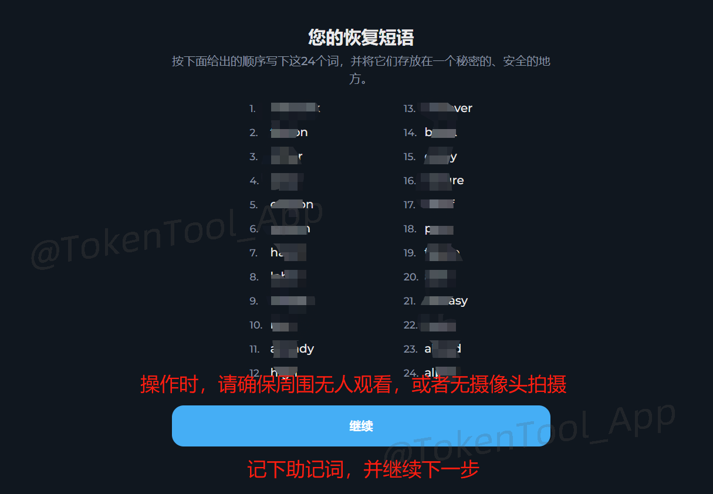

之后，会让你验证助记词。按照他给的序号，填入相应的助记词（注意大小写），即可完成操作

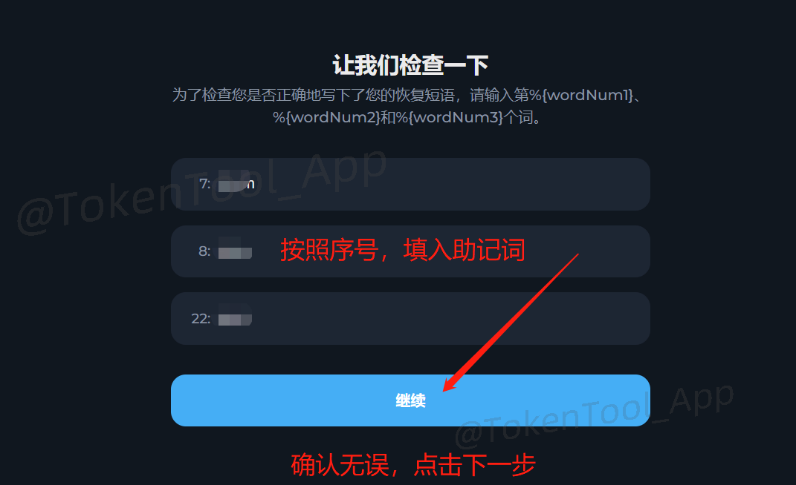

助记词完成后，创建一个钱包密码。该密码是在你每次支付确认的时候需要输入的

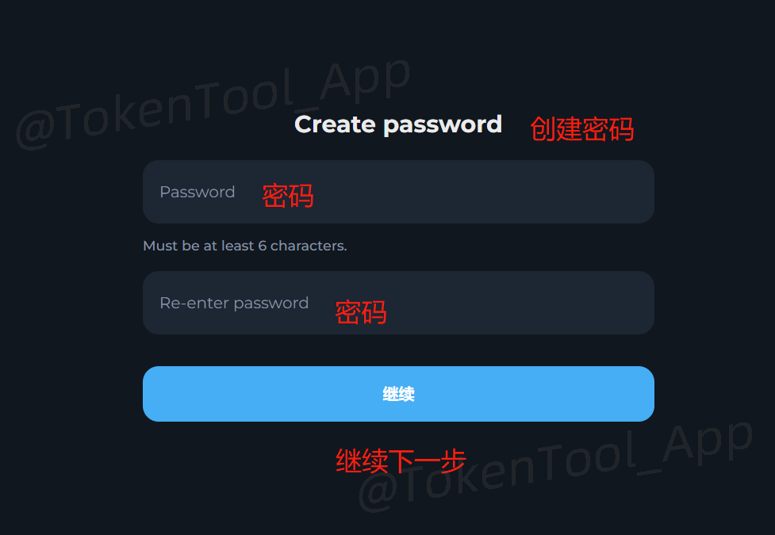

密码设置完成后，恭喜你，你的钱包已经创建成功

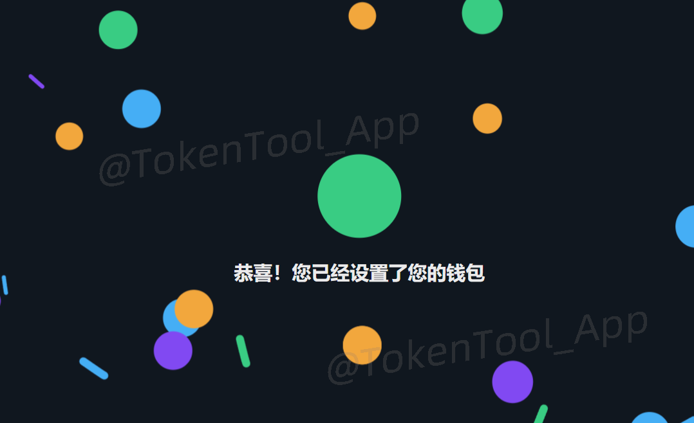

## 四、充值 TON 代币

你可以从交易所（如 OKX、币安）购买 TON 并提币至 Tonkeeper 钱包地址。

1. 复制你的钱包地址
2. 在交易所选择「提币」
3. 网络选择 TON，地址粘贴 Tonkeeper 地址，输入数量确认即可
4. 
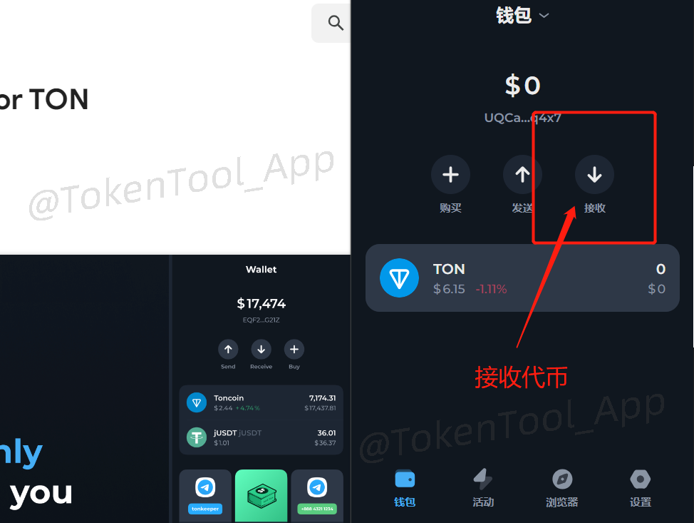

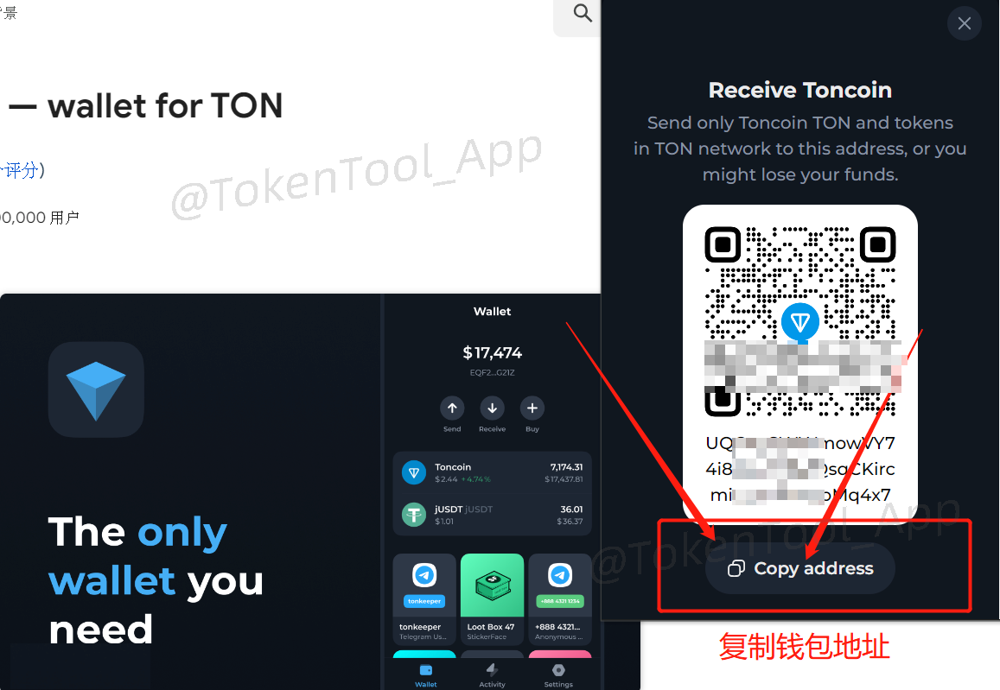

## 五、其他常用 TON 钱包推荐

除了 Tonkeeper，还有以下 TON 钱包插件可供选择：

| 钱包名称 | 官网地址 |
|----------|----------|
| [OpenMask](https://www.openmask.app/) | https://www.openmask.app/ |
| [MyTonWallet](https://mytonwallet.io/) | https://mytonwallet.io/ |
| [Tonflow](https://tonflow.io/) | https://tonflow.io/ |

如在使用中遇到任何问题，欢迎加入官方社区咨询：

📢 Telegram 社群：[https://t.me/tokentool_app](https://t.me/tokentool_app)