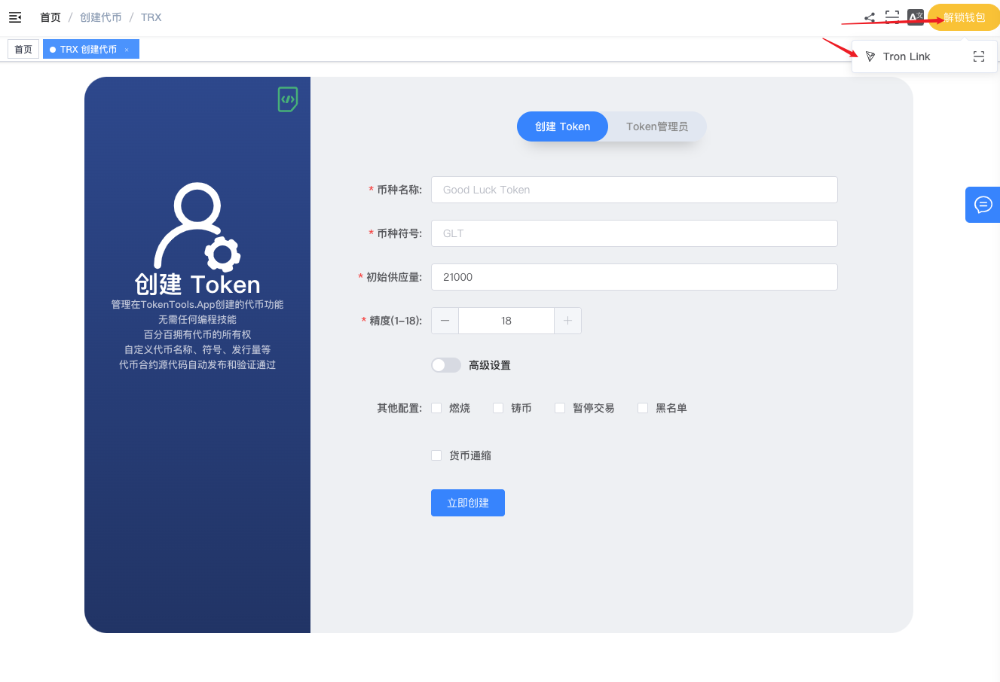
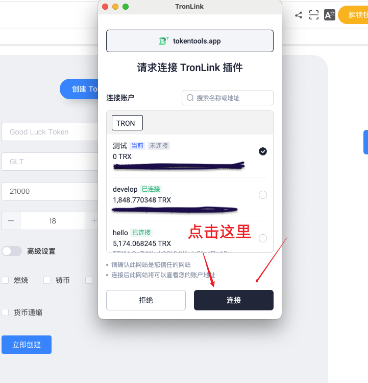
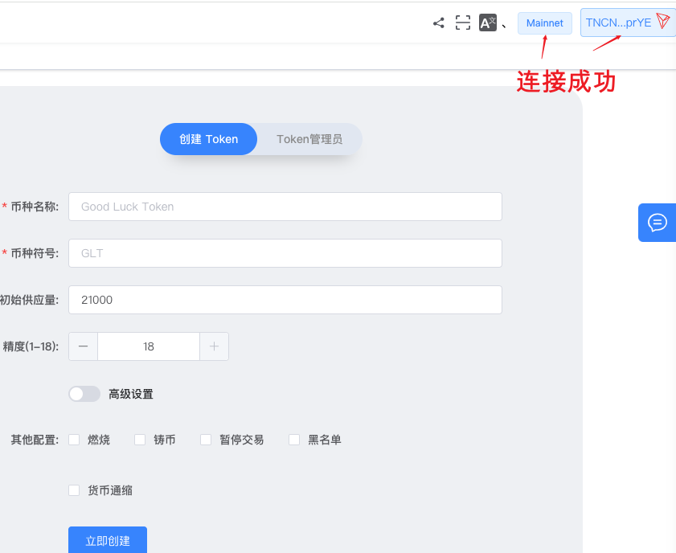
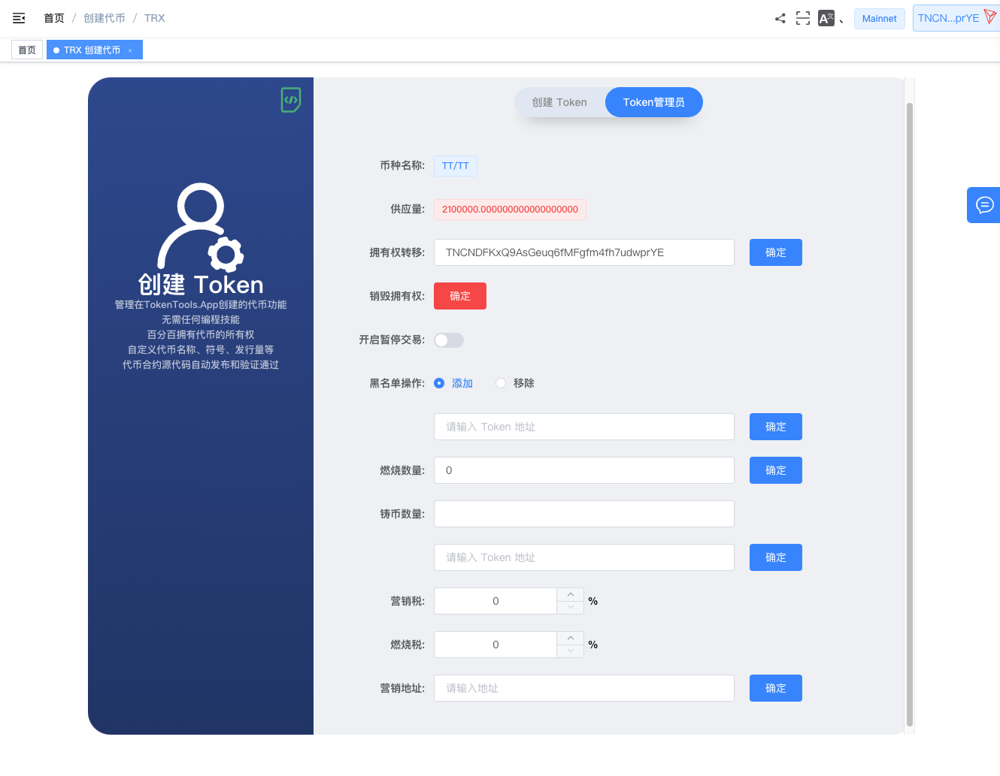

# 波场Tron一键发币教程

> **TokenTool是一个区块链工具箱，支持TRX、ETH、BSC、等超多公链，可以创建多种不同机制模型代币，轻松解决发币问题，可在几分钟内创建一个属于你自己的Token。**

> **点击加入 [TokenTool官方交流群](https://t.me/tokentool_app) 交流反馈**

> **推荐使用电脑版谷歌浏览器 + `TronLink` 插件钱包 进行操作.**
> **手机用户也可以在 `TP钱包、欧易Web3钱包`-发现-输入官网链接 进行操作.**

## 一、波场发币前提条件

- 发币之前请安装TronLink钱包，可以看 → [波宝钱包安装教程](https://docs.tokentools.app/tron/tronlink)
- 钱包内最少准备 **800TRX**（最好还有60万能量）
- 手机发币可以使用TP钱包或欧易Web3钱包
- 本教程针对的是TRC20代币，不包括TRC10代币

## 二、波场发币流程

- 1、连接波宝钱包
- 2、填写代币参数信息
- 3、钱包确认并支付费用
- 4、发币成功

接下来就每一步，给大家做详细的介绍

### 1、连接钱包

所有发币的教程第一步，就是连接钱包。我们首先打开波场一键发币的网址：[https://tokentools.app/createToken/trx](https://tokentools.app/createToken/trx) ，点击右上角链接钱包

此时会跳出波宝钱包提示，按照提示点击连接就可以了

连接成功后，右上角会出现钱包地址，说明就可以进入下一步了

### 2、填写代币参数

参数介绍说明

**币种名称：** 代币的名称信息（如BitCoin）

**币种符号：** 代币的符号信息（如BTC）

**初始供应量：** 代币的总供应量（精度18位时，总供应量可以1后面15个0，精度17位时，总供应量可以1后面16个0，以此类推..）

**精度：** 代币的精度位数（精度是代表币的小数位数`如：0.000001`代表有6为精度）

**手续费说明（设置的税针对：`买卖`，`转账`  都会收取税）：**

​	**营销税：** 扣除税，本币进入营销地址

​	**销毁税：** 扣除税，每笔交易中会根据比例数量进行销毁基础代币，转入到`0x000000000000000000000000000000000000dead` 黑洞地址

### 3、Token管理员介绍

成功创建了代币，生成了代币的地址 ，代币拥有者可通过 `token管理员` 功能进行代币管理

**开启暂停交易：** 如果开启则当前代币无法进行转账操作（包括swap操作）

**黑名单添加/移除：** 通过添加地址，将过滤指定的地址无法参与代币的任何操作，如（科学家地址添加到黑名单中

**燃烧数量：** 缩量缩少代币的流通，将总量打入燃烧地址中。

**铸币数量：** 扩大供应量，铸币需要填写地址，将铸出来的币发送到某个地址中。

**手续费说明（设置的税针对：`买卖`，`转账`  都会收取税）：**

​	**营销税：** 扣除税，本币进入营销地址

​	**销毁税：** 扣除税，每笔交易中会根据比例数量进行销毁基础代币，转入到`0x000000000000000000000000000000000000dead` 黑洞地址

**营销地址：** 可以二次修改营销地址。

### 常见问题解答

- **能解释一下税部分的设置吗？**
  - 解答：税设置是针对 **`买卖`** 、 **`转账`** 操作收取的，营销税就是进入营销地址的，销毁税就是进入黑洞地址的。
- **我可以单独设置买的税和卖的税不同吗？比如（买营销：1%，卖营销：2%）？**
  - 解答：不可以，本版本 **`买卖`** 、 **`转账`** ，都是相同的，无法拆开，如需要设置不同，可以使用其他版本 如（V2，V3，版本发币）
- **这个版本为什么没有swap平台可以选择？**
  - 这个版本税的回流都是本币计算，所以你可以用任何 **`swap`** 添加池子，可以用任何 **`交易对`** 添加池子。

如果您还有其他问题，可以加入TokenTool一键发币群了解，

> **点击加入 [TokenTool官方交流群](https://t.me/tokentool_app) 交流反馈**

