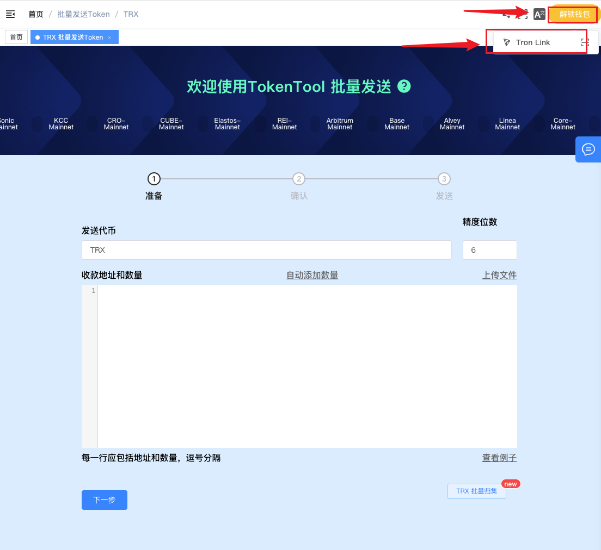
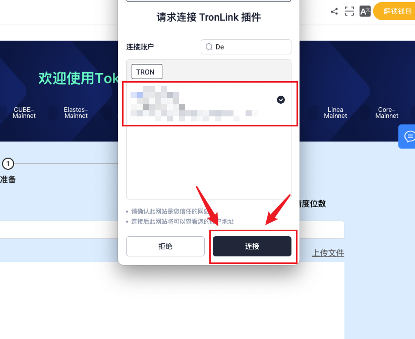
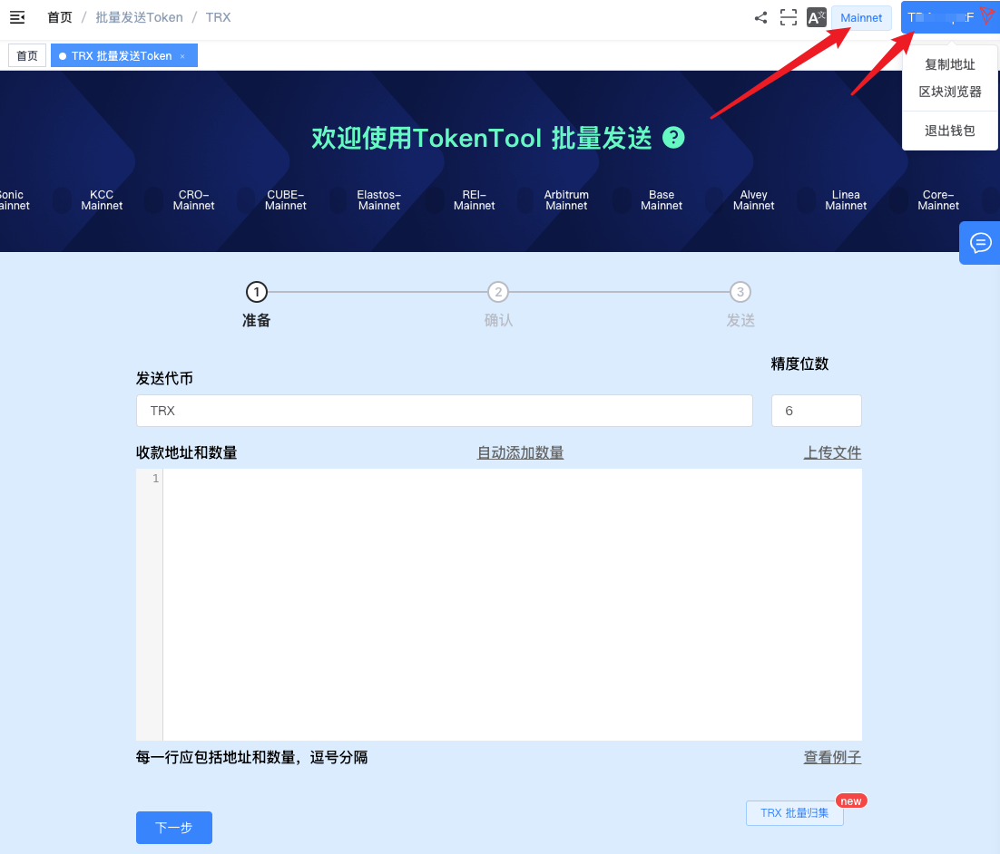
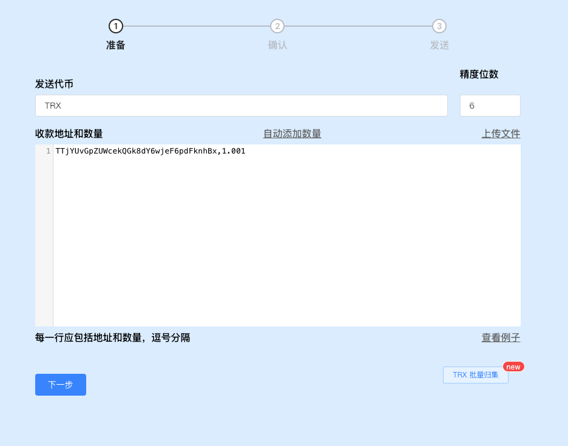
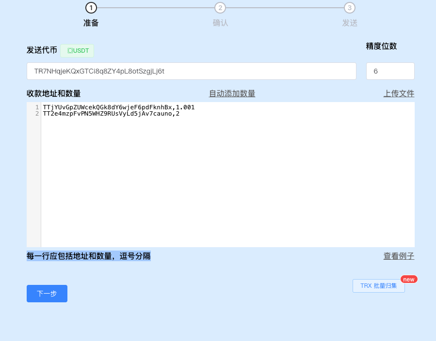
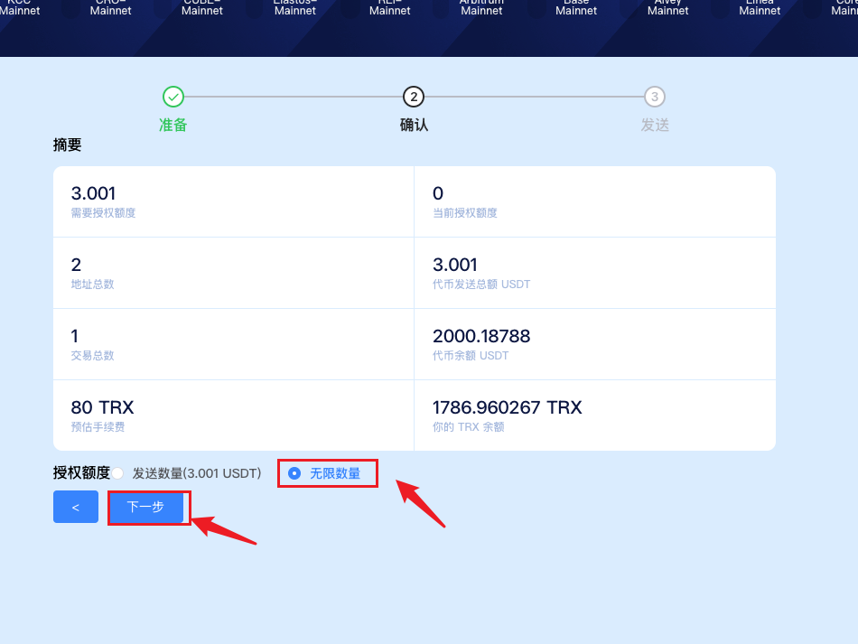
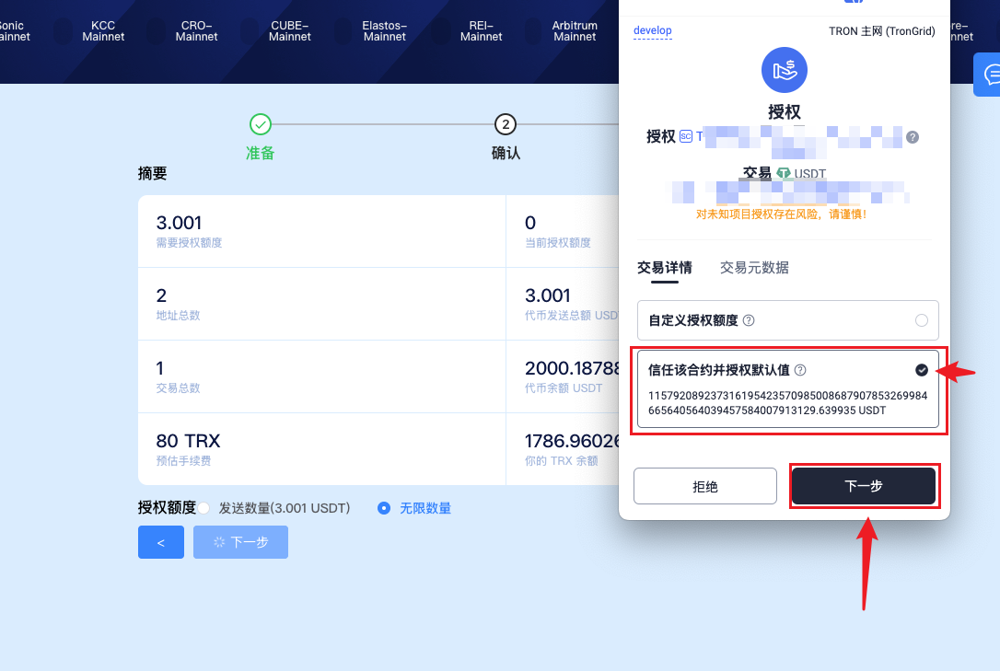
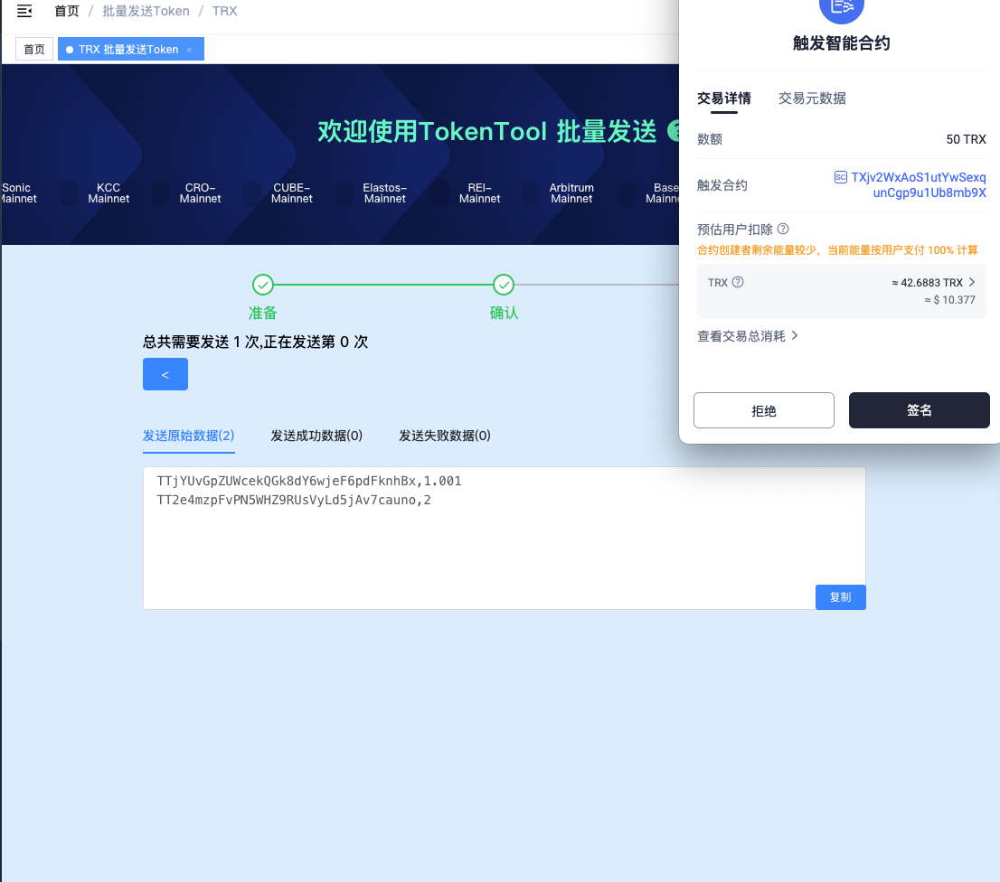

# 波场 Tron 批量转账工具教程

波场批量转账工具是什么？顾名思义，它可以在波场链上批量转账代币，如 TRX、USDT、SUN 等等。使用批量转账工具，用户可以高效地将某一地址中的代币发送至多个不同地址。

相较于逐一转账，批量操作显著节省时间和精力。比如：一次性向 200 个地址转账，与手动进行 200 次操作相比，效率不可同日而语。同时，批量转账在能量消耗上也更加经济。

下面，TokenTool 将演示如何使用该工具进行批量转账操作。


波场链批量转账需要消耗能量，尤其是 USDT 这类合约代币，能量消耗极高。操作前建议提前购买足够能量。购买地址：[https://feee.io/?ic=Z5U7](https://feee.io/?ic=Z5U7)


### 一、连接波宝钱包

打开波场批量转账工具：[https://tokentools.app/oneToMore/trx](https://tokentools.app/oneToMore/trx)，点击右上角的“连接钱包”按钮。  
请确保已在浏览器中安装 TronLink 波宝钱包。如未安装，可参考安装指南 → [TronLink 波宝钱包安装教程](https://docs.tokentools.app/tron/tronlink)

之后 TronLink 钱包会弹出确认窗口，点击 **连接**。

连接成功后，页面右上角将显示你的钱包地址，此时即可进入下一步。

### 二、填写转账信息

选择需要转账的代币，填写收款地址列表及各自的转账数量。

例如，若你要将 USDT 转账至多个地址，可在输入框中填写地址和对应金额，每行一组，使用逗号分隔：

确认无误后点击 **下一步**，系统将显示地址数量与总转账金额。请再次核对信息，然后点击 **下一步 / 授权**。

若是首次操作合约代币（如 USDT），钱包会提示进行授权，点击确认即可。  
> 注：TRX 原生代币无需授权。

授权时请选择 “信任该合约并授权默认值”。

授权完成后点击 **下一步**，钱包将请求你进行签名授权，确认无误后完成操作。

之后可点击 **发送交易**，钱包弹出确认并签名，即可完成批量转账。

### 三、疑问解答

**1、授权有风险吗？**

- 答：批量转账是通过智能合约执行的，需要授权合约调取你的代币。如果平台本身安全性存在问题，授权存在潜在风险。但如果平台稳定、未遭攻击或作恶，则授权是安全的。

**2、一次最多可以转多少个地址？**

- 答：多少地址无上限，但是每次打包转账地址 **200 个** 进行打包上链一次，也就是400个地址需要付2次Gas能量，以确保操作稳定性和成功率。

**3、转账大约消耗多少能量？**

- 答：例如，向 10 个地址转账 USDT，大概消耗 **38.4 万能量** 和 **82 TRX**。

如有其他疑问，欢迎加入官方 Telegram 社群获取帮助：  
📢 [https://t.me/tokentool_app](https://t.me/tokentool_app)
