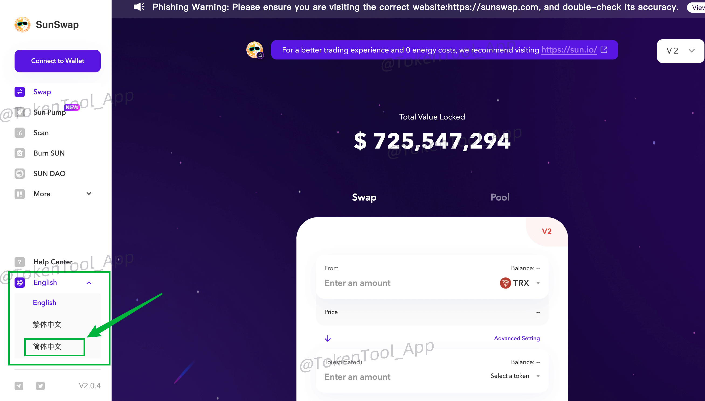
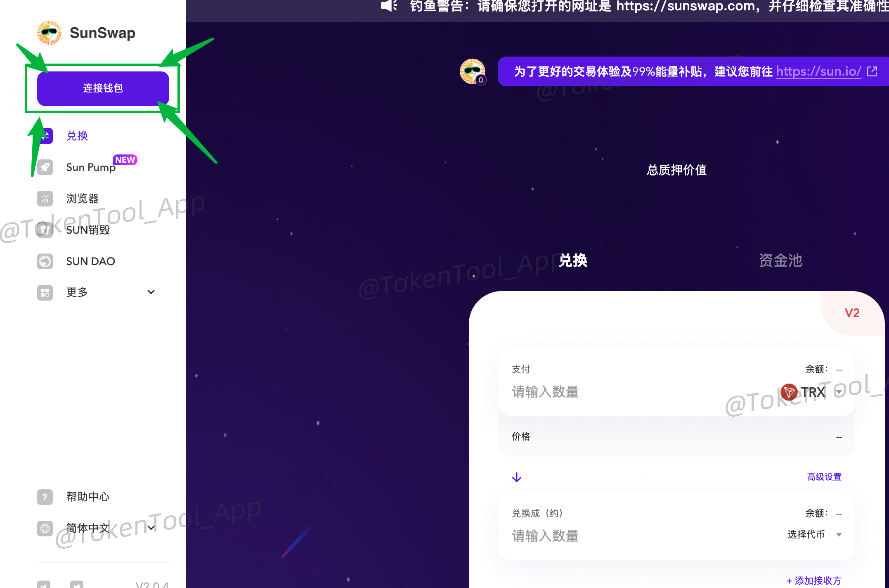
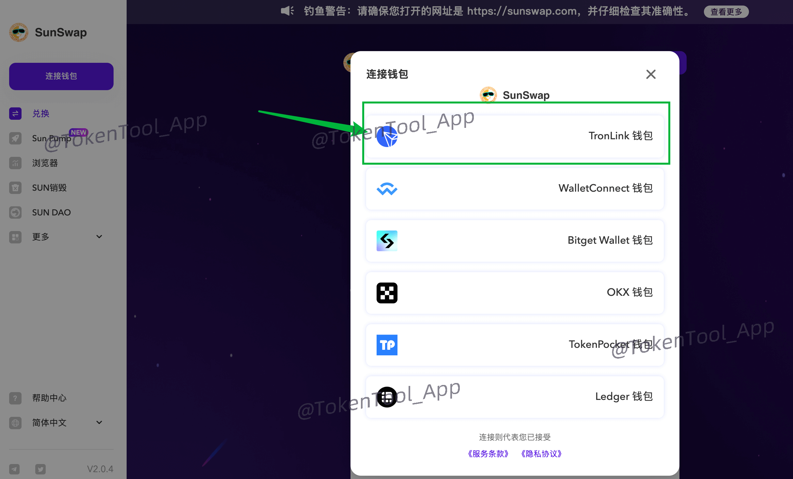
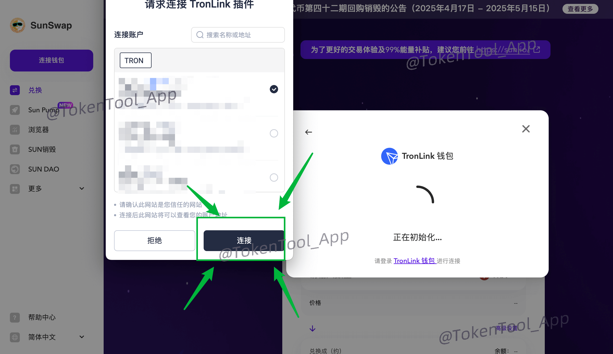
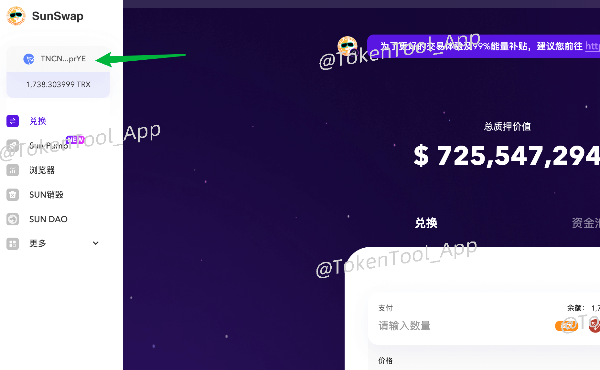
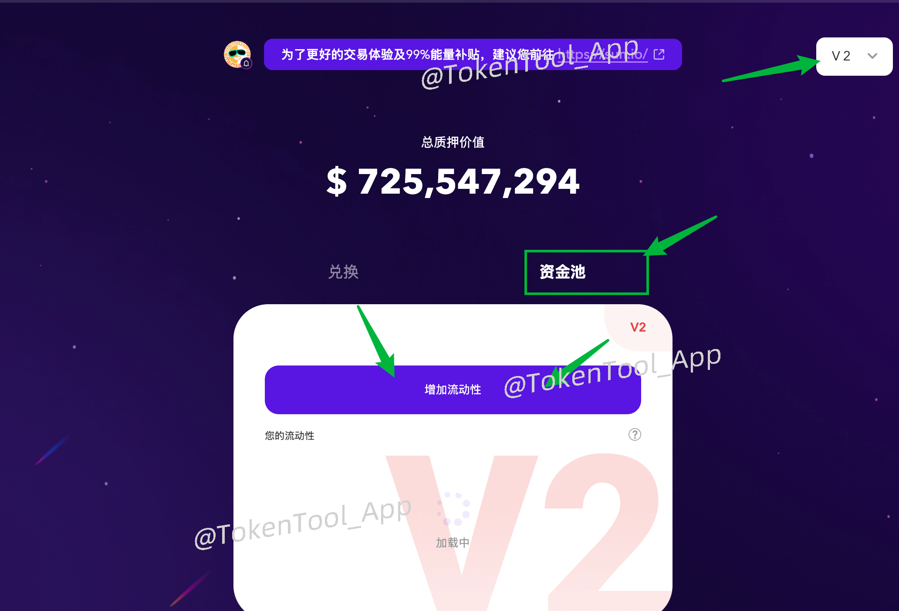
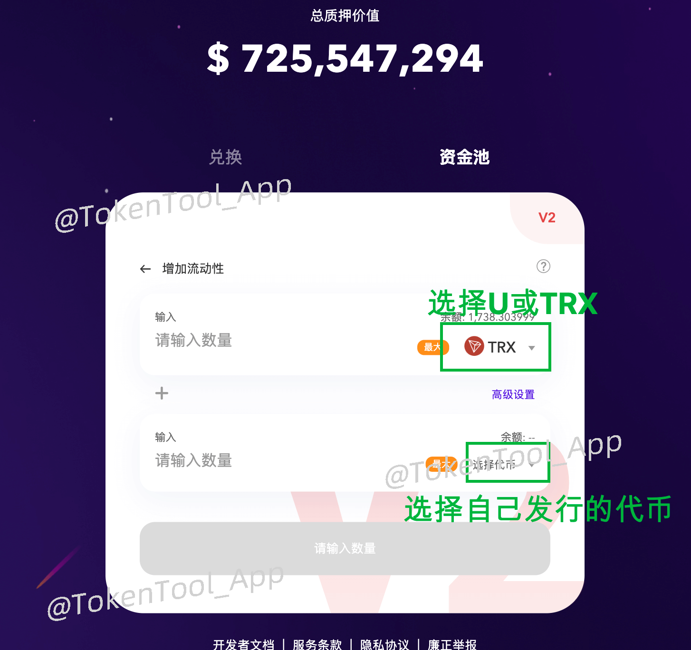
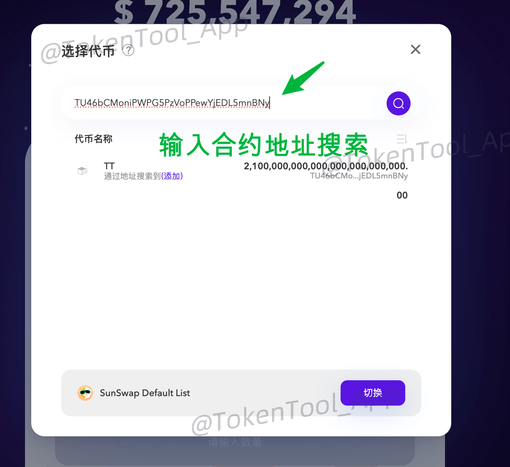
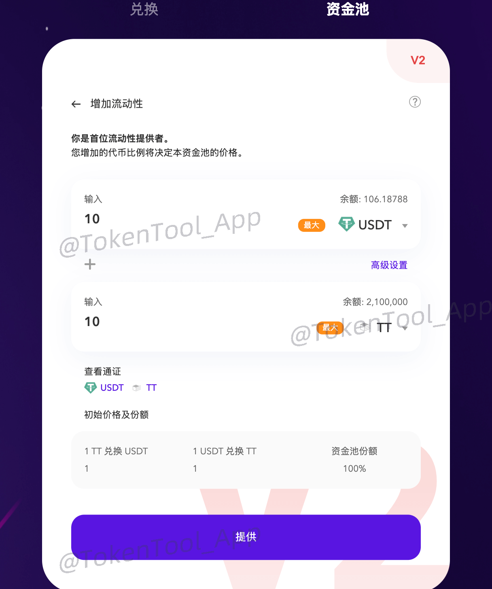

# SunSwap 流动性资金池教程

[SunSwap](https://sunswap.com/#/home) 是波场（TRON）链上最大的去中心化交易所（DEX），集代币兑换、流动性挖矿、稳定币质押、平台治理等功能于一体。几乎所有 TRC20 通证若想在链上进行流通交易，都需在 SunSwap 创建流动性池。SunSwap 的前身是 JustSwap，后被 SUN 团队收购并更名为 SunSwap。


SunSwap 官方网站：[https://sunswap.com/](https://sunswap.com/#/home)


本教程将手把手教你如何通过电脑操作，在 SunSwap 上创建一个自己的流动性池，也就是我们常说的“加池子”。

### 一、打开 SunSwap 并连接钱包

1. 打开官网：[https://sunswap.com/](https://sunswap.com/#/home)
2. 点击**左下角语言切换按钮**，将界面语言设置为中文。

3. 接着，点击**左上角“连接钱包”按钮**。

系统会弹出可选钱包列表，推荐使用 **TronLink 波宝钱包**。

> 如果你尚未安装 TronLink 插件钱包，可参考这份安装教程 → [波宝钱包 TronLink 安装教程](https://docs.tokentools.app/tron/tronlink)

选择 TronLink 后，浏览器会弹出钱包授权窗口。勾选要连接的钱包地址并点击“连接”。

连接成功后，页面左上角将显示你的钱包地址和余额。

### 二、添加流动性（创建资金池）

在添加流动性之前，请注意 SunSwap 存在不同版本的资金池。

| 版本 | 特点说明 |
|------|----------|
| V1   | 仅支持 TRX 交易对，不推荐使用 |
| V2   | 目前最主流、结构清晰、用户最多 |
| V3   | 提供集中流动性等高级功能，适合专业用户 |

👉 **建议使用 V2 版本进行操作。**

### 创建步骤如下：

1. 在页面顶部点击「**资金池**」。

2. 选择你要创建的交易对：
   - 上方选择 USDT 或 TRX
   - 下方选择你自己发行或想提供流动性的 TRC20 代币

确认交易对后，输入你希望投入池子的两个代币数量，并设置初始价格。

> 💡 **价格参考**：如果你提供了 10 USDT 和 10 个代币，则系统会自动设定代币价格为 1 USDT。

输入完成后，点击「提供」按钮，钱包确认后即完成创建。


⚠️ 注意事项：
- 加池子操作可能会消耗大量 TRX 能量，建议钱包中预留**至少 1000 TRX**。
- 即使加池失败，也会产生 TRX 消耗，请谨慎确认相关参数。


如有其他疑问，欢迎加入官方 Telegram 社群获取帮助：  
📢 [https://t.me/tokentool_app](https://t.me/tokentool_app)