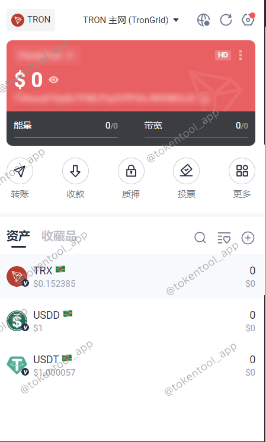
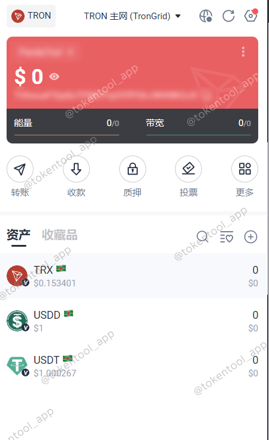

# 波宝钱包TronLink安装教程

> **波场生态最大的去中心化钱包TronLink**

TronLink Wallet，中文称之为：波宝钱包，是波场生态最大的去中心化钱包，已经诞生超过5年，支持主网、测试网以及EVM链等多链生态，其才有HD多链钱包结构，一套助记词，即可管理 TRON、 Ethereum、 BSC 及 BTTC 网络的资产。

> **点击加入 [TokenTool官方交流群](https://t.me/tokentool_app) 交流反馈**

⚠️ 唯一官网：https://www.tronlink.org/cn/ ，其余都是假的

## 一、安装TronLink钱包插件

波宝钱包TronLink有App和浏览器插件两个，App大家在Google Play或者Apple Store下载就可以了，这篇文章是教大家安装波宝钱包插件的

首先，我们进入TronLink的官方网站：https://www.tronlink.org/cn/ ，点击谷歌浏览器图标，会跳转到插件安装地址

如果点击没有反应，也可以直接通过链接，也可以进入到钱包插件的安装页面，链接：https://chromewebstore.google.com/detail/tronlink/ibnejdfjmmkpcnlpebklmnkoeoihofec  进入安装页面后，我们点击Add To Chrome（添加至Chrome）

之后在跳出来的提示里，点击添加扩展程序

等待十几秒钟后，钱包插件就会安装成功。然后我们在谷歌浏览器的右上角，就能找到安装好的TronLink

## 二、创建Tron钱包

当我们打开TronLink插件的时候，第一步是要将钱包的语言设置为中文，以便后面的使用

之后，我们就有两种操作方式了：创建钱包或者导入钱包，这两个流程TokenTool将分别和大家说一下

###  1.创建钱包

点击创建钱包之后，会跳转条款页面，点击同意后，进行钱包的名称与密码设置，我们按照提示设置好钱包密码（这个密码较为复杂，包含大写、小写、数字以及特殊符号），搞定之后，钱包就创建成功了

然后我们需要备份钱包的助记词，以防钱包丢失。

点击“备份钱包”这个按钮之后，进行密码确认。输入完密码后，点击“开始备份”，即可进入到下一步

之后，钱包会要求你查看并将看到的助记词复制下来

最后，我们需要进行助记词的验证，如下图所示

以图片中的9号为例，我们需要选择助记词里顺序为9的单词，点击确认。如此确认三次，钱包就默认你真正将助记词备份下来了，之后就算是验证成功了。

至此，恭喜你，你的钱包就算是创建完成了，即可进入到钱包主页面

### 2.导入钱包

以上是注册钱包的过程，如果我们要导入钱包应该怎么做呢？其实也很简单。

首先，我们在第一步的时候选择**导入钱包**

在确认同意相关的条款后，输入钱包的助记词或者私钥，之后会让你设置钱包的名称与密码

一切都设置完成后，点击下一步，会让你勾选钱包的网络

由于TronLink波宝钱包是一个多链钱包，可以支持波场链，也可以支持ETH、BSC等EVM链，所以你可以选择勾选任意你需要的链。

我们这里默认选择TRON波场链即可，之后就算是导入完成了，可以进入到钱包主页了

### 常见问题解答

- **波场账户需要激活吗？**
  - 解答：是的。一个活跃的波场账户地址，钱包内必须有TRX才行。向一个新的地址转账1个TRX，即可激活

- **能量和带宽是什么意思？**
  - 解答：波场链的转账并不是直接消耗TRX的，它消耗的是带宽与能量。如果你的钱包里没有这两样东西，则会通过燃烧TRX的方式获得能量及能量。如果有，则不需要TRX

- **怎么获得能量？**
	- 解答：获得能量的方式主要有两种，一种是通过质押TRX，由TRX网络将能量给你。如果你的TRX数量不够多，那么也可以通过购买租用的方式获得能量。
	- TRX能量购买租用平台： https://feee.io/?ic=6CLV

- **怎么获得能量？**
  - 如果转账的是TRX，基本上不需要消耗能量，可以忽略不计
  - 如果转账的USDT，则分两种情况
    - 对方钱包有USDT，转账一笔消耗大概65000能量（预估燃烧13个TRX）
    - 对方钱没有USDT，转账一笔销毁大概130000能量（预估燃烧27个TRX）

- **我的钱包里没有TRX，只有U，该怎么办？**
  - 解答：这的确是个很棘手的问题。尽管目前各个钱包软件在尝试0手续费转账，但是方案都不成熟。在这种情况下，您只能是让别人帮你购买能量，或者想办法搞到一些TRX了（例如通过交易所提币的方式）

如果您还有其他问题，可以加入TokenTool一键发币群了解，

> **点击加入 [TokenTool官方交流群](https://t.me/tokentool_app) 交流反馈**