# 波场代币合约验证和开源教程

> 一篇文章学会在波场链开源

所谓合约验证，就是在波场官方浏览器上将合约源码上传，并与已经发行的代币进行匹配，由此对合约进行开源。开源后的代币，透明性更强，也更容易受到认可。

所有在TokenTool发行的波场TRC20代币，都可以参考这个教程进行开源。


代币验证之前，必须先下载合约文件




### 一、找到开源入口

首先，我们需要在波场官方浏览器找到开源入口。打开浏览器链接：[https://tronscan.org/](https://tronscan.org/) ，什么都别管，先设置语言。

将浏览器拉到底部位置，找到 **Preferences** 点击进行偏好设置

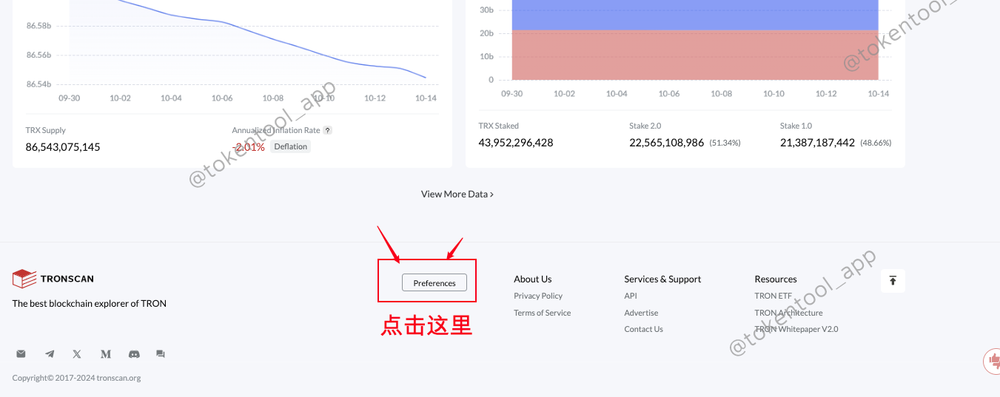

之后在出现的设置里选择中文，点击Save保存即可

当浏览器变为中文后，我们点击右上角连接钱包，登陆上浏览器

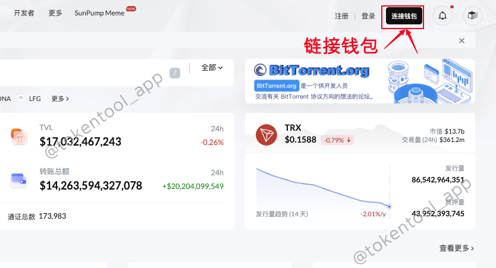

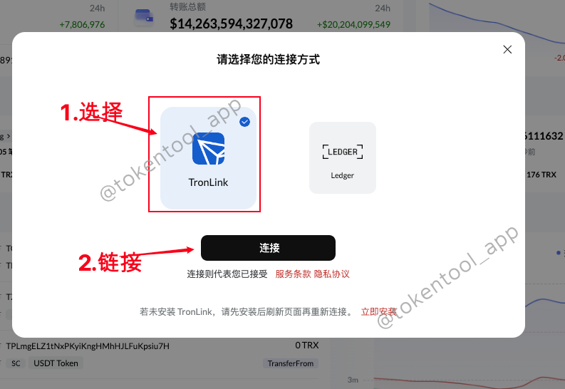

钱包连接成功后，我们在顶部菜单栏找到【**更多**】，然后在出现的功能列表里选择【**合约验证**】，就可以了

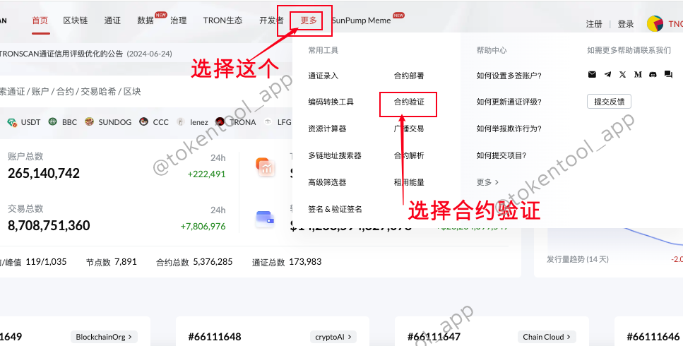

### 二、填写开源参数并上传源码

在合约开源页面，我们能看到这样的信息

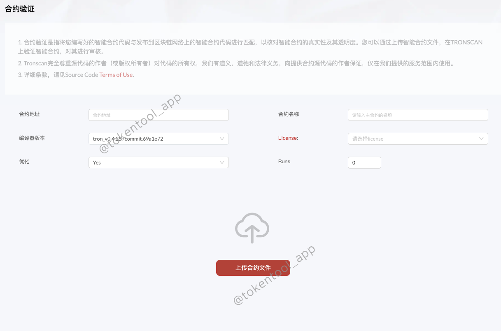

如果你觉得懵逼，不要紧，接下来我一 一教大家该怎么填写

- **合约地址：**这个很好理解，就是你的代币地址
- **合约名称：**这个填 **CoinToken** （注意大小写也不能错）
- **编译器版本：**选择 tron_v0.4.25+commit.69a1e72

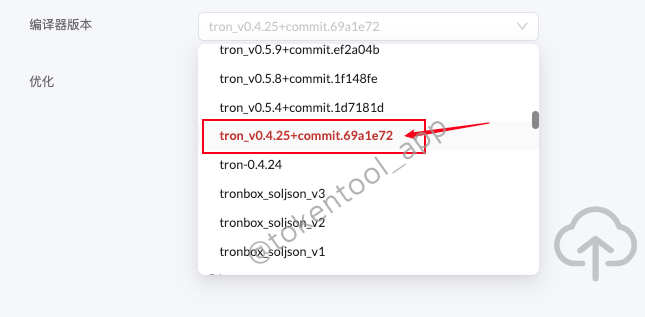

-  **License：** 选择MIT

-  **优化：** No

-  **Runs：** 0

参数填写完成之后，就是上传合约文件。我们将刚刚下载的合约文件传到来，如果没有下载，可以点击这里下载



合约文件上传成功，就可以看到源码了

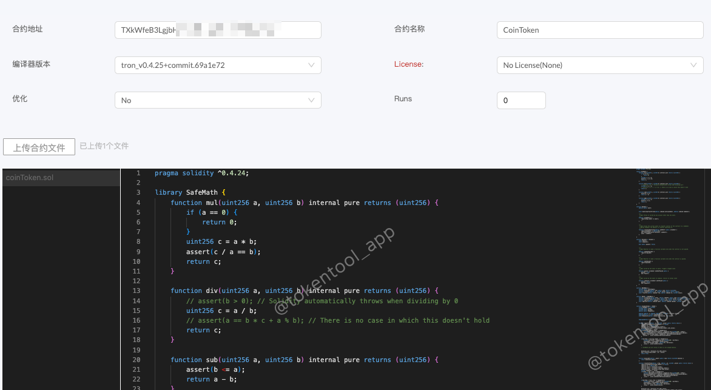

### 三、验证并发布

文件上传后，将页面往下拉，能发现一个人机验证的提示，点击进行谷歌人机验证

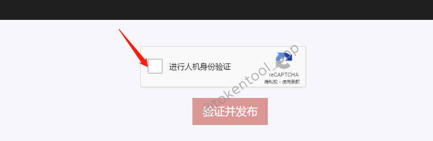

人机验证完成，点击 **【验证并发布】**

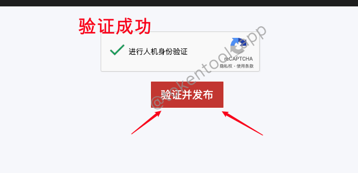

等待几秒钟，如果开源成功，会给你跳转到一个新的页面，可以看到你的合约源码

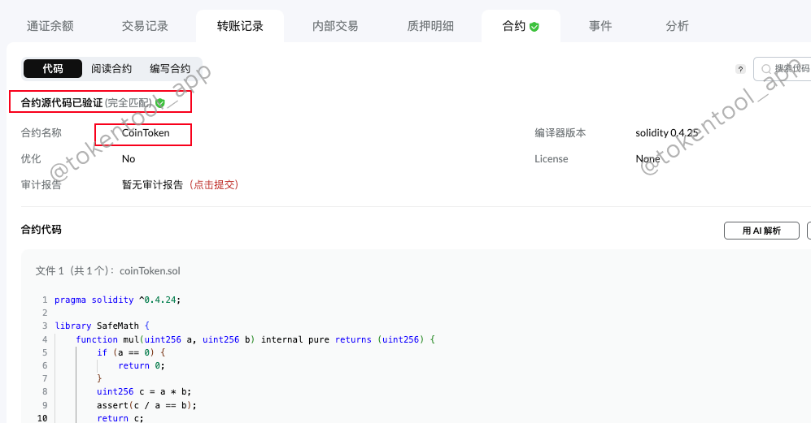

如果开源失败，会给出下图的提示

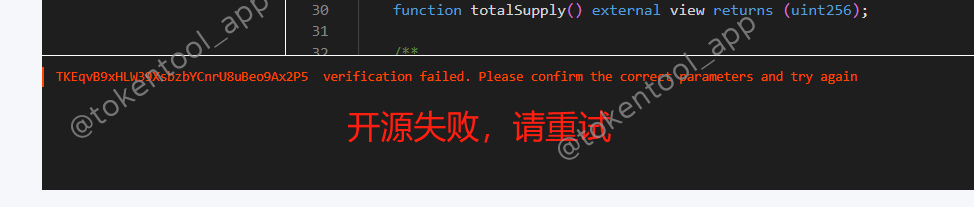

此时你需要再去检查一下，看看开源参数是不是填写正确了。重新填写之后，再刷新页面重试

### 常见问题解答

- **合约开源需要付费吗？**
  - 解答：不需要，合约开源不会收取任何费用

- **任何人都能开源吗？**
  - 解答：是的，只要有这套源码且参数填对的话，任何人都能按照这个流程开源

- **为什么我没有看到人机验证？**
	- 谷歌人机验证必须在开启梯子的前提下才会有，请检查网络是否正确

如果您还有其他问题，可以加入TokenTool官方群了解，

> **点击加入 [TokenTool官方交流群](https://t.me/tokentool_app) 交流反馈**